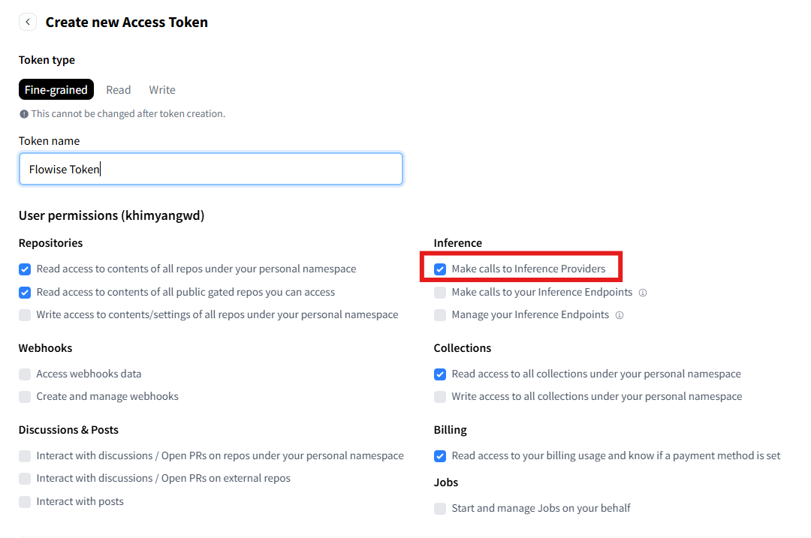
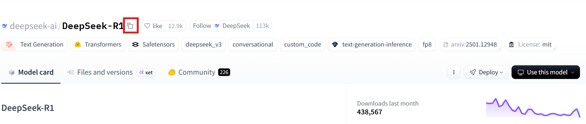
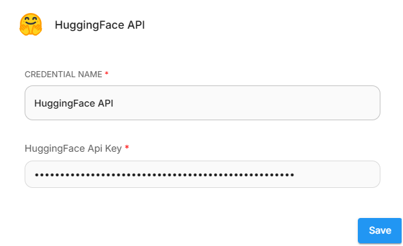
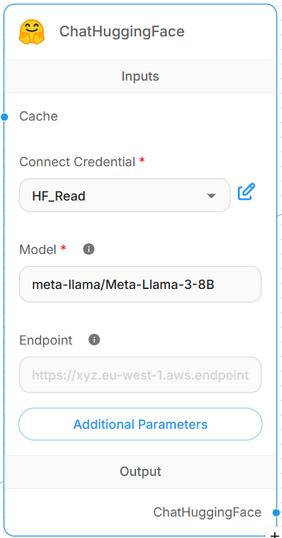

# ChatHuggingFace

## Prerequisite

1. [Log in](https://huggingface.co/login) or [sign up](https://huggingface.co/join) to [Hugging Face](http://huggingface.co).
2. Create an API key if you haven't done so:
    a. From your Hugging Face profile, select **Access Tokens** > **Create new token**.
    b. Create a *Fine-grained* token. Select all the read and write access you need. Ensure that you also select either:
        * *Make calls to Inference Providers* - to interact with the Serverless Inference API (formerly known as the "Inference API") from HuggingFace or other third-party providers (such as Together AI, Sambanova, or Replicate) through Hugging Face.
        * *Make calls to your Inference Endpoints* - to interact with a dedicated standalone Hugging Face instance that you’ve deployed on your own server.
        <figure><figcaption>
Hugging Face Token Creation
</figcaption></figure>
    c. Click **Copy** and save the API token in another location for retrieval later.
3. Select an LLM Model that you want to use:
    a. Select the **Models** tab on Hugging Face.
    b. Select the LLM Model that you want to use. On the model page, click the copy icon next to the model name to copy the model name to the clipboard.

    <figure><figcaption>
Hugging Face Model Page
</figcaption></figure>

## Setup

### Flowise
Set Up Flowise:
    * Deploy Flowise: Install and run Flowise, either locally or on the cloud. You can follow the official Flowise documentation or tutorials for deployment.

To create a chatflow in Flowise with a ChatHuggingFace chat model:
    1. From **Chatflows**, click **+ Add New** to create a new chatflow.
    2. Click **+** and drag **Chains** > **LLM Chain**.
    3. Click **+** and drag **Chat Models** > **ChatHuggingFace**.
        * **Connect Credential** > click **Create New**.
        * Create a new credential and enter in the HuggingFace Api Key field the Hugging Face access token you saved previously.
        <figure><figcaption>
Hugging Face Connect Credential
</figcaption></figure>
        * **Model**: Paste the model name from the clipboard (saved from the model page on Hugging Face).
        <figure><figcaption>
ChatHuggingFace Node
</figcaption></figure>
    4. Click **+** and drag **Prompts** > **Prompt Template**:
        * Expand the Template and enter an instruction. Example: "User Question: {question}".
    5. Connect the **ChatHuggingFace** output to the **Language Model** input of the LLM Chain.
    6. Connect the **PromptTemplate** output to the **Prompt** input of the LLM Chain.
    <figure><figcaption>
Hugging Face Chatflow
</figcaption></figure>
    7. Save your configuration before running your chatflow.
    8. Voila [🎉](https://emojipedia.org/party-popper/), you have created a chatflow with a **ChatHuggingFace node** in Flowise.

## Resources

* [HuggingFace Documentation](https://huggingface.co/docs)
* [HuggingFace Forum](https://discuss.huggingface.co/)