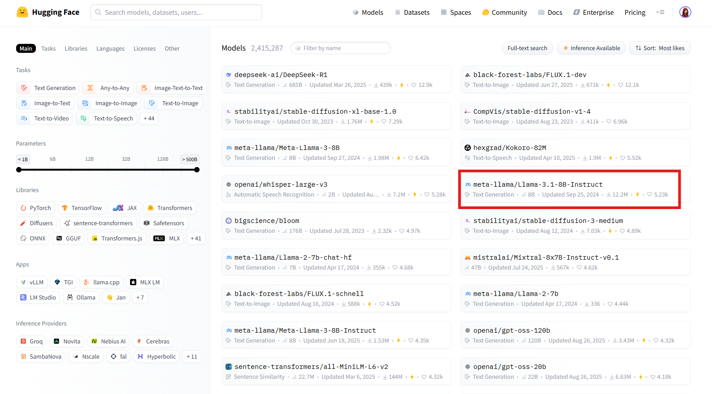
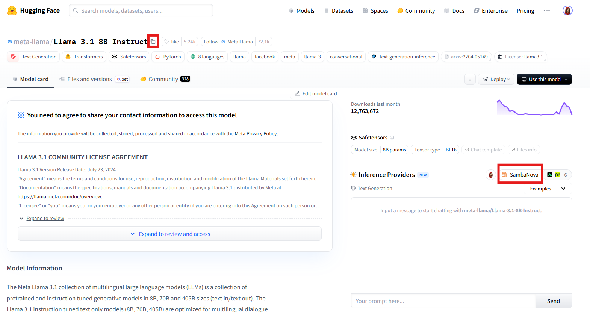

# ChatHuggingFace

## Prerequisite

1. [Log in](https://huggingface.co/login) or [sign up](https://huggingface.co/join) to [Hugging Face](https://huggingface.co).
2. Create an API key if you haven't done so:
    1. From your Hugging Face profile, select **Access Tokens** > **Create new token**.
    2. Create a *Fine-grained* token. Select all the read and write access you need. Ensure that you also select either:
        * *Make calls to Inference Providers* - to interact with the Serverless Inference API (formerly known as the "Inference API") from Hugging Face or other third-party providers (such as Together AI, Sambanova, or Replicate) through Hugging Face.
        * *Make calls to your Inference Endpoints* - to interact with a dedicated standalone Hugging Face instance that you’ve deployed on your own server.
        <figure><figcaption>
Hugging Face Token Creation
</figcaption></figure>
    3. Click **Copy** and save the API token in another location for later retrieval.
3. From the **Models** tab, select an LLM Model that you want to use.
    <figure><figcaption>
Hugging Face Models
</figcaption></figure>
4. On the LLM model page that opens:
    1. Click the icon next to the model name to copy the model name to the clipboard or save to another location for later retrieval.
    2. Note the default Inference Provider for the model.
        <figure><figcaption>
Hugging Face LLM Model Page
</figcaption></figure>
    3. If your provider is a third-party provider that requires a custom API key, first create the API key on the provider site, then copy and set the API key on your Hugging Face profile settings:
        1. Click **Settings** under your Hugging Face profile.
        2. Select **Inference Providers** on the left panel.
        3. Select the **Settings** tab.
        4. Select **Set a custom API key** for the provider, and paste in the API key.
            <figure><figcaption>
Hugging Face Inference Providers Page
</figcaption></figure>
        

## Setup

### Flowise
To get started, you need to deploy Flowise. Install and run Flowise, either locally or on the cloud. You can follow the official Flowise documentation or tutorials for deployment.

To create a chatflow in Flowise with a ChatHuggingFace chat model:
1. From **Chatflows**, click **+ Add New** to create a new chatflow.
2. Click **+** and drag **Chains** > **LLM Chain**.
3. Click **+** and drag **Chat Models** > **ChatHuggingFace**:
    * **Connect Credential**: Click **Create New** to create a new credential and enter the Hugging Face access token in the **HuggingFace API Key** field.
        <figure><figcaption>
Hugging Face Connect Credential
</figcaption></figure>
    * **Model**: Paste the model name from the clipboard (saved from the model page on Hugging Face).
    <figure><figcaption>
ChatHuggingFace Node
</figcaption></figure>
4. Click **+** and drag **Prompts** > **Prompt Template**:
    * Expand the Template and enter an instruction. Example: "User Question: {question}".
5. Connect the **ChatHuggingFace** output to the **Language Model** input of the LLM Chain.
6. Connect the **PromptTemplate** output to the **Prompt** input of the LLM Chain.
7. Save your configuration before running your chatflow.
8. Voila [🎉](https://emojipedia.org/party-popper/), you have created a chatflow with a **ChatHuggingFace node** in Flowise.
    <figure><figcaption>
Hugging Face Chatflow
</figcaption></figure>

## Resources

* [HuggingFace Documentation](https://huggingface.co/docs)
* [HuggingFace Forum](https://discuss.huggingface.co/)