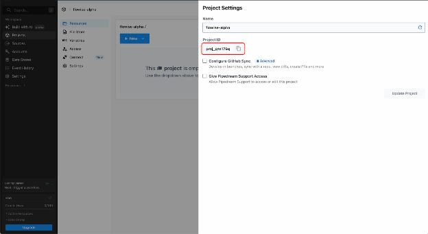
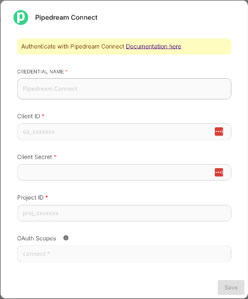
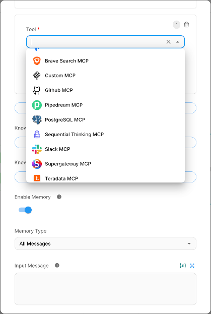
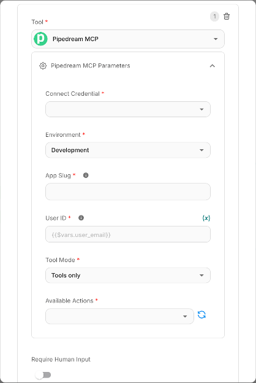
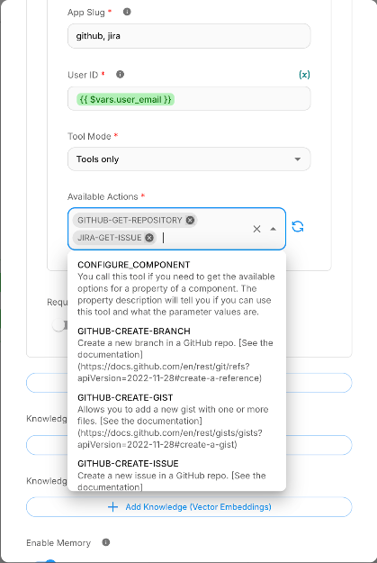

# Pipedream MCP

The **Pipedream MCP** node connects your Flowise agents to 3,000+ APIs and 10,000+ pre-built tools through [Pipedream Connect](https://pipedream.com/docs/connect/mcp/developers). Your agents can send Slack messages, create GitHub issues, update Google Sheets, manage Notion pages, and much more — all using a standardized MCP (Model Context Protocol) interface with fully-managed OAuth.

***

## 1. Prerequisites

Before using the Pipedream MCP node you need:

* **A Pipedream account**: sign up at [pipedream.com](https://pipedream.com) (free tier supports up to 1,000 connected accounts).
* **A Pipedream Connect project**: create one via the Pipedream dashboard or CLI (`pd init connect`).
* **An OAuth client**: generated inside your Pipedream workspace's [API settings](https://pipedream.com/settings/api). This gives you a **Client ID** and **Client Secret**.

***

## 2. Setting Up Pipedream Credentials

### 2.1 Create an OAuth Client in Pipedream

1. Go to [pipedream.com/settings/api](https://pipedream.com/settings/api).
2. Click **New OAuth Client**.
3. Name your client (e.g., `Flowise Agent`) and click **Create**.
4. **Copy the Client Secret immediately,** it will not be shown again.
5. Copy the **Client ID** from the list.

<figure><figcaption></figcaption></figure>

### 2.2 Find Your Project ID

1. Open your Pipedream project from the dashboard.
2. The Project ID is visible in the project settings (format: `proj_xxxxxxx`).

<figure><figcaption></figcaption></figure>

### 2.3 Add Credentials in Flowise

1. In Flowise, navigate to **Credentials** from the sidebar.
2. Click **Add Credential** and search for **Pipedream Connect**.
3. Fill in the following fields:

| Field             | Description                                                                 | Example       |
| ----------------- | --------------------------------------------------------------------------- | ------------- |
| **Client ID**     | The OAuth Client ID from Pipedream                                          | `wBSGhxxxx`   |
| **Client Secret** | The OAuth Client Secret (stored securely)                                   | `••••••••`    |
| **Project ID**    | Your Pipedream Connect project ID                                           | `proj_xyz789` |
| **OAuth Scopes**  | _(Optional)_ Space-separated scopes. Defaults to `connect:*` if left blank. | `connect:*`   |

4. Click **Save**.

<figure><figcaption></figcaption></figure>

**Tip:** For production environments, use the narrowest scopes you need. See [Pipedream Authentication Docs](https://pipedream.com/docs/connect/api-reference/authentication) for available scopes.

***

## 3. Adding the Pipedream MCP Node

1. Open a chatflow in the Flowise canvas.
2. Add an **Agent** node (e.g., Tool Agent, OpenAI Function Agent).
3. From the **Tools (MCP)** category, drag the **Pipedream MCP** node onto the canvas.
4. Connect the Pipedream MCP node's output to the Agent node's **Tools** input.
5. Configure the node (see next section).

<figure><figcaption></figcaption></figure>

***

## 4. Node Configuration Reference

| Parameter              | Type                     | Required | Description                                                                                                                                                                                                                                  |
| ---------------------- | ------------------------ | -------- | -------------------------------------------------------------------------------------------------------------------------------------------------------------------------------------------------------------------------------------------- |
| **Connect Credential** | Credential selector      | Yes      | Select the Pipedream Connect credential you created in Step 2.                                                                                                                                                                               |
| **Environment**        | Dropdown                 | Yes      | `Development` or `Production`. Controls which Pipedream environment your connected accounts and tool calls run against. Use `Development` for testing.                                                                                       |
| **App Slug**           | Text                     | Yes      | The unique identifier for a Pipedream app (e.g., `slack`, `gmail`, `notion`, `linear`). Browse all available apps at [mcp.pipedream.com](https://mcp.pipedream.com). Supports **multiple apps** via comma separation (e.g., `slack,notion`). |
| **User ID**            | Text (accepts variables) | Yes      | A unique identifier for your end user. Supports Flowise variables `{{$vars.user_email}}` and flow variables `{{$flow.sessionId}}`. See [Section 7](pipedream-mcp-user-guide.md#7-using-variables-for-user-id).                               |
| **Tool Mode**          | Dropdown                 | Yes      | Currently supports `Tools only` mode, which exposes the app's pre-built actions as individual tools to the agent.                                                                                                                            |
| **Available Actions**  | Multi-select (async)     | Yes      | After filling in App Slug and User ID, click the **refresh** button to load the list of available actions for the specified app(s). Select the specific actions you want to expose to your agent.                                            |

<figure><figcaption></figcaption></figure>

***

## 5. Selecting Actions

Once you provide a valid **App Slug** and **User ID**, click the refresh icon next to **Available Actions**. The node will connect to Pipedream's remote MCP server and retrieve all available tools for the specified app.

Each action is listed with:

* **Name:** the tool identifier (displayed in uppercase), e.g., `GITHUB-GET-REPOSITORY`
* **Description:** what the tool does, e.g., _"Get Information for a specific repository"_

Select only the actions your agent needs. Fewer tools help the LLM make better decisions and reduce token usage.

<figure><figcaption></figcaption></figure>

### Finding App Slugs

The **app slug** is the lowercase name shown in the URL on Pipedream. For example:

* `pipedream.com/apps/slack` → slug is `slack`
* `pipedream.com/apps/google-sheets` → slug is `google-sheets`
* `pipedream.com/apps/notion` → slug is `notion`

Browse the full catalog at [mcp.pipedream.com](https://mcp.pipedream.com) or [pipedream.com/explore](https://pipedream.com/explore).

<figure><figcaption></figcaption></figure>

***

## 6. Account Connection Flow

When an agent invokes a Pipedream tool for a user who has not yet connected their account for that app, Pipedream returns a **Connect URL**. The Pipedream MCP node automatically detects this and provides the connect URL to the user. The connect URL opens a Pipedream hosted page where the user authorizes the app (e.g., signs in to Slack via OAuth). The link is scoped to the specific user and expires after 4 hours.

**Key points:**

* The connect URL renders as a clickable link in the chat UI.
* Once the user connects their account, subsequent tool calls will execute normally.
* User credentials are encrypted at rest on Pipedream's servers and never exposed to the LLM.

<figure><figcaption></figcaption></figure>

***

## 7. Using Variables for User ID

The **User ID** field identifies the end user in Pipedream Connect. This is critical for multi-user scenarios where each user connects their own accounts.

### Supported Variable Types

| Variable Syntax        | Source                      | Resolved At           |
| ---------------------- | --------------------------- | --------------------- |
| `{{$vars.user_email}}` | Flowise workspace variables | Design-time + Runtime |
| `{{$flow.sessionId}}`  | Flow context (session)      | Runtime only          |

### Workspace Variables

1. In Flowise, go to **Variables** from the sidebar.
2. Create a variable (e.g., `user_email` with value `john@example.com`).
3. In the Pipedream MCP node, set **User ID** to `{{$vars.user_email}}`.

<figure><figcaption></figcaption></figure>

### Flow Variables

Use `{{$flow.sessionId}}` to automatically scope Pipedream accounts per chat session. This is useful when each session represents a different user.

**Important:** Flow variables like `{{$flow.sessionId}}` are only resolved at runtime. When clicking "refresh" on Available Actions in the editor, the node uses a fallback preview user ID (`flowise_preview_user`) so that action listing still works.

### Static User ID

For single-user or testing scenarios, you can also enter a plain string like `test-user-1` or `admin@mycompany.com`.

**Allowed characters:** Letters, digits, `.` `_` `@` `+` `-` (max 250 characters).

***

## 8. Security Best Practices

| Practice                               | Details                                                                                                               |
| -------------------------------------- | --------------------------------------------------------------------------------------------------------------------- |
| **Enable "Require Human Input"**       | For destructive or write actions (sending messages, deleting data), enable human approval on the Agent node.          |
| **Use narrow OAuth scopes**            | In your Pipedream credential, specify only the scopes you need.                                                       |
| **Use per-user IDs**                   | Always use a unique User ID per end user. This ensures Pipedream scopes credentials to individual users.              |
| **Use Production environment in prod** | Switch from `Development` to `Production` when deploying. Pipedream keeps separate credential stores per environment. |
| **Select minimal actions**             | Only expose the actions your agent needs. Fewer tools reduce the attack surface and improve LLM accuracy.             |
| **Protect your Client Secret**         | Never expose the Client Secret in client-side code or version control. Flowise stores it encrypted.                   |

***

## 9. External References

| Resource                                 | Link                                                                                                                       |
| ---------------------------------------- | -------------------------------------------------------------------------------------------------------------------------- |
| Pipedream MCP Developer Docs             | [pipedream.com/docs/connect/mcp/developers](https://pipedream.com/docs/connect/mcp/developers)                             |
| Browse Available MCP Apps & Tools        | [mcp.pipedream.com](https://mcp.pipedream.com)                                                                             |
| Explore Pipedream Actions                | [pipedream.com/explore](https://pipedream.com/explore)                                                                     |
| Pipedream Connect Overview               | [pipedream.com/docs/connect/mcp](https://pipedream.com/docs/connect/mcp)                                                   |
| OAuth / Authentication Docs              | [pipedream.com/docs/connect/api-reference/authentication](https://pipedream.com/docs/connect/api-reference/authentication) |
| App Discovery                            | [pipedream.com/docs/connect/app-discovery](https://pipedream.com/docs/connect/app-discovery)                               |
| Connect Quickstart (CLI)                 | [pipedream.com/docs/connect/quickstart](https://pipedream.com/docs/connect/quickstart)                                     |
| Pipedream Security & Privacy             | [pipedream.com/docs/privacy-and-security](https://pipedream.com/docs/privacy-and-security)                                 |
| MCP Tool Modes (Sub-agent / Full-config) | [pipedream.com/docs/connect/mcp/tool-modes](https://pipedream.com/docs/connect/mcp/tool-modes)                             |
