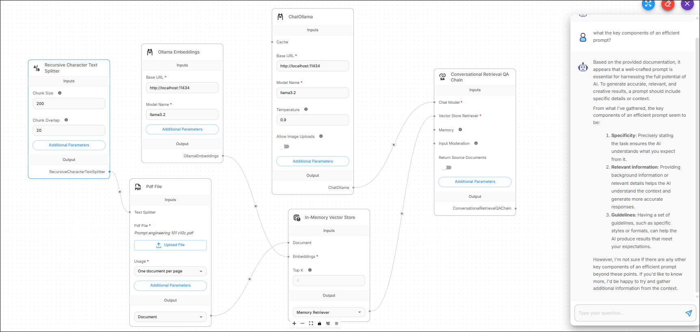

# In-Memory Vector Store

<figure><figcaption>
Chatflow Using an In-Memory Vector Store
</figcaption></figure>

# Overview
AI and machine learning use an in-memory vector store as a tool to store and search through embeddings (mathematical representations of data) entirely within a computer’s RAM. 

Because the data lives in memory rather than on a physical hard drive, it provides the extreme speed required for real-time AI tasks like chatbots or recommendation engines.

These are the key characterstics that differentiate an in-memory vector store from a persistent vector database such as Pinecone:
* Speed: Ultra fast
* Storage: Limited by available RAM
* Persistence: Volatile data that is lost after system restarts
* Use case: Best for Prototyping, small datasets, caching

## Use Case Examples

Developers can start with an in-memory store like the LangChain In-Memory VectorStore because:

* They're easy to set up and don't require hosting a separate database.

* They act as "short-term memory" for LLMs, allowing a chatbot to remember the last few conversations without any lag.
* They can store the answers to common questions in memory and retrieve them instantly if a user asks something similar. This saves time and money as it doesn't involve calling an expensive AI model again.

# Prerequisites
To integrate an in-memory vector store in Flowise, you don't need external database accounts. You only need these internal building blocks and optionally API credentials:

* External API keys:

  * LLM API Keys to power the chat model that answers questions. Examples include OpenAI, Anthropic, Google Gemini.

  * Embedding Model API Key to convert your text into the numerical vectors that the store can hold. Examples include OpenAI or Hugging Face.

  **Note**: If you're running your system 100% locally, then you can use Ollama for both LLM and Embeddings, which removes the need for external API keys. The instructions in the Flowise Configuration section use these local resources as examples:
  
  * **ChatOllama** for Chat Model 
  * **Ollama Embeddings** for Embeddings  

* Required components or nodes:

  * Document Loader: A node to feed data into the store. Examples include Pdf File, Plain Text, or Web Scraper.
  *  Text Splitter: A node to help break the content into logical chunks to prevent overwhelming the AI with huge files . Example: Recursive Character Text Splitter.
  *  Embeddings: A node for indexing the incoming text for the vector store. Examples include OpenAI Embeddings or Ollama Embeddings.

* System requiremnets:
  * Sufficient RAM: Since the data is stored in your system's memory, ensure your machine (or the server hosting Flowise) has enough free RAM
  * Persistence strategy: Since data is lost on Flowise restart, have a plan to upsert (re-upload) the data whenever Flowise restarts.

# Flowise Configuration

## Initialize Your Chatflow

1. Open your Flowise dashboard.
2. Click **Add New** to create a fresh canvas

3. Name your flow. Example: "In-Memory Knowledge Base."

## Add In-Memory Vector Store Node

1. Click the **+** (plus) button on the left to open the nodes panel.
2. Go to **Vector Stores** and drag the **In-Memory Vector Store** node into the canvas. This node needs these main inputs:   
   * Document
    * Embeddings
    * (Optional) Record Manager

 ## Connect Your Document Loader
To give the vector store data to search through, you need to load a file:
    
1. Go to **Document Loaders**.

2. Drag a loader such as PDF File or Text File into the canvas.

3. Upload your file to the loader node.

4. (Optional but Recommended): Add a **Recursive Character Text Splitter** (under Text Splitters) and connect it to the Document Loader to break your text into smaller, searchable chunks.

5. Connect the output of the Document Loader to the Document input of the In-Memory Vector Store.

## Add an Embedding Model

The vector store needs a way to understand the text.

1. Go to **Embeddings**.

2. Select a local model such as **Ollama Embeddings**. If you use a global model instead such as OpenAI or Hugging Face, you'll also need to provide an external API key.

3. Connect the Embeddings node to the Embeddings input of the In-Memory Vector Store.

## Connect to a Retrieval Chain

You need a chain that can actually use this data.

1. Go to **Chains** and drag the **Conversational Retrieval QA Chain** (or Retrieval QA Chain) into the canvas.

2. Connect the In-Memory Vector Store output to the Vector Store Retriever input of the chain.

3. Add a Chat Model such as **ChatOllama** and connect it to the Retrieval Chain’s Chat Model input.

## Load Your Documents into RAM

After you connected your flow, click **Upsert Vector Database** (database icon) to process your documents and load them into the RAM.

Since the data is "in-memory," it's erased every time you restart Flowise. To refill the memory after a restart, click **Upsert** again.

