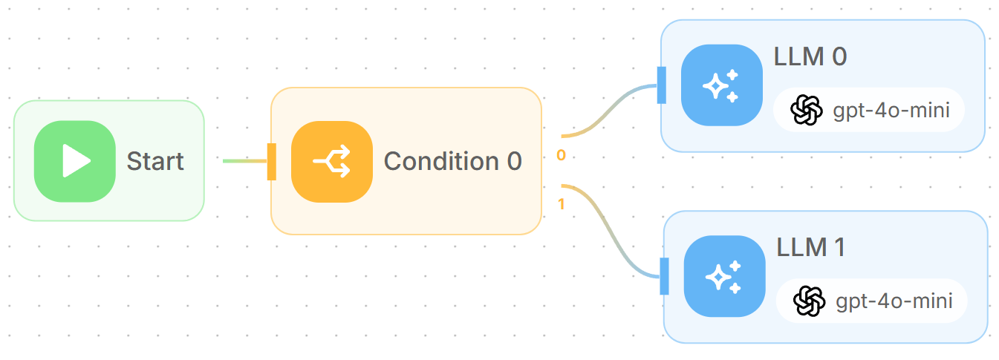

# Human In The Loop

In the previous tutorials, we explored how an Agent can dynamically use tools and automate execution. **Human-in-the-loop** adds a layer of control by allowing the Agent to request human input, approval, or feedback before proceeding.

There are 2 ways human in the loop can be used:

* Using [Human Input](../using-flowise/agentflowv2.md#id-11.-human-input-node) node to halt the execution
*   Enable **Require Human Input** for Agent's tools


## Human Input Node

The **Human Input** node allows execution to be paused and only resumed after a human has provided feedback to either approve or reject the action.

In this tutorial, we’ll learn how to create an automated email reply agent that asks for user feedback before sending out the email.

### Overview

The goal of this use case is to create an intelligent email reply system that:

1. Receives incoming email inquiries
2. Generates professional email responses using AI
3. Requests human approval before sending
4. Allows for revisions and improvements
5. Automatically sends the approved email

<figure><figcaption></figcaption></figure>

#### Step 1: Setting up the Start Node

1. Drag and drop the **Start** node onto the canvas. This will be the entry point for incoming email data.
2. Configure the Start node with the following settings:
   * **Input Type**: Select "Form Input" to capture structured email data
   * **Form Title**: "Email Inquiry"
   * **Form Description**: "Incoming email inquiry"
3. Add the following Form Input Types:
   * **Subject** (String): To capture the email subject line
   * **Body** (String): To capture the email content
   * **From** (String): To capture the sender's email address

<figure><figcaption></figcaption></figure>

#### Step 2: Creating the Email Reply Agent

1. Add an **Agent** node and connect it to the Start node. This agent will analyze the incoming email and generate an appropriate response.
2.  Add system message, for example:

    ```
    You are a customer support agent working in Flowise Inc. Write a professional email reply to user's query. Use the web search tools to get more details about the prospect.

    Always reply as Samantha, Customer Support Representative in Flowise. Don't use placeholders.
    ```
3. Add the following tools to enhance the agent's capabilities:
   * **Google Custom Search**: To research customer information and provide relevant context
   * **Current DateTime**: To include accurate timestamps in responses

<figure><figcaption></figcaption></figure>

#### Step 3: Adding Human Input for Approval

1. Add a **Human Input** node and connect it to the Email Reply Agent. This creates the human-in-the-loop checkpoint.
2. Configure the Human Input node:
   * **Description Type**: "Fixed"
   * **Description**: "Are you sure you want to proceed?"
   * **Enable Feedback**: True (allows humans to provide additional feedback)
3. This node will pause the workflow and present the AI-generated response to a human reviewer. The reviewer can either:
   * **Proceed**: Approve the response and continue to email sending
   * **Reject**: Send feedback and loop back to the agent for improvements

<figure><figcaption></figcaption></figure>

#### Step 4: Setting up the Loop Back Mechanism

1. Add a **Loop** node to handle rejection scenarios. This allows the workflow to return to the Email Reply Agent for improvements.
2. Configure the Loop node:
   * **Loop Back To**: Select "Email Reply Agent" from the dropdown
   * **Max Loop Count**: 5 (prevents infinite loops)
3. Connect the "reject" output from the Human Input node to this Loop node. When a human rejects the response, the workflow will return to the agent with the feedback for improvement.

<figure><figcaption></figcaption></figure>

#### Step 5: Creating the Email Subject & Body Generator

1. Add an **LLM** node and connect it to the "proceed" output of the Human Input node. This node will structure the approved response into proper email format.
2. Set up JSON Structured Output:
   * **Key**: "subject", **Type**: "string", **Description**: "Subject of the email"
   * **Key**: "body", **Type**: "string", **Description**: "Body of the email"

<figure><figcaption></figcaption></figure>

#### Step 6: Setting up Email Sending

1. Add a **Tool** node and connect it to the Email Subject & Body LLM node. This will handle the actual email sending.
2. Configure the Tool node:
   * **Tool**: Select "Gmail" from the available tools
   * **Message Actions**: "sendMessage"
3. Configure the tool input arguments:
   * **to**: Use the variable `{{ $form.from }}` to reply to the original sender
   * **subject**: Use `{{ llmAgentflow_0.output.subject }}` to get the generated subject from Step 5
   * **body**: Use `{{ llmAgentflow_0.output.body }}` to get the generated email body from Step 5

<figure><figcaption></figcaption></figure>

### How the Workflow Operates

When an email inquiry comes in, here's what happens:

1. **Form Input**: The system captures the email subject, body, and sender information
2. **AI Analysis**: The Email Reply Agent analyzes the inquiry and generates a professional response using web search for additional context
3. **Human Review**: The workflow pauses and presents the AI-generated response to a human reviewer
4. **Decision Point**: The human can either:
   * **Approve**: The response proceeds to email formatting and sending
   * **Reject**: The response returns to the agent with feedback for improvement
5. **Email Formatting**: If approved, the response is structured into proper email format with subject and body
6. **Email Sending**: The final email is automatically sent via Gmail to the original sender

### Testing the Workflow

1. Start the workflow by filling out the form with a sample email inquiry

<figure><figcaption></figcaption></figure>

2. Review the Agent response in the Human Input step

<figure><figcaption></figcaption></figure>

3. Reject the response and provide more feedback:

<figure><figcaption></figcaption></figure>

4. Review the revised response from Agent:

<figure><figcaption></figcaption></figure>

5. Proceed and verify that email is being sent correctly:

<figure><figcaption></figcaption></figure>

### How to let others to review

1. From the dashboard left side bar, click **Executions.**
2. Find the Execution trace, and click **Share.**

<figure><figcaption></figcaption></figure>

3. The execution trace is now available as a public link. You can share this link with others for review.

<figure><figcaption></figcaption></figure>

4. Users outside of Flowise can reject or approve:

<figure><figcaption></figcaption></figure>
