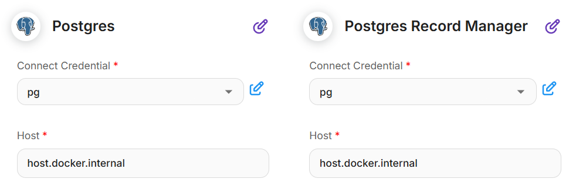

# Tools & MCP

In the previous [**Interacting with API**](interacting-with-api.md) tutorial, we explored how to enable LLMs to call external APIs. To enhance the user experience, Flowise provides a list of prebuilt tools. Refer to the [**Tools**](../integrations/langchain/tools/) section for the full list of available integrations.

In cases where the tool you need is not yet available, you can create a **Custom Tool** to suit your requirements.

## Custom Tool

We are going to use the same [Event Management Server](interacting-with-api.md#prerequisite), and create a custom tool which can call the HTTP POST request for `/events`.

<figure><figcaption></figcaption></figure>

* **Tool Name:** `create_event`
* **Tool Description:** `Use this when you want to create a new event.`
* **Input Schema:** A JSON schema of the API request body which allows LLM to know how to automatically generate the correct JSON body. For instance:
* **Javascript Function**: The actual function to execute once this tool is called

```javascript
const fetch = require('node-fetch');
const url = 'http://localhost:5566/events';
const options = {
    method: 'POST',
    headers: {
        'Content-Type': 'application/json'
    },
    body: JSON.stringify({
      name: $name,
      location: $location,
      date: $date
    })
};
try {
    const response = await fetch(url, options);
    const text = await response.text();
    return text;
} catch (error) {
    console.error(error);
    return '';
}
```

### How to use function:

* You can use any libraries imported in Flowise.
* You can use properties specified in Input Schema as variables with prefix `$`:
  * Property from Input Schema = `name`
  * Variable to be used in Function = `$name`
* You can get default flow config:
  * `$flow.sessionId`
  * `$flow.chatId`
  * `$flow.chatflowId`
  * `$flow.input`
  * `$flow.state`
* You can get custom variables: `$vars.<variable-name>`
* Must return a string value at the end of function

### Use custom tool on Agent

After custom tool has been created, you can use it on the Agent node.

<figure><figcaption></figcaption></figure>

From the Tool dropdown, select the custom tool. You can also turn on **Return Direc**t if you want to directly return the output from custom tool.

<figure><figcaption></figcaption></figure>

### Use custom tool on Tool

It can also be used as a Tool Node in a determined workflow scenario.\
In this case, **Tool Input Arguments must be explicitly defined and filled with values**, because there is no LLM to automatically determine the values.

<figure><figcaption></figcaption></figure>
