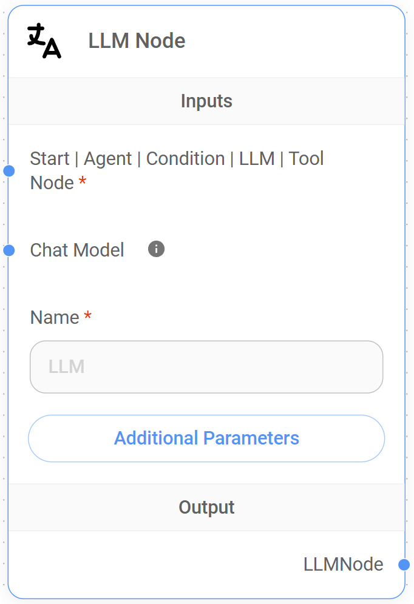
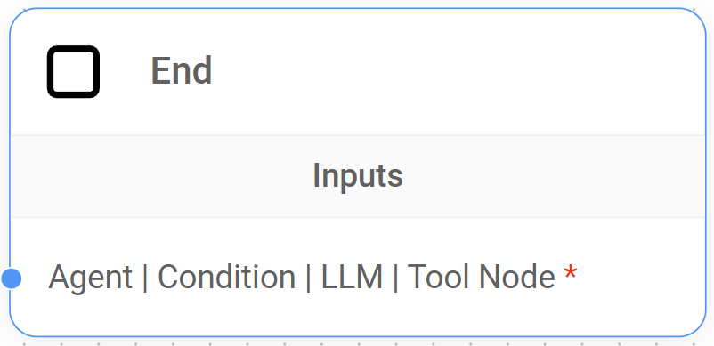

# Sequential Agents

This guide offers a complete overview of the Sequential Agent AI system architecture within Flowise, exploring its core components and workflow design principles.


**Disclaimer**: This documentation is intended to help Flowise users understand and build conversational workflows using the Sequential Agent system architecture. It is not intended to be a comprehensive technical reference for the LangGraph framework and should not be interpreted as defining industry standards or core LangGraph concepts.


## Concept

Built on top of [LangGraph](https://www.langchain.com/langgraph), Flowise's Sequential Agents architecture facilitates the **development of conversational agentic systems by structuring the workflow as a directed cyclic graph (DCG)**, allowing controlled loops and iterative processes.

This graph, composed of interconnected nodes, defines the sequential flow of information and actions, enabling the agents to process inputs, execute tasks, and generate responses in a structured manner.

<figure><figcaption></figcaption></figure>

### Understanding Sequential Agents' DCG Architecture

This architecture simplifies the management of complex conversational workflows by defining a clear and understandable sequence of operations through its DCG structure.

Let's explore some key elements of this approach:



* **Node-based processing:** Each node in the graph represents a discrete processing unit, encapsulating its own functionality like language processing, tool execution, or conditional logic.
* **Data flow as connections:** Edges in the graph represent the flow of data between nodes, where the output of one node becomes the input for the subsequent node, enabling a chain of processing steps.
* **State management:** State is managed as a shared object, persisting throughout the conversation. This allows nodes to access relevant information as the workflow progresses.



* **Flow:** The movement or direction of data within the workflow. It describes how information passes between nodes during a conversation.
* **Workflow:** The overall design and structure of the system. It's the blueprint that defines the sequence of nodes, their connections, and the logic that orchestrates the conversation flow.
* **State:** A shared data structure that represents the current snapshot of the conversation. It includes the conversation history `state.messages` and any custom State variables defined by the user.
* **Custom State:** User-defined key-value pairs added to the state object to store additional information relevant to the workflow.
* **Tool:** An external system, API, or service that can be accessed and executed by the workflow to perform specific tasks, such as retrieving information, processing data, or interacting with other applications.
* **Human-in-the-Loop (HITL):** A feature that allows human intervention in the workflow, primarily during tool execution. It enables a human reviewer to approve or reject a tool call before it's executed.
* **Parallel node execution:** It refers to the ability to execute multiple nodes concurrently within a workflow by using a branching mechanism. This means that different branches of the workflow can process information or interact with tools simultaneously, even though the overall flow of execution remains sequential.



***

## Sequential Agents vs Multi-Agents

While both Multi-Agent and Sequential Agent systems in Flowise are built upon the LangGraph framework and share the same fundamental principles, the Sequential Agent architecture provides a [lower level of abstraction](#user-content-fn-1)[^1], offering more granular control over every step of the workflow.

**Multi-Agent systems**, which are characterized by a hierarchical structure with a central supervisor agent delegating tasks to specialized worker agents, **excel at handling complex workflows by breaking them down into manageable sub-tasks**. This decomposition into sub-tasks is made possible by pre-configuring core system elements under the hood, such as condition nodes, which would require manual setup in a Sequential Agent system. As a result, users can more easily build and manage teams of agents.

In contrast, **Sequential Agent systems** operate like a streamlined assembly line, where data flows sequentially through a chain of nodes, making them ideal for tasks demanding a precise order of operations and incremental data refinement. Compared to the Multi-Agent system, its lower-level access to the underlying workflow structure makes it fundamentally more **flexible and customizable, offering parallel node execution and full control over the system logic**, incorporating conditions, state, and loop nodes into the workflow, allowing for the creation of new dynamic branching capabilities.

### Introducing State, Loop and Condition Nodes

Flowise's Sequential Agents offer new capabilities for creating conversational systems that can adapt to user input, make decisions based on context, and perform iterative tasks.

These capabilities are made possible by the introduction of four new core nodes; the State Node, the Loop Node, and two Condition Nodes.

<figure><figcaption></figcaption></figure>

* **State Node:** We define State as a shared data structure that represents the current snapshot of our application or workflow. The State Node allows us to **add a custom State** to our workflow from the start of the conversation. This custom State is accessible and modifiable by other nodes in the workflow, enabling dynamic behavior and data sharing.
* **Loop Node:** This node **introduces controlled cycles** within the Sequential Agent workflow, enabling iterative processes where a sequence of nodes can be repeated based on specific conditions. This allows agents to refine outputs, gather additional information from the user, or perform tasks multiple times.
* **Condition Nodes:** The Condition and Condition Agent Node provide the necessary control to **create complex conversational flows with branching paths**. The Condition Node evaluates conditions directly, while the Condition Agent Node uses an agent's reasoning to determine the branching logic. This allows us to dynamically guide the flow's behavior based on user input, the custom State, or results of actions taken by other nodes.

### Choosing the right system

Selecting the ideal system for your application depends on understanding your specific workflow needs. Factors like task complexity, the need for parallel processing, and your desired level of control over data flow are all key considerations.

* **For simplicity:** If your workflow is relatively straightforward, where tasks can be completed one after the other and therefore does not require parallel node execution or Human-in-the-Loop (HITL), the Multi-Agent approach offers ease of use and quick setup.
* **For flexibility:** If your workflow needs parallel execution, dynamic conversations, custom State management, and the ability to incorporate HITL, the **Sequential Agent** approach provides the necessary flexibility and control.

Here's a table comparing Multi-Agent and Sequential Agent implementations in Flowise, highlighting key differences and design considerations:

<table><thead><tr><th width="173.33333333333331"></th><th width="281">Multi-Agent</th><th>Sequential Agent</th></tr></thead><tbody><tr><td>Structure</td><td><strong>Hierarchical</strong>; Supervisor delegates to specialized Workers.</td><td><strong>Linear, cyclic and/or</strong> <strong>branching</strong>; nodes connect in a sequence, with conditional logic for branching.</td></tr><tr><td>Workflow</td><td>Flexible; designed for breaking down a complex task into a <strong>sequence of sub-tasks</strong>, completed one after another.</td><td>Highly flexible; <strong>supports parallel node execution</strong>, complex dialogue flows, branching logic, and loops within a single conversation turn.</td></tr><tr><td>Parallel Node Execution</td><td><strong>No</strong>; Supervisor handles one task at a time.</td><td><strong>Yes</strong>; can trigger multiple actions in parallel within a single run.</td></tr><tr><td>State Management</td><td><strong>Implicit</strong>; State is in place, but is not explicitly managed by the developer.</td><td><strong>Explicit</strong>; State is in place, and developers can define and manage an initial or custom State using the State Node and the "Update State" field in various nodes.</td></tr><tr><td>Tool Usage</td><td><strong>Workers</strong> can access and use tools as needed.</td><td>Tools are accessed and executed through <strong>Agent Nodes</strong> and <strong>Tool Nodes</strong>.</td></tr><tr><td>Human-in-the-Loop (HITL)</td><td>HITL is <strong>not supported.</strong></td><td><strong>Supported</strong> through the Agent Node and Tool Node's "Require Approval" feature, allowing human review and approval or rejection of tool execution.</td></tr><tr><td>Complexity</td><td>Higher level of abstraction; <strong>simplifies workflow design.</strong></td><td>Lower level of abstraction; <strong>more complex workflow design</strong>, requiring careful planning of node interactions, custom State management, and conditional logic.</td></tr><tr><td>Ideal Use Cases</td><td><ul><li>Automating linear processes (e.g., data extraction, lead generation).</li><li>Situations where sub-tasks need to be completed one after the other.</li></ul></td><td><ul><li>Building conversational systems with dynamic flows.</li><li>Complex workflows requiring parallel node execution or branching logic.</li><li>Situations where decision-making is needed at multiple points in the conversation.</li></ul></td></tr></tbody></table>


**Note**: Even though Multi-Agent systems are technically a higher-level layer built upon the Sequential Agent architecture, they offer a distinct user experience and approach to workflow design. The comparison above treats them as separate systems to help you select the best option for your specific needs.


***

## Sequential Agents Nodes

Sequential Agents bring a whole new dimension to Flowise, **introducing 10 specialized nodes**, each serving a specific purpose, offering more control over how our conversational agents interact with users, process information, make decisions, and execute actions.

The following sections aim to provide a comprehensive understanding of each node's functionality, inputs, outputs, and best practices, ultimately enabling you to craft sophisticated conversational workflows for a variety of applications.

<figure><figcaption></figcaption></figure>

***

## 1. Start Node

As its name implies, the Start Node is the **entry point for all workflows in the Sequential Agent architecture**. It receives the initial user query, initializes the conversation State, and sets the flow in motion.

<figure><figcaption></figcaption></figure>

### Understanding the Start Node

The Start Node ensures that our conversational workflows have the necessary setup and context to function correctly. **It's responsible for setting up key functionalitie**s that will be used throughout the rest of the workflow:

* **Defining the default LLM:** The Start Node requires us to specify a Chat Model (LLM) compatible with function calling, enabling agents in the workflow to interact with tools and external systems. It will be the default LLM used under the hood in the workflow.
* **Initializing Memory:** We can optionally connect an Agent Memory Node to store and retrieve conversation history, enabling more context-aware responses.
* **Setting a custom State:** By default, the State contains an immutable `state.messages` array, which acts as the transcript or history of the conversation between the user and the agents. The Start Node allows you to connect a custom State to the workflow adding a State Node, enabling the storage of additional information relevant to your workflow
* **Enabling moderation:** Optionally, we can connect Input Moderation to analyze the user's input and prevent potentially harmful content from being sent to the LLM.

### Inputs

<table><thead><tr><th width="212"></th><th width="102">Required</th><th>Description</th></tr></thead><tbody><tr><td>Chat Model</td><td><strong>Yes</strong></td><td>The default LLM that will power the conversation. Only compatible with <strong>models that are capable of function calling</strong>.</td></tr><tr><td>Agent Memory Node</td><td>No</td><td>Connect an Agent Memory Node to <strong>enable persistence and context preservation</strong>.</td></tr><tr><td>State Node</td><td>No</td><td>Connect a State Node to <strong>set a custom State</strong>, a shared context that can be accessed and modified by other nodes in the workflow.</td></tr><tr><td>Input Moderation</td><td>No</td><td>Connect a Moderation Node to <strong>filter content</strong> by detecting text that could generate harmful output, preventing it from being sent to the LLM.</td></tr></tbody></table>

### Outputs

The Start Node can connect to the following nodes as outputs:

* **Agent Node:** Routes the conversation flow to an Agent Node, which can then execute actions or access tools based on the conversation's context.
* **LLM Node:** Routes the conversation flow to an LLM Node for processing and response generation.
* **Condition Agent Node:** Connects to a Condition Agent Node to implement branching logic based on the agent's evaluation of the conversation.
* **Condition Node:** Connects to a Condition Node to implement branching logic based on predefined conditions.

### Best Practices



**Choose the right Chat Model**

Ensure your selected LLM supports function calling, a key feature for enabling agent-tool interactions. Additionally, choose an LLM that aligns with the complexity and requirements of your application. You can override the default LLM by setting it at the Agent/LLM/Condition Agent node level when necessary.

**Consider context and persistence**

If your use case demands it, utilize Agent Memory Node to maintain context and personalize interactions.



**Incorrect Chat Model (LLM) selection**

* **Problem:** The Chat Model selected in the Start Node is not suitable for the intended tasks or capabilities of the workflow, resulting in poor performance or inaccurate responses.
* **Example:** A workflow requires a Chat Model with strong summarization capabilities, but the Start Node selects a model optimized for code generation, leading to inadequate summaries.
* **Solution:** Choose a Chat Model that aligns with the specific requirements of your workflow. Consider the model's strengths, weaknesses, and the types of tasks it excels at. Refer to the documentation and experiment with different models to find the best fit.

**Overlooking Agent Memory Node configuration**

* **Problem:** The Agent Memory Node is not properly connected or configured, resulting in the loss of conversation history data between sessions.
* **Example:** You intend to use persistent memory to store user preferences, but the Agent Memory Node is not connected to the Start Node, causing preferences to be reset on each new conversation.
* **Solution:** Ensure that the Agent Memory Node is connected to the Start Node and configured with the appropriate database (SQLite). For most use cases, the default SQLite database will be sufficient.

**Inadequate Input Moderation**

* **Problem:** The "Input Moderation" is not enabled or configured correctly, allowing potentially harmful or inappropriate user input to reach the LLM and generate undesirable responses.
* **Example:** A user submits offensive language, but the input moderation fails to detect it or is not set up at all, allowing the query to reach the LLM.
* **Solution:** Add and configure an input moderation node in the Start Node to filter out potentially harmful or inappropriate language. Customize the moderation settings to align with your specific requirements and use cases.



## 2. Agent Memory Node

The Agent Memory Node **provides a mechanism for persistent memory storage**, allowing the Sequential Agent workflow to retain the conversation history `state.messages` and any custom State previously defined across multiple interactions

This long-term memory is essential for agents to learn from previous interactions, maintain context over extended conversations, and provide more relevant responses.

<figure><figcaption></figcaption></figure>

### Where the data is recorded

By default, Flowise utilizes its **built-in SQLite database** to store conversation history and custom state data, creating a "**checkpoints**" table to manage this persistent information.

#### Understanding the "checkpoints" table structure and data format

This table **stores snapshots of the system's State at various points during a conversation**, enabling the persistence and retrieval of conversation history. Each row represents a specific point or "checkpoint" in the workflow's execution.

<figure><figcaption></figcaption></figure>

#### Table structure

* **thread\_id:** A unique identifier representing a specific conversation session, **our session ID**. It groups together all checkpoints related to a single workflow execution.
* **checkpoint\_id:** A unique identifier for each execution step (node execution) within the workflow. It helps track the order of operations and identify the State at each step.
* **parent\_id:** Indicates the checkpoint\_id of the preceding execution step that led to the current checkpoint. This establishes a hierarchical relationship between checkpoints, allowing for the reconstruction of the workflow's execution flow.
* **checkpoint:** Contains a JSON string representing the current State of the workflow at that specific checkpoint. This includes the values of variables, the messages exchanged, and any other relevant data captured at that point in the execution.
* **metadata:** Provides additional context about the checkpoint, specifically related to node operations.

#### How it works

As a Sequential Agent workflow executes, the system records a checkpoint in this table for each significant step. This mechanism provides several benefits:

* **Execution tracking:** Checkpoints enable the system to understand the execution path and the order of operations within the workflow.
* **State management:** Checkpoints store the State of the workflow at each step, including variable values, conversation history, and any other relevant data. This allows the system to maintain contextual awareness and make informed decisions based on the current State.
* **Workflow resumption:** If the workflow is paused or interrupted (e.g., due to a system error or user request), the system can use the stored checkpoints to resume execution from the last recorded State. This ensures that the conversation or task continues from where it left off, preserving the user's progress and preventing data loss.

### **Inputs**

The Agent Memory Node has **no specific input connections**.

### Node Setup

<table><thead><tr><th width="189"></th><th width="107">Required</th><th>Description</th></tr></thead><tbody><tr><td>Database</td><td><strong>Yes</strong></td><td>The type of database used for storing conversation history. Currently, <strong>only SQLite is supported</strong>.</td></tr></tbody></table>

### Additional Parameters

<table><thead><tr><th width="189"></th><th width="107">Required</th><th>Description</th></tr></thead><tbody><tr><td>Database File Path</td><td>No</td><td>The file path to the SQLite database file. <strong>If not provided, the system will use a default location</strong>.</td></tr></tbody></table>

### **Outputs**

The Agent Memory Node interacts solely with the **Start Node**, making the conversation history available from the very beginning of the workflow.

### **Best Practices**



**Strategic use**

Employ Agent Memory only when necessary. For simple, stateless interactions, it might be overkill. Reserve it for scenarios where retaining information across turns or sessions is essential.



**Unnecessary overhead**

* **The Problem:** Using Agent Memory for every interaction, even when not needed, introduces unnecessary storage and processing overhead. This can slow down response times and increase resource consumption.
* **Example:** A simple weather chatbot that provides information based on a single user request doesn't need to store conversation history.
* **Solution:** Analyze the requirements of your system and only utilize Agent Memory when persistent data storage is essential for functionality or user experience.



***

## 3. State Node

The State Node, which can only be connected to the Start Node, **provides a mechanism to set a user-defined or custom State** into our workflow from the start of the conversation. This custom State is a JSON object that is shared and can be updated by nodes in the graph, passing from one node to another as the flow progresses.

<figure><figcaption></figcaption></figure>

### Understanding the State Node

By default, the State includes a `state.messages` array, which acts as our conversation history. This array stores all messages exchanged between the user and the agents, or any other actors in the workflow, preserving it throughout the workflow execution.

Since by definition this `state.messages` array is immutable and cannot be modified, **the purpose of the State Node is to allow us to define custom key-value pairs**, expanding the state object to hold any additional information relevant to our workflow.


When no **Agent Memory Node** is used, the State operates in-memory and is not persisted for future use.


### Inputs

The State Node has **no specific input connections**.

### Outputs

The State Node can only connect to the **Start Node**, allowing the setup of a custom State from the beginning of the workflow and allowing other nodes to access and potentially modify this shared custom State.

### Additional Parameters

<table><thead><tr><th width="157"></th><th width="113">Required</th><th>Description</th></tr></thead><tbody><tr><td>Custom State</td><td><strong>Yes</strong></td><td>A JSON object representing the <strong>initial custom State of the workflow</strong>. This object can contain any key-value pairs relevant to the application.</td></tr></tbody></table>

### How to set a custom State <a href="#alert-dialog-title" id="alert-dialog-title"></a>

Specify the **key**, **operation type**, and **default value** for the state object. The operation type can be either "Replace" or "Append".

* **Replace**
  1. Replace the existing value with the new value.
  2. If the new value is null, the existing value will be retained.
* **Append**
  1. Append the new value to the existing value.
  2. Default values can be empty or an array. Ex: \["a", "b"]
  3. Final value is an array.

#### Example using JS


```javascript
{
    aggregate: {
        value: (x, y) => x.concat(y), // here we append the new message to the existing messages
        default: () => []
    }
}
```


#### Example using Table

To define a custom State using the table interface in the State Node, follow these steps:

1. **Add item:** Click the "+ Add Item" button to add rows to the table. Each row represents a key-value pair in your custom State.
2. **Specify keys:** In the "Key" column, enter the name of each key you want to define in your state object. For example, you might have keys like "userName", "userLocation", etc.
3. **Choose operations:** In the "Operation" column, select the desired operation for each key. You have two options:
   * **Replace:** This will replace the existing value of the key with the new value provided by a node. If the new value is null, the existing value will be retained.
   * **Append:** This will append the new value to the existing value of the key. The final value will be an array.
4. **Set default values:** In the "Default Value" column, enter the initial value for each key. This value will be used if no other node provides a value for the key. The default value can be empty or an array.

#### Example Table

| Key      | Operation | Default Value |
| -------- | --------- | ------------- |
| userName | Replace   | null          |

<figure><figcaption></figcaption></figure>

1. This table defines one key in the custom State: `userName`.
2. The `userName` key will use the "Replace" operation, meaning its value will be updated whenever a node provides a new value.
3. The `userName` key has a default value of _null,_ indicating that it has no initial value.


Remember that this table-based approach is an alternative to defining the custom State using JavaScript. Both methods achieve the same result.


#### Example using API

```json
{
    "question": "hello",
    "overrideConfig": {
        "stateMemory": [
            {
                "Key": "userName",
                "Operation": "Replace",
                "Default Value": "somevalue"
            }
        ]
    }
}
```

### Best Practices



**Plan your custom State structure**

Before building your workflow, design the structure of your custom State. A well-organized custom State will make your workflow easier to understand, manage, and debug.

**Use meaningful key names**

Choose descriptive and consistent key names that clearly indicate the purpose of the data they hold. This will improve the readability of your code and make it easier for others (or you in the future) to understand how the custom State is being used.

**Keep custom State minimal**

Only store information in the custom State that is essential for the workflow's logic and decision-making.

**Consider State persistence**

If you need to preserve State across multiple conversation sessions (e.g., for user preferences, order history, etc.), use the Agent Memory Node to store the State in a persistent database.



**Inconsistent State Updates**

* **Problem:** Updating the custom State in multiple nodes without a clear strategy can lead to inconsistencies and unexpected behavior.
* **Example**
  1. Agent 1 updates `orderStatus` to "Payment Confirmed".
  2. Agent 2, in a different branch, updates `orderStatus` to "Order Complete" without checking the previous status.
* **Solution:** Use Conditions Nodes to control the flow of the custom State updates and ensure that custom State transitions happen in a logical and consistent manner.



***

## 4. Agent Node

The Agent Node is a **core component of the Sequential Agent architecture.** It acts as a decision-maker and orchestrator within our workflow.

<figure><figcaption></figcaption></figure>

### Understanding the Agent Node

Upon receiving input from preceding nodes, which always includes the full conversation history `state.messages` and any custom State at that point in the execution, the Agent Node uses its defined "persona", established by the System Prompt, to determine if external tools are necessary to fulfill the user's request.

* If tools are required, the Agent Node autonomously selects and executes the appropriate tool. This execution can be automatic or, for sensitive tasks, require human approval (HITL) before proceeding. Once the tool completes its operation, the Agent Node receives the results, processes them using the designated Chat Model (LLM), and generates a comprehensive response.
* In cases where no tools are needed, the Agent Node directly leverages the Chat Model (LLM) to formulate a response based on the current conversation context.

### Inputs

<table><thead><tr><th width="195"></th><th width="107">Required</th><th>Description</th></tr></thead><tbody><tr><td>External Tools</td><td>No</td><td>Provides the Agent Node with <strong>access to a suite of external tools</strong>, enabling it to perform actions and retrieve information.</td></tr><tr><td>Chat Model</td><td>No</td><td>Add a new Chat Model to <strong>overwrite the default Chat Model</strong> (LLM) of the workflow. Only compatible with models that are capable of function calling.</td></tr><tr><td>Start Node</td><td><strong>Yes</strong></td><td>Receives the <strong>initial user input</strong>, along with the custom State (if set up) and the rest of the default <code>state.messages</code> array from the Start Node.</td></tr><tr><td>Condition Node</td><td><strong>Yes</strong></td><td>Receives input from a preceding Condition Node, enabling the Agent Node to <strong>take actions or guide the conversation based on the outcome of the Condition Node's evaluation</strong>.</td></tr><tr><td>Condition Agent Node</td><td><strong>Yes</strong></td><td>Receives input from a preceding Condition Agent Node, enabling the Agent Node to <strong>take actions or guide the conversation based on the outcome of the Condition Agent Node's evaluation</strong>.</td></tr><tr><td>Agent Node</td><td><strong>Yes</strong></td><td>Receives input from a preceding Agent Node, <strong>enabling chained agent actions</strong> and maintaining conversational context</td></tr><tr><td>LLM Node</td><td><strong>Yes</strong></td><td>Receives the output from LLM Node, enabling the Agent Node to <strong>process the LLM's response</strong>.</td></tr><tr><td>Tool Node</td><td><strong>Yes</strong></td><td>Receives the output from a Tool Node, enabling the Agent Node to <strong>process and integrate tool's outputs into its response</strong>.</td></tr></tbody></table>


The **Agent Node requires at least one connection from the following nodes**: Start Node, Agent Node, Condition Node, Condition Agent Node, LLM Node, or Tool Node.


### Outputs

The Agent Node can connect to the following nodes as outputs:

* **Agent Node:** Passes control to a subsequent Agent Node, enabling the chaining of multiple agent actions within a workflow. This allows for more complex conversational flows and task orchestration.
* **LLM Node:** Passes the agent's output to an LLM Node, enabling further language processing, response generation, or decision-making based on the agent's actions and insights.
* **Condition Agent Node:** Directs the flow to a Condition Agent Node. This node evaluates the Agent Node's output and its predefined conditions to determine the appropriate next step in the workflow.
* **Condition Node:** Similar to the Condition Agent Node, the Condition Node uses predefined conditions to assess the Agent Node's output, directing the flow along different branches based on the outcome.
* **End Node:** Concludes the conversation flow.
* **Loop Node:** Redirects the flow back to a previous node, enabling iterative or cyclical processes within the workflow. This is useful for tasks that require multiple steps or involve refining results based on previous interactions. For example, you might loop back to an earlier Agent Node or LLM Node to gather additional information or refine the conversation flow based on the current Agent Node's output.

### Node Setup

<table><thead><tr><th width="201"></th><th width="101">Required</th><th>Description</th></tr></thead><tbody><tr><td>Agent Name</td><td><strong>Yes</strong></td><td>Add a descriptive name to the Agent Node to enhance workflow readability and easily <strong>target it back when using loops</strong> within the workflow.</td></tr><tr><td>System Prompt</td><td>No</td><td>Defines the <strong>agent's 'persona'</strong> and <strong>guides its behavior</strong>. For example, "<em>You are a customer service agent specializing in technical support</em> [...]."</td></tr><tr><td>Require Approval</td><td>No</td><td><strong>Activates the Human-in-the-loop (HITL) feature</strong>. If set to '<strong>True</strong>,' the Agent Node will request human approval before executing any tool. This is particularly valuable for sensitive operations or when human oversight is desired. Defaults to '<strong>False</strong>,' allowing the Agent Node to execute tools autonomously.</td></tr></tbody></table>

### Additional Parameters

<table><thead><tr><th width="200"></th><th width="102">Required</th><th>Description</th></tr></thead><tbody><tr><td>Human Prompt</td><td>No</td><td>This prompt is appended to the <code>state.messages</code> array as a human message. It allows us to <strong>inject a human-like message into the conversation flow</strong> after the Agent Node has processed its input and before the next node receives the Agent Node's output.</td></tr><tr><td>Approval Prompt</td><td>No</td><td><strong>A customizable prompt presented to the human reviewer when the HITL feature is active</strong>. This prompt provides context about the tool execution, including the tool's name and purpose. The variable <code>{tools}</code> within the prompt will be dynamically replaced with the actual list of tools suggested by the agent, ensuring the human reviewer has all necessary information to make an informed decision.</td></tr><tr><td>Approve Button Text</td><td>No</td><td>Customizes <strong>the text displayed on the button for approving tool execution</strong> in the HITL interface. This allows for tailoring the language to the specific context and ensuring clarity for the human reviewer.</td></tr><tr><td>Reject Button Text</td><td>No</td><td>Customizes the <strong>text displayed on the button for rejecting tool execution</strong> in the HITL interface. Like the Approve Button Text, this customization enhances clarity and provides a clear action for the human reviewer to take if they deem the tool execution unnecessary or potentially harmful.</td></tr><tr><td>Update State</td><td>No</td><td>Provides a <strong>mechanism to modify the shared custom State object within the workflow</strong>. This is useful for storing information gathered by the agent or influencing the behavior of subsequent nodes.</td></tr><tr><td>Max Iteration</td><td>No</td><td>Limits the <strong>number of iterations</strong> an Agent Node can make within a single workflow execution.</td></tr></tbody></table>

### Best Practices



**Clear system prompt**

Craft a concise and unambiguous System Prompt that accurately reflects the agent's role and capabilities. This guides the agent's decision-making and ensures it acts within its defined scope.

**Strategic tool selection**

Choose and configure the tools available to the Agent Node, ensuring they align with the agent's purpose and the overall goals of the workflow.

**HITL for sensitive tasks**

Utilize the 'Require Approval' option for tasks involving sensitive data, requiring human judgment, or carrying a risk of unintended consequences.

**Leverage custom State updates**

Update the custom State object strategically to store gathered information or influence the behavior of downstream nodes.



**Agent inaction due to tool overload**

* **Problem:** When an Agent Node has access to a large number of tools within a single workflow execution, it might struggle to decide which tool is the most appropriate to use, even when a tool is clearly necessary. This can lead to the agent failing to call any tool at all, resulting in incomplete or inaccurate responses.
* **Example:** Imagine a customer support agent designed to handle a wide range of inquiries. You've equipped it with tools for order tracking, billing information, product returns, technical support, and more. A user asks, "What's the status of my order?" but the agent, overwhelmed by the number of potential tools, responds with a generic answer like, "I can help you with that. What's your order number?" without actually using the order tracking tool.
* **Solution**
  1. **Refine system prompts:** Provide clearer instructions and examples within the Agent Node's System Prompt to guide it towards the correct tool selection. If needed, emphasize the specific capabilities of each tool and the situations in which they should be used.
  2. **Limit tool choices per node:** If possible, break down complex workflows into smaller, more manageable segments, each with a more focused set of tools. This can help reduce the cognitive load on the agent and improve its tool-selection accuracy.

**Overlooking HITL for sensitive tasks**

* **Problem:** Failing to utilize the Agent Node's "Require Approval" (HITL) feature for tasks involving sensitive information, critical decisions, or actions with potential real-world consequences can lead to unintended outcomes or damage to user trust.
* **Example:** Your travel booking agent has access to a user's payment information and can automatically book flights and hotels. Without HITL, a misinterpretation of user intent or an error in the agent's understanding could result in an incorrect booking or unauthorized use of the user's payment details.
* **Solution**
  1. **Identify sensitive actions:** Analyze your workflow and identify any actions that involve accessing or processing sensitive data (e.g., payment info, personal details).
  2. **Implement "Require Approval":** For these sensitive actions, enable the "Require Approval" option within the Agent Node. This ensures that a human reviews the agent's proposed action and the relevant context before any sensitive data is accessed or any irreversible action is taken.
  3. **Design clear approval prompts:** Provide clear and concise prompts for human reviewers, summarizing the agent's intent, the proposed action, and the relevant information needed for the reviewer to make an informed decision.

**Unclear or incomplete system prompt**

* **Problem:** The System Prompt provided to the Agent Node lacks the necessary specificity and context to guide the agent effectively in carrying out its intended tasks. A vague or overly general prompt can lead to irrelevant responses, difficulty in understanding user intent, and an inability to leverage tools or data appropriately.
* **Example:** You're building a travel booking agent, and your System Prompt simply states "_You are a helpful AI assistant._" This lacks the specific instructions and context needed for the agent to effectively guide users through flight searches, hotel bookings, and itinerary planning.
* **Solution:** Craft a detailed and context-aware System Prompt:


```
You are a travel booking agent. Your primary goal is to assist users in planning and booking their trips. 
- Guide them through searching for flights, finding accommodations, and exploring destinations.
- Be polite, patient, and offer travel recommendations based on their preferences.
- Utilize available tools to access flight data, hotel availability, and destination information.
```




***

## 5. LLM Node

Like the Agent Node, the LLM Node is a **core component of the Sequential Agent architecture**. Both nodes utilize the same Chat Models (LLMs) by default, providing the same basic language processing capabilities, but the LLM Node distinguishes itself in these key areas.

<figure><figcaption></figcaption></figure>

### Key advantages of the LLM Node

While a detailed comparison between the LLM Node and the Agent Node is available in [this section](sequential-agents.md#agent-node-vs.-llm-node-selecting-the-optimal-node-for-conversational-tasks), here's a brief overview of the **LLM Node's key advantages**:

* **Structured data:** The LLM Node provides a dedicated feature to define a JSON schema for its output. This makes it exceptionally easy to extract structured information from the LLM's responses and pass that data to consequent nodes in the workflow. The Agent Node does not have this built-in JSON schema feature
* **HITL:** While both nodes support HITL for tool execution, the LLM Node defers this control to the Tool Node itself, providing more flexibility in workflow design.

### Inputs

<table><thead><tr><th width="184"></th><th width="111">Required</th><th>Description</th></tr></thead><tbody><tr><td>Chat Model</td><td>No</td><td>Add a new Chat Model to <strong>overwrite the default Chat Model</strong> (LLM) of the workflow. Only compatible with models that are capable of function calling.</td></tr><tr><td>Start Node</td><td><strong>Yes</strong></td><td>Receives the <strong>initial user input</strong>, along with the custom State (if set up) and the rest of the default <code>state.messages</code> array from the Start Node.</td></tr><tr><td>Agent Node</td><td><strong>Yes</strong></td><td>Receives output from an Agent Node, which may include tool execution results or agent-generated responses.</td></tr><tr><td>Condition Node</td><td><strong>Yes</strong></td><td>Receives input from a preceding Condition Node, enabling the LLM Node to <strong>take actions or guide the conversation based on the outcome of the Condition Node's evaluation</strong>.</td></tr><tr><td>Condition Agent Node</td><td><strong>Yes</strong></td><td>Receives input from a preceding Condition Agent Node, enabling the LLM Node to <strong>take actions or guide the conversation based on the outcome of the Condition Agent Node's evaluation</strong>.</td></tr><tr><td>LLM Node</td><td><strong>Yes</strong></td><td>Receives output from another LLM Node, <strong>enabling chained reasoning</strong> or information processing across multiple LLM Nodes.</td></tr><tr><td>Tool Node</td><td><strong>Yes</strong></td><td>Receives output from a Tool Node, <strong>providing the results of tool execution for further processing</strong> or response generation.</td></tr></tbody></table>


The **LLM Node requires at least one connection from the following nodes**: Start Node, Agent Node, Condition Node, Condition Agent Node, LLM Node, or Tool Node.


### **Node Setup**

<table><thead><tr><th width="240"></th><th width="118">Required</th><th>Description</th></tr></thead><tbody><tr><td>LLM Node Name</td><td><strong>Yes</strong></td><td>Add a descriptive name to the LLM Node to enhance workflow readability and easily <strong>target it back when using loops</strong> within the workflow.</td></tr></tbody></table>

### Outputs

The LLM Node can connect to the following nodes as outputs:

* **Agent Node:** Passes the LLM's output to an Agent Node, which can then use the information to decide on actions, execute tools, or guide the conversation flow.
* **LLM Node:** Passes the output to a subsequent LLM Node, enabling chaining of multiple LLM operations. This is useful for tasks like refining text generation, performing multiple analyses, or breaking down complex language processing into stages.
* **Tool Node**: Passes the output to a Tool Node, enabling the execution of a specific tool based on the LLM Node's instructions.
* **Condition Agent Node:** Directs the flow to a Condition Agent Node. This node evaluates the LLM Node's output and its predefined conditions to determine the appropriate next step in the workflow.
* **Condition Node:** Similar to the Condition Agent Node, the Condition Node uses predefined conditions to assess the LLM Node's output, directing the flow along different branches based on the outcome.
* **End Node:** Concludes the conversation flow.
* **Loop Node:** Redirects the flow back to a previous node, enabling iterative or cyclical processes within the workflow. This could be used to refine the LLM's output over multiple iterations.

### Additional Parameters

<table><thead><tr><th width="200"></th><th width="141">Required</th><th>Description</th></tr></thead><tbody><tr><td>System Prompt</td><td>No</td><td>Defines the <strong>agent's 'persona' and guides its behavior</strong>. For example, "<em>You are a customer service agent specializing in technical support</em> [...]."</td></tr><tr><td>Human Prompt</td><td>No</td><td>This prompt is appended to the <code>state.messages</code> array as a human message. It allows us to <strong>inject a human-like message into the conversation flow</strong> after the LLM Node has processed its input and before the next node receives the LLM Node's output.</td></tr><tr><td>JSON Structured Output</td><td>No</td><td>To instruct the LLM (Chat Model) to <strong>provide the output in JSON structure schema</strong> (Key, Type, Enum Values, Description).</td></tr><tr><td>Update State</td><td>No</td><td>Provides a <strong>mechanism to modify the shared custom State object within the workflow</strong>. This is useful for storing information gathered by the LLM Node or influencing the behavior of subsequent nodes.</td></tr></tbody></table>

### Best Practices



**Clear system prompt**

Craft a concise and unambiguous System Prompt that accurately reflects the LLM Node's role and capabilities. This guides the LLM Node's decision-making and ensures it acts within its defined scope.

**Optimize for structured output**

Keep your JSON schemas as straightforward as possible, focusing on the essential data elements. Only enable JSON Structured Output when you need to extract specific data points from the LLM's response or when downstream nodes require JSON input.

**Strategic tool selection**

Choose and configure the tools available to the LLM Node (via the Tool Node), ensuring they align with the application purpose and the overall goals of the workflow.

**HITL for sensitive tasks**

Utilize the 'Require Approval' option for tasks involving sensitive data, requiring human judgment, or carrying a risk of unintended consequences.

**Leverage State updates**

Update the custom State object strategically to store gathered information or influence the behavior of downstream nodes.



**Unintentional tool execution due to Incorrect HITL setup**

* **Problem:** While the LLM Node can trigger Tool Nodes, it relies on the Tool Node's configuration for Human-in-the-Loop (HITL) approval. Failing to properly configure HITL for sensitive actions can lead to tools being executed without human review, potentially causing unintended consequences.
* **Example:** Your LLM Node is designed to interact with a tool that makes changes to user data. You intend to have a human review these changes before execution, but the connected Tool Node's "Require Approval" option is not enabled. This could result in the tool automatically modifying user data based solely on the LLM's output, without any human oversight.
* **Solution**
  1. **Double-Check tool node settings:** Always ensure that the "Require Approval" option is enabled within the settings of any Tool Node that handles sensitive actions.
  2. **Test HITL thoroughly:** Before deploying your workflow, test the HITL process to ensure that human review steps are triggered as expected and that the approval/rejection mechanism functions correctly.

**Overuse or misunderstanding of JSON structured output**

* **Problem:** While the LLM Node's JSON Structured Output feature is powerful, misusing it or not fully understanding its implications can lead to data errors.
* **Example:** You define a complex JSON schema for the LLM Node's output, even though the downstream tasks only require a simple text response. This adds unnecessary complexity and makes your workflow harder to understand and maintain. Additionally, if the LLM's output doesn't conform to the defined schema, it can cause errors in subsequent nodes.
* **Solution**
  1. **Use JSON output strategically:** Only enable JSON Structured Output when you have a clear need to extract specific data points from the LLM's response or when the downstream Tool Nodes require JSON input.
  2. **Keep schemas simple:** Design your JSON schemas to be as simple and concise as possible, focusing only on the data elements that are absolutely necessary for the task.



***

## 6. Tool Node

The Tool Node is a valuable component of Flowise's Sequential Agent system, **enabling the integration and execution of external tools** within conversational workflows. It acts as a bridge between the language-based processing of LLM Nodes and the specialized functionalities of external tools, APIs, or services.

<figure><figcaption></figcaption></figure>

### Understanding the Tool Node

The Tool Node's primary function is to **execute external tools** based on instructions received from an LLM Node and to **provide flexibility for Human-in-the-Loop (HITL)** intervention in the tool execution process.

#### Here's a step-by-step explanation of how it works

1. **Tool Call Reception:** The Tool Node receives input from an LLM Node. If the LLM's output contains the `tool_calls` property, the Tool Node will proceed with tool execution.
2. **Execution:** The Tool Node directly passes the LLM's `tool_calls` (which include the tool name and any required parameters) to the specified external tool. Otherwise, the Tool Node does not execute any tools in that particular workflow execution. It does not process or interpret the LLM's output in any way.
3. **Human-in-the-Loop (HITL):** The Tool Node allows for optional HITL, enabling human review and approval or rejection of tool execution before it occurs.
4. **Output passing:** After the tool execution (either automatic or after HITL approval), the Tool Node receives the tool's output and passes it to the next node in the workflow. If the Tool Node's output is not connected to a subsequent node, the tool's output is returned to the original LLM Node for further processing.

### Inputs

<table><thead><tr><th width="164"></th><th width="107">Required</th><th>Description</th></tr></thead><tbody><tr><td>LLM Node</td><td><strong>Yes</strong></td><td>Receives the output from an LLM Node, which may or may not contain <code>tool_calls</code> property. If it is present, the Tool Node will use them to execute the specified tool.</td></tr><tr><td>External Tools</td><td>No</td><td>Provides the Tool Node with <strong>access to a suite of external tools</strong>, enabling it to perform actions and retrieve information.</td></tr></tbody></table>

### Node Setup

<table><thead><tr><th width="183"></th><th width="101">Required</th><th>Description</th></tr></thead><tbody><tr><td>Tool Node Name</td><td><strong>Yes</strong></td><td>Add a descriptive name to the Tool Node to enhance workflow readability.</td></tr><tr><td>Require Approval (HITL)</td><td>No</td><td><strong>Activates the Human-in-the-loop (HITL) feature</strong>. If set to '<strong>True</strong>,' the Tool Node will request human approval before executing any tool. This is particularly valuable for sensitive operations or when human oversight is desired. Defaults to '<strong>False</strong>,' allowing the Tool Node to execute tools autonomously.</td></tr></tbody></table>

### Outputs

The Tool Node can connect to the following nodes as outputs:

* **Agent Node:** Passes the Tool Node's output (the result of the executed tool) to an Agent Node. The Agent Node can then use this information to decide on actions, execute further tools, or guide the conversation flow.
* **LLM Node:** Passes the output to a subsequent LLM Node. This enables the integration of tool results into the LLM's processing, allowing for further analysis or refinement of the conversation flow based on the tool's output.
* **Condition Agent Node:** Directs the flow to a Condition tool Node. This node evaluates the Tool Node's output and its predefined conditions to determine the appropriate next step in the workflow.
* **Condition Node:** Similar to the Condition Agent Node, the Condition Node uses predefined conditions to assess the Tool Node's output, directing the flow along different branches based on the outcome.
* **End Node:** Concludes the conversation flow.
* **Loop Node:** Redirects the flow back to a previous node, enabling iterative or cyclical processes within the workflow. This could be used for tasks that require multiple tool executions or involve refining the conversation based on tool results.

### Additional Parameters

<table><thead><tr><th width="200"></th><th width="102">Required</th><th>Description</th></tr></thead><tbody><tr><td>Approval Prompt</td><td>No</td><td><strong>A customizable prompt presented to the human reviewer when the HITL feature is active</strong>. This prompt provides context about the tool execution, including the tool's name and purpose. The variable <code>{tools}</code> within the prompt will be dynamically replaced with the actual list of tools suggested by the LLM Node, ensuring the human reviewer has all necessary information to make an informed decision.</td></tr><tr><td>Approve Button Text</td><td>No</td><td>Customizes <strong>the text displayed on the button for approving tool execution</strong> in the HITL interface. This allows for tailoring the language to the specific context and ensuring clarity for the human reviewer.</td></tr><tr><td>Reject Button Text</td><td>No</td><td>Customizes the <strong>text displayed on the button for rejecting tool execution</strong> in the HITL interface. Like the Approve Button Text, this customization enhances clarity and provides a clear action for the human reviewer to take if they deem the tool execution unnecessary or potentially harmful.</td></tr><tr><td>Update State</td><td>No</td><td>Provides a <strong>mechanism to modify the custom State object within the workflow</strong>. This is useful for storing information gathered by the Tool Node (after the tool execution) or influencing the behavior of subsequent nodes.</td></tr></tbody></table>

### Best Practices



**Strategic HITL placement**

Consider which tools require human oversight (HITL) and enable the "Require Approval" option accordingly.

**Informative Approval Prompts**

When using HITL, design clear and informative prompts for human reviewers. Provide sufficient context from the conversation and summarize the tool's intended action.



**Unhandled tool output formats**

* **Problem:** The Tool Node outputs data in a format that is not expected or handled by subsequent nodes in the workflow, leading to errors or incorrect processing.
* **Example:** A Tool Node retrieves data from an API in JSON format, but the following LLM Node expects text input, causing a parsing error.
* **Solution:** Ensure that the output format of the external tool is compatible with the input requirements of the nodes connected to the Tool Node's output.



***

## 7. Condition Node

The Condition Node acts as a **decision-making point in Sequential Agent workflows**, evaluating a set of predefined conditions to determine the flow's next path.

<figure><figcaption></figcaption></figure>

### Understanding the Condition Node

The Condition Node is essential for building workflows that adapt to different situations and user inputs. It examines the current State of the conversation, which includes all messages exchanged and any custom State variables previously defined. Then, based on the evaluation of the conditions specified in the node setup, the Condition Node directs the flow to one of its outputs.

For instance, after an Agent or LLM Node provides a response, a Condition Node could check if the response contains a specific keyword or if a certain condition is met in the custom State. If it does, the flow might be directed to an Agent Node for further action. If not, it could lead to a different path, perhaps ending the conversation or prompting the user with additional questions.

This enables us to **create branches in our workflow**, where the path taken depends on the data flowing through the system.

#### Here's a step-by-step explanation of how it works

1. The Condition Node receives input from any preceding node: Start Node, Agent Node, LLM Node, or Tool Node.
2. It has access to the full conversation history and the custom State (if any), giving it plenty of context to work with.
3. We define a condition that the node will evaluate. This could be checking for keywords, comparing values in the state, or any other logic we could implement via JavaScript.
4. Based on whether the condition evaluates to **true** or **false**, the Condition Node sends the flow down one of its predefined output paths. This creates a "fork in the road" or branch for our workflow.

### How to set up conditions

The Condition Node allows us to define dynamic branching logic in our workflow by choosing either a **table-based interface** or a **JavaScript code editor** to define the conditions that will control the conversation flow.

<figure><figcaption></figcaption></figure>

<details>

<summary>Conditions using CODE</summary>

The **Condition Node uses JavaScript** to evaluate specific conditions within the conversation flow.

We can set up conditions based on keywords, State changes, or other factors to dynamically guide the workflow to different branches based on the context of the conversation. Here are some examples:

**Keyword condition**

This checks if a specific word or phrase exists in the conversation history.

* **Example:** We want to check if the user said "yes" in their last message.


```javascript
const lastMessage = $flow.state.messages[$flow.state.messages.length - 1].content; 
return lastMessage.includes("yes") ? "Output 1" : "Output 2";
```


1. This code gets the last message from state.messages and checks if it contains "yes".
2. If "yes" is found, the flow goes to "Output 1"; otherwise, it goes to "Output 2".

**State change condition**

This checks if a specific value in the custom State has changed to a desired value.

* **Example:** We're tracking an orderStatus variable our custom State, and we want to check if it has become "confirmed".


```javascript
return $flow.state.orderStatus === "confirmed" ? "Output 1" : "Output 2";
```


1. This code directly compares the orderStatus value in our custom State to "confirmed".
2. If it matches, the flow goes to "Output 1"; otherwise, it goes to "Output 2".

</details>

<details>

<summary>Conditions using TABLE</summary>

The Condition Node allows us to define conditions using a **user-friendly table interface**, making it easy to create dynamic workflows without writing JavaScript code.

You can set up conditions based on keywords, State changes, or other factors to guide the conversation flow along different branches. Here are some examples:

**Keyword condition**

This checks if a specific word or phrase exists in the conversation history.

* **Example:** We want to check if the user said "yes" in their last message.
*   **Setup**

    <table data-header-hidden><thead><tr><th width="294"></th><th width="116"></th><th width="99"></th><th></th></tr></thead><tbody><tr><td><strong>Variable</strong></td><td><strong>Operation</strong></td><td><strong>Value</strong></td><td><strong>Output Name</strong></td></tr><tr><td>$flow.state.messages[-1].content</td><td>Is</td><td>Yes</td><td>Output 1</td></tr></tbody></table>

    1. This table entry checks if the content (.content) of the last message (\[-1]) in `state.messages` is equal to "Yes".
    2. If the condition is met, the flow goes to "Output 1". Otherwise, the workflow is directed to a default "End" output.

**State change condition**

This checks if a specific value in our custom State has changed to a desired value.

* **Example:** We're tracking an orderStatus variable in our custom State, and we want to check if it has become "confirmed".
*   **Setup**

    <table data-header-hidden><thead><tr><th width="266"></th><th width="113"></th><th></th><th></th></tr></thead><tbody><tr><td><strong>Variable</strong></td><td><strong>Operation</strong></td><td><strong>Value</strong></td><td><strong>Output Name</strong></td></tr><tr><td>$flow.state.orderStatus</td><td>Is</td><td>Confirmed</td><td>Output 1</td></tr></tbody></table>

    1. This table entry checks if the value of orderStatus in the custom State is equal to "confirmed".
    2. If the condition is met, the flow goes to "Output 1". Otherwise, the workflow is directed to a default "End" output.

</details>

### Defining conditions using the table interface

This visual approach allows you to easily set up rules that determine the path of your conversational flow, based on factors like user input, the current state of the conversation, or the results of actions taken by other nodes.

<details>

<summary>Table-Based: Condition Node</summary>

*   **Updated on 09/08/2024**

    <table><thead><tr><th width="134"></th><th width="189">Description</th><th>Options/Syntax</th></tr></thead><tbody><tr><td><strong>Variable</strong></td><td>The variable or data element to evaluate in the condition.</td><td>- <code>$flow.state.messages.length</code> (Total Messages)<br>- <code>$flow.state.messages[0].con</code> (First Message Content)<br>- <code>$flow.state.messages[-1].con</code> (Last Message Content)<br>- <code>$vars.&#x3C;variable-name></code> (Global variable)</td></tr><tr><td><strong>Operation</strong></td><td>The comparison or logical operation to perform on the variable.</td><td>- Contains<br>- Not Contains<br>- Start With<br>- End With<br>- Is<br>- Is Not<br>- Is Empty<br>- Is Not Empty<br>- Greater Than<br>- Less Than<br>- Equal To<br>- Not Equal To<br>- Greater Than or Equal To<br>- Less Than or Equal To</td></tr><tr><td><strong>Value</strong></td><td>The value to compare the variable against.</td><td>- Depends on the data type of the variable and the selected operation.<br>- Examples: "yes", 10, "Hello"</td></tr><tr><td><strong>Output Name</strong></td><td>The name of the output path to follow if the condition evaluates to <code>true</code>.</td><td>- User-defined name (e.g., "Agent1", "End", "Loop")</td></tr></tbody></table>

</details>

### Inputs

<table><thead><tr><th width="167"></th><th width="118">Required</th><th>Description</th></tr></thead><tbody><tr><td>Start Node</td><td><strong>Yes</strong></td><td>Receives the State from the Start Node. This allows the Condition Node to <strong>evaluate conditions based on the initial context of the conversation</strong>, including any custom State.</td></tr><tr><td>Agent Node</td><td><strong>Yes</strong></td><td>Receives the Agent Node's output. This enables the Condition Node to <strong>make decisions based on the agent's actions</strong> and the conversation history, including any custom State.</td></tr><tr><td>LLM Node</td><td><strong>Yes</strong></td><td>Receives the LLM Node's output. This allows the Condition Node to <strong>evaluate conditions based on the LLM's response</strong> and the conversation history, including any custom State.</td></tr><tr><td>Tool Node</td><td><strong>Yes</strong></td><td>Receives the Tool Node's output. This enables the Condition Node to <strong>make decisions based on the results of tool execution</strong> and the conversation history, including any custom State.</td></tr></tbody></table>


The **Condition Node requires at least one connection from the following nodes**: Start Node, Agent Node, LLM Node, or Tool Node.


### Outputs

The Condition Node **dynamically determines its output path based on the predefined conditions**, using either the table-based interface or JavaScript. This provides flexibility in directing the workflow based on condition evaluations.

#### Condition evaluation logic

* **Table-Based conditions:** The conditions in the table are evaluated sequentially, from top to bottom. The first condition that evaluates to true triggers its corresponding output. If none of the predefined conditions are met, the workflow is directed to the default "End" output.
* **Code-Based conditions:** When using JavaScript, we must explicitly return the name of the desired output path, including a name for the default "End" output.
* **Single output path:** Only one output path is activated at a time. Even if multiple conditions could be true, only the first matching condition determines the flow.

#### Connecting outputs

Each predefined output, including the default "End" output, can be connected to any of the following nodes:

* **Agent Node:** To continue the conversation with an agent, potentially taking actions based on the condition's outcome.
* **LLM Node:** To process the current State and conversation history with an LLM, generating responses or making further decisions.
* **End Node:** To terminate the conversation flow. If any output, including the default "End" output, is connected to an End Node, the Condition Node will output the last response from the preceding node and end the workflow.
* **Loop Node:** To redirect the flow back to a previous sequential node, enabling iterative processes based on the condition's outcome.

### Node Setup

<table><thead><tr><th width="178"></th><th width="110">Required</th><th>Description</th></tr></thead><tbody><tr><td>Condition Node Name</td><td>No</td><td>An optional, <strong>human-readable name</strong> for the condition being evaluated. This is helpful for understanding the workflow at a glance.</td></tr><tr><td>Condition</td><td><strong>Yes</strong></td><td>This is where we <strong>define the logic that will be evaluated to determine the output paths</strong>.</td></tr></tbody></table>

### Best Practices



**Clear condition naming**

Use descriptive names for your conditions (e.g., "If user is under 18, then Policy Advisor Agent", "If order is confirmed, then End Node") to make your workflow easier to understand and debug.

**Prioritize simple conditions**

Start with simple conditions and gradually add complexity as needed. This makes your workflow more manageable and reduces the risk of errors.



**Mismatched condition logic and workflow design**

* **Problem:** The conditions you define in the Condition Node do not accurately reflect the intended logic of your workflow, leading to unexpected branching or incorrect execution paths.
* **Example:** You set up a condition to check if the user's age is greater than 18, but the output path for that condition leads to a section designed for users under 18.
* **Solution:** Review your conditions and ensure that the output paths associated with each condition match the intended workflow logic. Use clear and descriptive names for your outputs to avoid confusion.

**Insufficient State management**

* **Problem:** The Condition Node relies on a custom state variable that is not updated correctly, leading to inaccurate condition evaluations and incorrect branching.
* **Example:** You're tracking a "userLocation" variable in the custom State, but the variable is not updated when the user provides their location. The Condition Node evaluates the condition based on the outdated value, leading to an incorrect path.
* **Solution:** Ensure that any custom state variables used in your conditions are updated correctly throughout the workflow.



***

## 8. Condition Agent Node

The Condition Agent Node provides **dynamic and intelligent routing within Sequential Agent flows**. It combines the capabilities of the **LLM Node** (LLM and JSON Structured Output) and the **Condition Node** (user-defined conditions), allowing us to leverage agent-based reasoning and conditional logic within a single node.

<figure><figcaption></figcaption></figure>

### Key functionalities

* **Unified agent-based routing:** Combines agent reasoning, structured output, and conditional logic in a single node, simplifying workflow design.
* **Contextual awareness:** The agent considers the entire conversation history and any custom State when evaluating conditions.
* **Flexibility:** Provides both table-based and code-based options for defining conditions, when catering to different user preferences and skill levels.

### Setting up the Condition Agent Node

The Condition Agent Node acts as a specialized agent that can both **process information and make routing decisions**. Here's how to configure it:

1. **Define the agent's persona**
   * In the "System Prompt" field, provide a clear and concise description of the agent's role and the task it needs to perform for conditional routing. This prompt will guide the agent's understanding of the conversation and its decision-making process.
2. **Structure the Agent's Output (Optional)**
   * If you want the agent to produce structured output, use the "JSON Structured Output" feature. Define the desired schema for the output, specifying the keys, data types, and any enum values. This structured output will be used by the agent when evaluating conditions.
3. **Define conditions**
   * Choose either the table-based interface or the JavaScript code editor to define the conditions that will determine the routing behavior.
     * **Table-Based interface:** Add rows to the table, specifying the variable to check, the comparison operation, the value to compare against, and the output name to follow if the condition is met.
     * **JavaScript code:** Write custom JavaScript snippets to evaluate conditions. Use the `return` statement to specify the name of the output path to follow based on the condition's result.
4. **Connect outputs**
   * Connect each predefined output, including the default "End" output, to the appropriate subsequent node in the workflow. This could be an Agent Node, LLM Node, Loop Node, or an End Node.

### How to set up conditions

The Condition Agent Node allows us to define dynamic branching logic in our workflow by choose either a **table-based interface** or a **JavaScript code editor** to define the conditions that will control the conversation flow.

<figure><figcaption></figcaption></figure>

<details>

<summary>Conditions using CODE</summary>

The Condition Agent Node, like the Condition Node, **uses JavaScript code to evaluate specific conditions** within the conversation flow.

However, the Condition Agent Node can evaluate conditions based on a wider range of factors, including keywords, state changes, and the content of its own output (either as free-form text or structured JSON data). This allows for more nuanced and context-aware routing decisions. Here are some examples:

**Keyword condition**

This checks if a specific word or phrase exists in the conversation history.

* **Example:** We want to check if the user said "yes" in their last message.


```javascript
const lastMessage = $flow.state.messages[$flow.state.messages.length - 1].content; 
return lastMessage.includes("yes") ? "Output 1" : "Output 2";
```


1. This code gets the last message from state.messages and checks if it contains "yes".
2. If "yes" is found, the flow goes to "Output 1"; otherwise, it goes to "Output 2".

**State change condition**

This checks if a specific value in the custom State has changed to a desired value.

* **Example:** We're tracking an orderStatus variable our custom State, and we want to check if it has become "confirmed".


```javascript
return $flow.state.orderStatus === "confirmed" ? "Output 1" : "Output 2";
```


1. This code directly compares the orderStatus value in our custom State to "confirmed".
2. If it matches, the flow goes to "Output 1"; otherwise, it goes to "Output 2".

</details>

<details>

<summary>Conditions using TABLE</summary>

The Condition Agent Node also provides a **user-friendly table interface for defining conditions**, similar to the Condition Node. You can set up conditions based on keywords, state changes, or the agent's own output, allowing you to create dynamic workflows without writing JavaScript code.

This table-based approach simplifies condition management and makes it easier to visualize the branching logic. Here are some examples:

**Keyword condition**

This checks if a specific word or phrase exists in the conversation history.

* **Example:** We want to check if the user said "yes" in their last message.
*   **Setup**

    <table data-header-hidden><thead><tr><th width="305"></th><th width="116"></th><th width="99"></th><th></th></tr></thead><tbody><tr><td><strong>Variable</strong></td><td><strong>Operation</strong></td><td><strong>Value</strong></td><td><strong>Output Name</strong></td></tr><tr><td>$flow.state.messages[-1].content</td><td>Is</td><td>Yes</td><td>Output 1</td></tr></tbody></table>

    1. This table entry checks if the content (.content) of the last message (\[-1]) in `state.messages` is equal to "Yes".
    2. If the condition is met, the flow goes to "Output 1". Otherwise, the workflow is directed to a default "End" output.

**State change condition**

This checks if a specific value in our custom State has changed to a desired value.

* **Example:** We're tracking an orderStatus variable in our custom State, and we want to check if it has become "confirmed".
*   **Setup**

    <table data-header-hidden><thead><tr><th width="266"></th><th width="113"></th><th></th><th></th></tr></thead><tbody><tr><td><strong>Variable</strong></td><td><strong>Operation</strong></td><td><strong>Value</strong></td><td><strong>Output Name</strong></td></tr><tr><td>$flow.state.orderStatus</td><td>Is</td><td>Confirmed</td><td>Output 1</td></tr></tbody></table>

    1. This table entry checks if the value of orderStatus in the custom State is equal to "confirmed".
    2. If the condition is met, the flow goes to "Output 1". Otherwise, the workflow is directed to a default "End" output.

</details>

### Defining conditions using the table interface

This visual approach allows you to easily set up rules that determine the path of your conversational flow, based on factors like user input, the current state of the conversation, or the results of actions taken by other nodes.

<details>

<summary>Table-Based: Condition Agent Node</summary>

*   **Updated on 09/08/2024**

    <table><thead><tr><th width="125"></th><th width="186">Description</th><th>Options/Syntax</th></tr></thead><tbody><tr><td><strong>Variable</strong></td><td>The variable or data element to evaluate in the condition. This can include data from the agent's output.</td><td>- <code>$flow.output.content</code> (Agent Output - string)<br>- <code>$flow.output.&#x3C;replace-with-key></code> (Agent's JSON Key Output - string/number)<br>- <code>$flow.state.messages.length</code> (Total Messages)<br>- <code>$flow.state.messages[0].con</code> (First Message Content)<br>- <code>$flow.state.messages[-1].con</code> (Last Message Content)<br>- <code>$vars.&#x3C;variable-name></code> (Global variable)</td></tr><tr><td><strong>Operation</strong></td><td>The comparison or logical operation to perform on the variable.</td><td>- Contains<br>- Not Contains<br>- Start With<br>- End With<br>- Is<br>- Is Not<br>- Is Empty<br>- Is Not Empty<br>- Greater Than<br>- Less Than<br>- Equal To<br>- Not Equal To<br>- Greater Than or Equal To<br>- Less Than or Equal To</td></tr><tr><td><strong>Value</strong></td><td>The value to compare the variable against.</td><td>- Depends on the data type of the variable and the selected operation.<br>- Examples: "yes", 10, "Hello"</td></tr><tr><td><strong>Output Name</strong></td><td>The name of the output path to follow if the condition evaluates to <code>true</code>.</td><td>- User-defined name (e.g., "Agent1", "End", "Loop")</td></tr></tbody></table>

</details>

### Inputs

<table><thead><tr><th width="167"></th><th width="118">Required</th><th>Description</th></tr></thead><tbody><tr><td>Start Node</td><td>Yes</td><td>Receives the State from the Start Node. This allows the Condition Agent Node to <strong>evaluate conditions based on the initial context</strong> of the conversation, including any custom State.</td></tr><tr><td>Agent Node</td><td>Yes</td><td>Receives the Agent Node's output. This enables the Condition Agent Node to <strong>make decisions based on the agent's actions</strong> and the conversation history, including any custom State.</td></tr><tr><td>LLM Node</td><td>Yes</td><td>Receives LLM Node's output. This allows the Condition Agent Node to <strong>evaluate conditions based on the LLM's response</strong> and the conversation history, including any custom State.</td></tr><tr><td>Tool Node</td><td>Yes</td><td>Receives the Tool Node's output. This enables the Condition Agent Node to <strong>make decisions based on the results of tool execution</strong> and the conversation history, including any custom State.</td></tr></tbody></table>


The **Condition Agent Node requires at least one connection from the following nodes**: Start Node, Agent Node, LLM Node, or Tool Node.


### Node Setup

<table><thead><tr><th width="178">Parameter</th><th width="110">Required</th><th>Description</th></tr></thead><tbody><tr><td>Name</td><td>No</td><td>Add a descriptive name to the Condition Agent Node to enhance workflow readability and easily.</td></tr><tr><td>Condition</td><td><strong>Yes</strong></td><td>This is where we <strong>define the logic that will be evaluated to determine the output paths</strong>.</td></tr></tbody></table>

### Outputs

The Condition Agent Node, like the Condition Node, **dynamically determines its output path based on the conditions defined**, using either the table-based interface or JavaScript. This provides flexibility in directing the workflow based on condition evaluations.

#### Condition evaluation logic

* **Table-Based conditions:** The conditions in the table are evaluated sequentially, from top to bottom. The first condition that evaluates to true triggers its corresponding output. If none of the predefined conditions are met, the workflow is directed to the default "End" output.
* **Code-Based conditions:** When using JavaScript, we must explicitly return the name of the desired output path, including a name for the default "End" output.
* **Single output path:** Only one output path is activated at a time. Even if multiple conditions could be true, only the first matching condition determines the flow.

#### Connecting outputs

Each predefined output, including the default "End" output, can be connected to any of the following nodes:

* **Agent Node:** To continue the conversation with an agent, potentially taking actions based on the condition's outcome.
* **LLM Node:** To process the current State and conversation history with an LLM, generating responses or making further decisions.
* **End Node:** To terminate the conversation flow. If the default "End" output is connected to an End Node, the Condition Node will output the last response from the preceding node and end the conversation.
* **Loop Node:** To redirect the flow back to a previous sequential node, enabling iterative processes based on the condition's outcome.

#### Key differences from the Condition Node

* The Condition **Agent Node incorporates an agent's reasoning** and structured output into the condition evaluation process.
* It provides a more integrated approach to agent-based condition routing.

### Additional Parameters

<table><thead><tr><th width="180"></th><th width="111">Required</th><th>Description</th></tr></thead><tbody><tr><td>System Prompt</td><td>No</td><td><strong>Defines the Condition Agent's 'persona' and guides its behavior for making routing decisions.</strong> For example: "You are a customer service agent specializing in technical support. Your goal is to help customers with technical issues related to our product. Based on the user's query, identify the specific technical issue (e.g., connectivity problems, software bugs, hardware malfunctions)."</td></tr><tr><td>Human Prompt</td><td>No</td><td>This prompt is appended to the <code>state.messages</code> array as a human message. It allows us to <strong>inject a human-like message into the conversation flow</strong> after the Condition Agent Node has processed its input and before the next node receives the Condition Agent Node's output.</td></tr><tr><td>JSON Structured Output</td><td>No</td><td>To instruct the Condition Agent Node to <strong>provide the output in JSON structure schema</strong> (Key, Type, Enum Values, Description).</td></tr></tbody></table>

### Best Practices



**Craft a clear and focused system prompt**

Provide a well-defined persona and clear instructions to the agent in the System Prompt. This will guide its reasoning and help it generate relevant output for the conditional logic.

**Structure output for reliable conditions**

Use the JSON Structured Output feature to define a schema for the Condition Agent's output. This will ensure that the output is consistent and easily parsable, making it more reliable for use in conditional evaluations.



**Unreliable routing due to unstructured output**

* **Problem:** The Condition Agent Node is not configured to output structured JSON data, leading to unpredictable output formats that can make it difficult to define reliable conditions.
* **Example:** The Condition Agent Node is asked to determine user sentiment (positive, negative, neutral) but outputs its assessment as a free-form text string. The variability in the agent's language makes it challenging to create accurate conditions in the conditional table or code.
* **Solution:** Use the JSON Structured Output feature to define a schema for the agent's output. For example, specify a "sentiment" key with an enum of "positive," "negative," and "neutral." This will ensure that the agent's output is consistently structured, making it much easier to create reliable conditions.



***

## 9. Loop Node

The Loop Node allows us to create loops within our conversational flow, **redirecting the conversation back to a specific point**. This is useful for scenarios where we need to repeat a certain sequence of actions or questions based on user input or specific conditions.

<figure><figcaption></figcaption></figure>

### Understanding the Loop Node

The Loop Node acts as a connector, redirecting the flow back to a specific point in the graph, allowing us to create loops within our conversational flow. **It passes the current State, which includes the output of the node preceding the Loop Node to our target node.** This data transfer allows our target node to process information from the previous iteration of the loop and adjust its behavior accordingly.

For instance, let's say we're building a chatbot that helps users book flights. We might use a loop to iteratively refine the search criteria based on user feedback.

#### Here's how the Loop Node could be used

1. **LLM Node (Initial Search):** The LLM Node receives the user's initial flight request (e.g., "Find flights from Madrid to New York in July"). It queries a flight search API and returns a list of possible flights.
2. **Agent Node (Present Options):** The Agent Node presents the flight options to the user and asks if they would like to refine their search (e.g., "Would you like to filter by price, airline, or departure time?").
3. **Condition Agent Node:** The Condition Agent Node checks the user's response and has two outputs:
   * **If the user wants to refine:** The flow goes to the "Refine Search" LLM Node.
   * **If the user is happy with the results:** The flow proceeds to the booking process.
4. **LLM Node (Refine Search):** This LLM Node gathers the user's refinement criteria (e.g., "Show me only flights under $500") and updates the State with the new search parameters.
5. **Loop Node:** The Loop Node redirects the flow back to the initial LLM Node ("Initial Search"). It passes the updated State, which now includes the refined search criteria.
6. **Iteration:** The initial LLM Node performs a new search using the refined criteria, and the process repeats from step 2.

**In this example, the Loop Node enables an iterative search refinement process.** The system can continue to loop back and refine the search results until the user is satisfied with the options presented.

### Inputs

<table><thead><tr><th width="197"></th><th width="104">Required</th><th>Description</th></tr></thead><tbody><tr><td>Agent Node</td><td><strong>Yes</strong></td><td>Receives the output of a preceding Agent Node. This data is then sent back to the target node specified in the "Loop To" parameter.</td></tr><tr><td>LLM Node</td><td><strong>Yes</strong></td><td>Receives the output of a preceding LLM Node. This data is then sent back to the target node specified in the "Loop To" parameter.</td></tr><tr><td>Tool Node</td><td><strong>Yes</strong></td><td>Receives the output of a preceding Tool Node. This data is then sent back to the target node specified in the "Loop To" parameter.</td></tr><tr><td>Condition Node</td><td><strong>Yes</strong></td><td>Receives the output of a preceding Condition Node. This data is then sent back to the target node specified in the "Loop To" parameter.</td></tr><tr><td>Condition Agent Node</td><td><strong>Yes</strong></td><td>Receives the output of a preceding Condition Agent Node. This data is then sent back to the target node specified in the "Loop To" parameter.</td></tr></tbody></table>


The **Loop Node requires at least one connection from the following nodes**: Agent Node, LLM Node, Tool Node, Condition Node, or Condition Agent Node.


### Node Setup

<table><thead><tr><th width="125"></th><th width="109">Required</th><th>Description</th></tr></thead><tbody><tr><td>Loop To</td><td><strong>Yes</strong></td><td>The Loop Node requires us to <strong>specify the target node</strong> ("Loop To") where the conversational flow should be redirected. This target node must be an <strong>Agent Node</strong> or <strong>LLM Node</strong>.</td></tr></tbody></table>

### Outputs

The **Loop Node does not have any direct output connections**. It redirects the flow back to the specific sequential node in the graph.

### Best Practices



**Clear loop purpose**

Define a clear purpose for each loop in your workflow. If possible, document with a sticky note what you're trying to achieve with the loop.



**Confusing workflow structure**

* **Problem:** Excessive or poorly designed loops make the workflow difficult to understand and maintain.
* **Example:** You use multiple nested loops without clear purpose or labels, making it hard to follow the flow of the conversation.
* **Solution:** Use loops sparingly and only when necessary. Clearly document your Loop Nodes and the nodes they connect to.

**Infinite loops due to missing or incorrect exit conditions**

* **Problem:** The loop never terminates because the condition that should trigger the loop's exit is either missing or incorrectly defined.
* **Example:** A Loop Node is used to iteratively gather user information. However, the workflow lacks a Conditional Agent Node to check if all required information has been collected. As a result, the loop continues indefinitely, repeatedly asking the user for the same information.
* **Solution:** Always define clear and accurate exit conditions for loops. Use Condition Nodes to check state variables, user input, or other factors that indicate when the loop should terminate.



***

## 10. End Node

The End Node marks the definitive **termination point of the conversation** in a Sequential Agent workflow. It signifies that no further processing, actions, or interactions are required.

<figure><figcaption></figcaption></figure>

### Understanding the End Node

The End Node serves as a signal within Flowise's Sequential Agent architecture, **indicating that the conversation has reached its intended conclusion**. Upon reaching the End Node, the system "understands" that the conversational objective has been met, and no further actions or interactions are required within the flow.

### Inputs

<table><thead><tr><th width="212"></th><th width="103">Required</th><th>Description</th></tr></thead><tbody><tr><td>Agent Node</td><td><strong>Yes</strong></td><td>Receives the final output from a preceding Agent Node, indicating the end of the agent's processing.</td></tr><tr><td>LLM Node</td><td><strong>Yes</strong></td><td>Receives the final output from a preceding LLM Node, indicating the end of the LLM Node's processing.</td></tr><tr><td>Tool Node</td><td><strong>Yes</strong></td><td>Receives the final output from a preceding Tool Node, indicating the completion of the Tool Node's execution.</td></tr><tr><td>Condition Node</td><td><strong>Yes</strong></td><td>Receives the final output from a preceding Condition Node, indicating the end of the Condition Node's execution.</td></tr><tr><td>Condition Agent Node</td><td><strong>Yes</strong></td><td>Receives the final output from a preceding Condition Node, indicating the completion of the Condition Agent Node's processing.</td></tr></tbody></table>


The **End Node requires at least one connection from the following nodes**: Agent Node, LLM Node, or Tool Node.


### Outputs

The **End Node does not have any output** connections as it signifies the termination of the information flow.

### Best Practices



**Provide a final response**

If appropriate, connect the End Node to an dedicated LLM or Agent Node to generate a final message or summary for the user, providing closure to the conversation.



**Premature conversation termination**

* **Problem:** The End Node is placed too early in the workflow, causing the conversation to end before all necessary steps are completed or the user's request is fully addressed.
* **Example:** A chatbot designed to collect user feedback ends the conversation after the user provides their first comment, without giving them an opportunity to provide additional feedback or ask questions.
* **Solution:** Review your workflow logic and ensure that the End Node is placed only after all essential steps have been completed or the user has explicitly indicated their intent to end the conversation.

**Lack of closure for the user**

* **Problem:** The conversation ends abruptly without a clear signal to the user or a final message that provides a sense of closure.
* **Example:** A customer support chatbot ends the conversation immediately after resolving an issue, without confirming the resolution with the user or offering further assistance.
* **Solution:** Connect the End Node to a dedicate LLM or Agent Node to generate a final response that summarizes the conversation, confirms any actions taken, and provides a sense of closure for the user.



***

## Condition Node vs. Condition Agent Node

The Condition and Condition Agent Nodes are essential in Flowise's Sequential Agent architecture for creating dynamic conversational experiences.

These nodes enable adaptive workflows, responding to user input, context, and complex decisions, but differ in their approach to condition evaluation and sophistication.

<details>

<summary><strong>Condition Node</strong></summary>

**Purpose**

To create branches based on simple, predefined logical conditions.

**Condition evaluation**

Uses a table-based interface or JavaScript code editor to define conditions that are checked against the custom State and/or the full conversation history.

**Output behavior**

* Supports multiple output paths, each associated with a specific condition.
* Conditions are evaluated in order. The first matching condition determines the output.
* If no conditions are met, the flow follows a default "End" output.

**Best suited for**

* Straightforward routing decisions based on easily definable conditions.
* Workflows where the logic can be expressed using simple comparisons, keyword checks, or custom state variable values.

</details>

<details>

<summary><strong>Condition Agent Node</strong></summary>

**Purpose**

To create dynamic routing based on an agent's analysis of the conversation and its structured output.

**Condition evaluation**

* If no Chat Model is connected, it uses the default system LLM (from the Start Node) to process the conversation history and any custom State.
* It can generate structured output, which is then used for condition evaluation.
* Uses a table-based interface or JavaScript code editor to define conditions that are checked against the agent's own output, structured or not.

**Output behavior**

Same as the Condition Node:

* Supports multiple output paths, each associated with a specific condition.
* Conditions are evaluated in order. The first matching condition determines the output.
* If no conditions are met, the flow follows the default "End" output.

**Best suited for**

* More complex routing decisions that require an understanding of conversation context, user intent, or nuanced factors.
* Scenarios where simple logical conditions are insufficient to capture the desired routing logic.
* **Example:** A chatbot needs to determine if a user's question is related to a specific product category. A Condition Agent Node could be used to analyze the user's query and output a JSON object with a "category" field. The Condition Agent Node can then use this structured output to route the user to the appropriate product specialist.

</details>

### Summarizing

<table><thead><tr><th width="218"></th><th width="258">Condition Node</th><th>Condition Agent Node</th></tr></thead><tbody><tr><td><strong>Decision Logic</strong></td><td>Based on predefined logical conditions.</td><td>Based on agent's reasoning and structured output.</td></tr><tr><td><strong>Agent Involvement</strong></td><td>No agent involved in condition evaluation.</td><td>Uses an agent to process context and generate output for conditions.</td></tr><tr><td><strong>Structured Output</strong></td><td>Not possible.</td><td>Possible and encouraged for reliable condition evaluation.</td></tr><tr><td><strong>Condition Evaluation</strong></td><td>Only define conditions that are checked against the full conversation history.</td><td>Can define conditions that are checked against the agent's own output, structured or not.</td></tr><tr><td><strong>Complexity</strong></td><td>Suitable for simple branching logic.</td><td>Handles more nuanced and context-aware routing.</td></tr><tr><td><strong>Ideal Uses Cases</strong></td><td><ul><li>Routing based on user's age or a keyword in the conversation.</li></ul></td><td><ul><li>Routing based on user sentiment, intent, or complex contextual factors.</li></ul></td></tr></tbody></table>

### Choosing the right node

* **Condition Node:** Use the Condition Node when your routing logic involves straightforward decisions based on easily definable conditions. For instance, it's perfect for checking for specific keywords, comparing values in the State, or evaluating other simple logical expressions.
* **Condition Agent Node:** However, when your routing demands a deeper understanding of the conversation's nuances, the Condition Agent Node is the better choice. This node acts as your intelligent routing assistant, leveraging an LLM to analyze the conversation, make judgments based on context, and provide structured output that drives more sophisticated and dynamic routing.

***

## Agent Node vs. LLM Node

It's important to understand that both the **LLM Node and the Agent Node can be considered agentic entities within our system**, as they both leverage the capabilities of a large language model (LLM) or Chat Model.

However, while both nodes can process language and interact with tools, they are designed for different purposes within a workflow.

<details>

<summary>Agent Node</summary>

**Focus**

The primary focus of the Agent Node to simulate the actions and decision-making of a human agent within a conversational context.

It acts as a high-level coordinator within the workflow, bringing together language understanding, tool execution, and decision-making to create a more human-like conversational experience.

**Strengths**

* Effectively manages the execution of multiple tools and integrates their results.
* Offers built-in support for Human-in-the-Loop (HITL), enabling human review and approval for sensitive operations.

**Best Suited For**

* Workflows where the agent needs to guide the user, gather information, make choices, and manage the overall conversation flow.
* Scenarios requiring integration with multiple external tools.
* Tasks involving sensitive data or actions where human oversight is beneficial, like approving financial transaction

</details>

<details>

<summary>LLM Node</summary>

**Focus**

Similar to the Agent Node, but it provides more flexibility when using tools and Human-in-the-Loop (HITL), both via the Tool Node.

**Strengths**

* Enables the definition of JSON schemas to structure the LLM's output, making it easier to extract specific information.
* Offers flexibility in tool integration, allowing for more complex sequences of LLM and tool calls, and providing fine-grained control over the HITL feature.

**Best Suited For**

* Scenarios where structured data needs to be extracted from the LLM's response.
* Workflows requiring a mix of automated and human-reviewed tool executions. For example, an LLM Node might call a tool to retrieve product information (automated), and then a different tool to process a payment, which would require HITL approval.

</details>

### Summarizing

<table><thead><tr><th width="206"></th><th width="253">Agent Node</th><th>LLM Node</th></tr></thead><tbody><tr><td><strong>Tool Interaction</strong></td><td>Directly calls and manages multiple tools, built-in HITL.</td><td>Triggers tools via the Tool Node, granular HITL control at the tool level.</td></tr><tr><td><strong>Human-in-the-Loop (HITL)</strong></td><td>HITL controlled at the Agent Node level (all connected tools affected).</td><td>HITL managed at the individual Tool Node level (more flexibility).</td></tr><tr><td><strong>Structured Output</strong></td><td>Relies on the LLM's natural output format.</td><td>Relies on the LLM's natural output format, but, if needed, provides JSON schema definition to structure LLM output.</td></tr><tr><td><strong>Ideal Use Cases</strong></td><td><ul><li>Workflows with complex tool orchestration.</li><li>Simplified HITL at the Agent Level.</li></ul></td><td><ul><li>Extracting structured data from LLM output</li><li>Workflows with complex LLM and tool interactions, requiring mixed HITL levels.</li></ul></td></tr></tbody></table>

### Choosing the right node

* **Choose the Agent Node:** Use the Agent Node when you need to create a conversational system that can manage the execution of multiple tools, all of which share the same HITL setting (enabled or disabled for the entire Agent Node). The Agent Node is also well-suited for handling complex multi-step conversations where consistent agent-like behavior is desired.
* **Choose the LLM Node:** On the other hand, use the LLM Node when you need to extract structured data from the LLM's output using the JSON schema feature, a capability not available in the Agent Node. The LLM Node also excels at orchestrating tool execution with fine-grained control over HITL at the individual tool level, allowing you to mix automated and human-reviewed tool executions by using multiple Tool Nodes connected to the LLM Node.

[^1]: In our current context, a lower level of abstraction refers to a system that exposes a greater degree of implementation detail to the developer.
