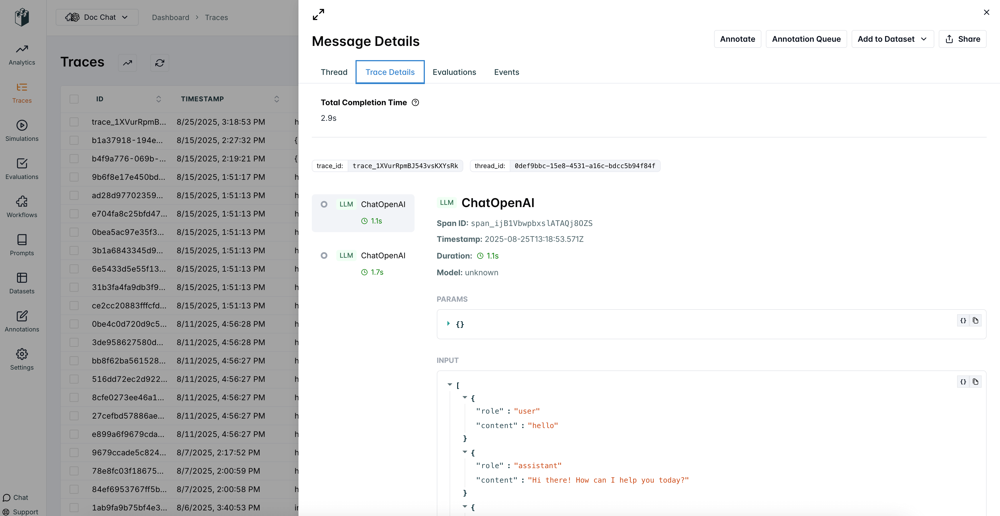

# LangWatch

---

[Langwatch](https://langwatch.ai) is a production-grade observability and LLMOps platform designed to monitor, debug, and enhance LLM applications and AI Agents at scale.

## Setup

1. At the top right corner of your Chatflow or Agentflow, click **Settings** > **Configuration**

<figure><figcaption></figcaption></figure>

2. Then go to the Analyse Chatflow section

<figure><figcaption></figcaption></figure>

3. You will see a list of providers, along with their configuration fields. Click on LangWatch.

<figure><figcaption></figcaption></figure>

4. If you haven't already, sign up for a free account [here](https://app.langwatch.ai) to get your API key.

5. Fill in the configuration details, then turn the provider **ON** and click **Save**

<figure><figcaption></figcaption></figure>

6. You can now use LangWatch to analyze and troubleshoot your chatflows and agentflows. Refer to the [official guide](https://docs.langwatch.ai) for more details.

<figure><figcaption></figcaption></figure>
