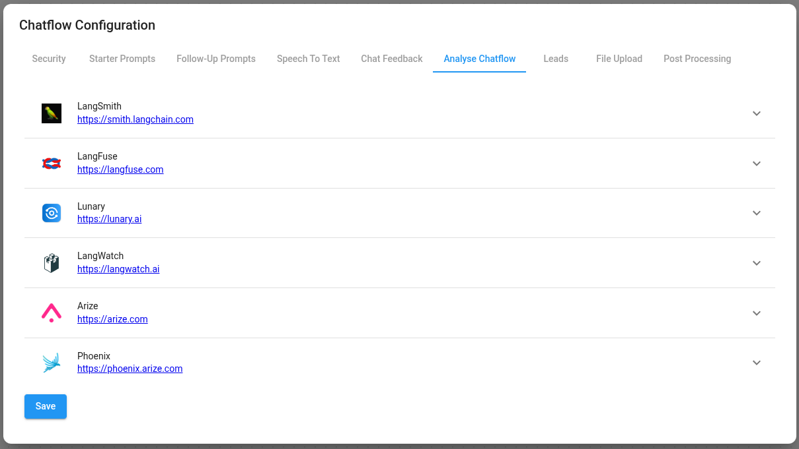

# Opik

***

## Setup

1. At the top right corner of your Chatflow or Agentflow, click **Settings** > **Configuration**

<figure><figcaption></figcaption></figure>

2. Then go to the Analyse Chatflow section

<figure><figcaption></figcaption></figure>

3. You will see a list of providers, along with their configuration fields. Click on Opik.

<figure><figcaption></figcaption></figure>

4. Create credentials for Opik. Refer to the [official guide](https://www.comet.com/docs/opik/tracing/sdk_configuration) on how to get the Opik API key.

<figure><figcaption></figcaption></figure>

5. Fill in other configuration details, then turn the provider **ON**

<figure><figcaption></figcaption></figure>

Now you can analyze your chatflows and agentflows using Opik UI:

<figure><figcaption></figcaption></figure>