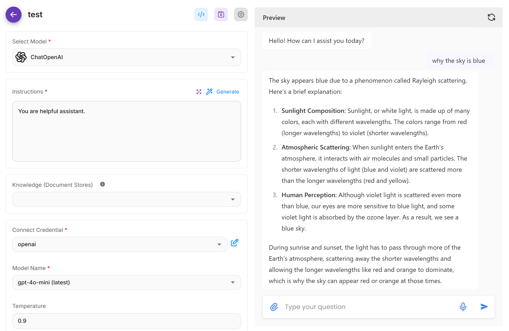

# Introduction

<figure><picture><source srcset=".gitbook/assets/Flowise Logo Cropped White High Res.png" media="(prefers-color-scheme: dark)"></picture><figcaption></figcaption></figure>

**Flowise** es una plataforma de desarrollo de IA generativa de código abierto para construir Agentes de IA y flujos de trabajo con modelos de lenguaje (LLM).

Ofrece una solución completa que incluye:

* [x] Constructor visual
* [x] Trazabilidad y análisis
* [x] Evaluaciones
* [x] Intervención humana (Human in the Loop)
* [x] API, SDK y chatbot embebido
* [x] Equipos y espacios de trabajo

Existen tres constructores visuales principales:

* Assistant
* Chatflow
* Agentflow

## Assistant

Assistant es la forma más amigable para principiantes de crear un Agente de IA. Los usuarios pueden crear un asistente conversacional capaz de seguir instrucciones, utilizar herramientas cuando sea necesario y recuperar información desde archivos subidos (RAG) para responder a consultas del usuario.

<figure><picture><source srcset=".gitbook/assets/Screenshot 2025-05-12 215934.png" media="(prefers-color-scheme: dark)"></picture><figcaption></figcaption></figure>

## Chatflow

Chatflow está diseñado para construir sistemas de agente único, chatbots y flujos simples con modelos de lenguaje (LLM). Es más flexible que Assistant. Los usuarios pueden utilizar técnicas avanzadas como Graph RAG, Reranker, código personalizado, entre otros.

<figure><picture><source srcset=".gitbook/assets/dark.png" media="(prefers-color-scheme: dark)"></picture><figcaption></figcaption></figure>

## Agentflow

Agentflow es el superconjunto de Chatflow y Assistant. Se puede utilizar para crear asistentes conversacionales, sistemas de agente único, sistemas multi-agente y orquestaciones de flujo de trabajo complejas.

<figure><figcaption></figcaption></figure>

### Ve Flowise en acción

En esta demo de inicio rápido de 2 minutos, aprenderás los fundamentos básicos de cómo funciona Flowise.


Construyendo una aplicación de preguntas y respuestas con PDF


### Construyendo tu primera aplicación LLM

Este video de 10 minutos te enseñará cómo construir tu primera aplicación LLM usando Flowise.


Construye tu primera aplicación LLM desde cero con Flowise


## Contribuir

Si quieres ayudar a este proyecto, por favor considera revisar la [Guía de Contribución](https://github.com/FlowiseAI/Flowise/blob/main/CONTRIBUTING.md).

## ¿Necesitas Ayuda?

Para soporte y más discusiones, únete a nuestro servidor de [Discord](https://discord.gg/jbaHfsRVBW).
