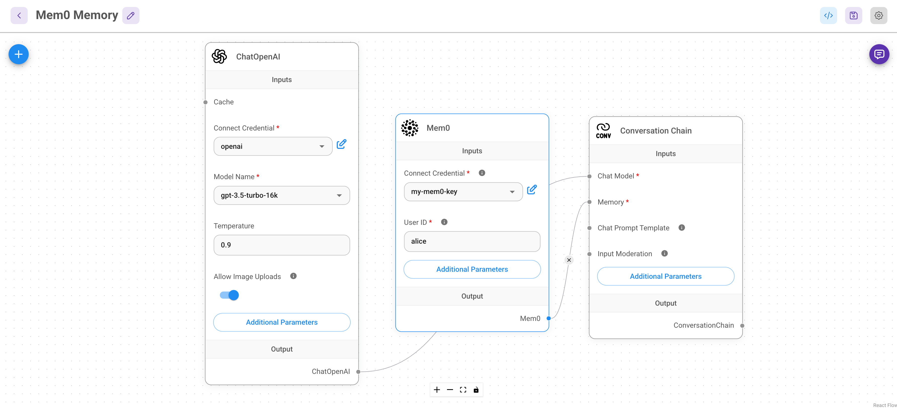

# Mem0 Memory

[Mem0](https://github.com/mem0ai/mem0) (pronunciado "mem-cero") mejora los asistentes y agentes de IA con una capa de memoria inteligente, permitiendo interacciones personalizadas. Recuerda las preferencias del usuario, se adapta a sus necesidades y mejora continuamente con el tiempo. Esto lo hace ideal para aplicaciones como chatbots de soporte al cliente, asistentes de IA y agentes autónomos de IA.

Mem0 ofrece un conjunto completo de funciones de gestión de memoria, permitiendo una integración fluida en diversas aplicaciones basadas en IA.

---

## Uso de Mem0 con Flowise

Sigue estos pasos para integrar Mem0 con Flowise:

### 1. Configurar Flowise

1. Abre la aplicación Flowise y crea un nuevo lienzo o selecciona una plantilla del mercado de Flowise.
2. En este ejemplo, utilizamos la plantilla **Conversation Chain**.
3. Reemplaza la memoria predeterminada **Buffer Memory** con **Mem0 Memory**.

<figure><figcaption>Integración de Flowise con Mem0</figcaption></figure>

### 2. Obtener tu clave de API de Mem0

1. Dirígete al [panel de claves de API de Mem0](https://app.mem0.ai/dashboard/api-keys).
2. Genera o copia tu clave de API de Mem0 existente.

<figure><figcaption>Obtener clave de API de Mem0</figcaption></figure>

### 3. Configurar credenciales de Mem0 en Flowise

1. Ingresa la **clave de API de Mem0** en la sección de credenciales de Mem0.

<figure><figcaption>Configurar credenciales de API</figcaption></figure>

### 4. Guardar y probar el flujo de chat

1. Guarda tu configuración de Flowise.
2. Ejecuta una prueba de chat y almacena información.

<figure><figcaption>Prueba de almacenamiento de memoria</figcaption></figure>

### 5. Verificar los recuerdos almacenados en el panel de Mem0

1. Visita el [panel de Mem0](https://app.mem0.ai/dashboard/requests) para revisar los recuerdos almacenados.

<figure><figcaption>Revisión de recuerdos almacenados</figcaption></figure>

### 6. Validar la retención de memoria

1. Borra el historial de chat en Flowise.
2. Haz una pregunta basada en información previamente almacenada para confirmar la retención.

<figure><figcaption>Confirmación de persistencia de memoria</figcaption></figure>

---

## Configuraciones adicionales

Mem0 proporciona diversas opciones de personalización:

<figure><figcaption>Opciones de configuración de Mem0</figcaption></figure>

1. **Modo Solo Búsqueda**: Permite recuperar recuerdos sin crear nuevos. El historial de chat se mantiene hasta que se borre manualmente.
2. **Entidades de Mem0**: Utiliza identificadores como `user_id`, `run_id`, `app_id` y `agent_id` para un control más preciso de la memoria.
3. **ID del Proyecto**: Asigna el almacenamiento de memoria a un proyecto específico. Gestiona proyectos en [Mem0 Projects](https://app.mem0.ai/settings/projects/overview).
4. **ID de la Organización**: Asigna el almacenamiento de memoria a una organización específica. Gestiona organizaciones en [Mem0 Organizations](https://app.mem0.ai/settings/organizations/overview).

---

## Configuraciones en la plataforma Mem0

Existen configuraciones adicionales en [Mem0 Project Settings](https://app.mem0.ai/dashboard/project-settings):

1. **Instrucciones Personalizadas**: Define instrucciones a nivel de proyecto para refinar la extracción de memoria. Ejemplo: Extraer solo detalles académicos.
2. **Fecha de Expiración**: Establece un período de expiración para los recuerdos almacenados, permitiendo la eliminación automática de datos cuando sea necesario.

<figure><figcaption>Personalización de configuraciones a nivel de proyecto</figcaption></figure>

---

## Configurar credenciales de Mem0 en Flowise

Para agregar credenciales en Flowise:

1. Dirígete a la configuración de credenciales.
2. Agrega una nueva entrada de credenciales para Mem0.
3. Pega tu [clave de API de Mem0](https://app.mem0.ai/dashboard/api-keys) en el campo de clave de API.

<figure><figcaption>Introducir clave de API en Flowise</figcaption></figure>

---

Con estas configuraciones, tu configuración de Flowise se integrará perfectamente con Mem0, proporcionando una mejor retención de memoria e interacciones de IA personalizadas.

