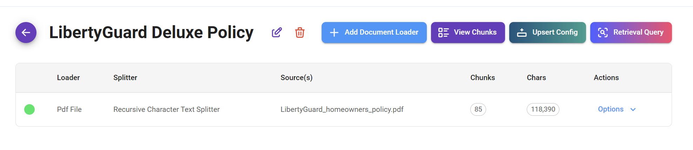

# Document Stores

***

Los Document Stores de Flowise ofrecen un enfoque versátil para la gestión de datos, permitiéndote cargar, dividir y preparar tu conjunto de datos y hacer upsert en una única ubicación.

Este enfoque centralizado simplifica el manejo de datos y permite una gestión eficiente de varios formatos de datos, facilitando la organización y el acceso a tus datos dentro de la aplicación Flowise.

## Configuración

En este tutorial, configuraremos un sistema de [Retrieval Augmented Generation (RAG)](../use-cases/multiple-documents-qna.md) para recuperar información sobre la _Póliza de Propietarios de Vivienda LibertyGuard Deluxe_, un tema sobre el que los LLMs no están extensamente entrenados.

Usando los **Document Stores de Flowise**, prepararemos y haremos upsert de datos sobre LibertyGuard y su conjunto de pólizas de seguro de hogar. Esto permitirá que nuestro sistema RAG responda con precisión a las consultas de los usuarios sobre las ofertas de seguro de hogar de LibertyGuard.

## 1. Agregar un Document Store

* Comienza agregando un Document Store y nombrándolo. En nuestro caso, "LibertyGuard Deluxe Homeowners Policy".

<figure><figcaption></figcaption></figure>

## 2. Seleccionar un Document Loader

* Ingresa al Document Store que acabas de crear y selecciona el [Document Loader](../integrations/langchain/document-loaders/) que deseas usar. En nuestro caso, como nuestro conjunto de datos está en formato PDF, usaremos el [PDF Loader](../integrations/langchain/document-loaders/pdf-file.md).

<figure><figcaption></figcaption></figure>

<figure><figcaption></figcaption></figure>

## 3. Preparar tus Datos

* Primero, comenzamos subiendo nuestro archivo PDF.
* Luego, agregamos una **clave de metadata única**. Esto es opcional, pero es una buena práctica ya que nos permite dirigirnos y filtrar este mismo conjunto de datos más tarde si lo necesitamos.

<figure><figcaption></figcaption></figure>

* Finalmente, selecciona el [Text Splitter](../integrations/langchain/text-splitters/) que deseas usar para dividir tus datos. En nuestro caso particular, usaremos el [Recursive Character Text Splitter](../integrations/langchain/text-splitters/recursive-character-text-splitter.md).


En esta guía, hemos agregado un tamaño generoso de **Chunk Overlap** para asegurar que no se pierda información relevante entre chunks. Sin embargo, el tamaño óptimo de superposición depende de la complejidad de tus datos. Es posible que necesites ajustar este valor según tu conjunto de datos específico y la naturaleza de la información que deseas extraer. Más sobre este tema en esta [guía](../use-cases/upserting-data.md).


<figure><figcaption></figcaption></figure>

## 4. Vista Previa de tus Datos

* Ahora podemos previsualizar cómo se dividirán nuestros datos usando nuestra configuración actual de [Text Splitter](../integrations/langchain/text-splitters/); `chunk_size=1500` y `chunk_overlap=750`.

<figure><figcaption></figcaption></figure>

* Es importante experimentar con diferentes [Text Splitters](../integrations/langchain/text-splitters/), tamaños de Chunk y valores de Overlap para encontrar la configuración óptima para tu conjunto de datos específico. Esta vista previa te permite refinar el proceso de división y asegurar que los chunks resultantes sean adecuados para tu sistema RAG.

<figure><figcaption></figcaption></figure>


Observa que nuestra metadata personalizada `company: "liberty"` se ha insertado en cada chunk. Esta metadata nos permite filtrar y recuperar fácilmente información de este conjunto de datos específico más tarde, incluso si usamos el mismo índice de vector store para otros conjuntos de datos.


## 5. Procesar tus Datos

* Una vez que estés satisfecho con el proceso de división, es momento de procesar tus datos.

<figure><figcaption></figcaption></figure>

<figure><figcaption></figcaption></figure>

Después de procesar tus datos, mantienes la capacidad de refinar chunks individuales eliminando o agregando contenido. Este control granular ofrece varias ventajas:

* **Precisión Mejorada:** Identifica y rectifica inexactitudes o inconsistencias presentes en los datos originales, asegurando que la información utilizada en tu aplicación sea confiable.
* **Relevancia Mejorada:** Refina el contenido de los chunks para enfatizar información clave y eliminar secciones irrelevantes, aumentando así la precisión y efectividad de tu proceso de recuperación.
* **Optimización de Consultas:** Adapta los chunks para alinearse mejor con las consultas anticipadas de los usuarios, haciéndolos más dirigidos y mejorando la experiencia general del usuario.

## 6. Configurar el Proceso de Upsert

* Con nuestros datos procesados adecuadamente - cargados a través de un Document Loader y divididos apropiadamente -, ahora podemos proceder a configurar el proceso de upsert.

<figure><figcaption></figcaption></figure>

El proceso de upsert comprende tres pasos fundamentales:

* **Selección de Embedding:** Comenzamos eligiendo el modelo de embedding apropiado para codificar nuestro conjunto de datos. Este modelo transformará nuestros datos en una representación vectorial numérica.
* **Selección de Data Store:** Luego, determinamos el Vector Store donde residirá nuestro conjunto de datos.
* **Selección de Record Manager (Opcional):** Finalmente, tenemos la opción de implementar un Record Manager. Este componente proporciona las funcionalidades para gestionar nuestro conjunto de datos una vez que está almacenado dentro del Vector Store.

<figure><figcaption></figcaption></figure>

### 1. Seleccionar Embeddings

* Haz clic en la tarjeta "Select Embeddings" y elige tu [modelo de embedding](../integrations/langchain/embeddings/) preferido. En nuestro caso, seleccionaremos OpenAI como proveedor de embedding y usaremos el modelo "text-embedding-ada-002" con 1536 dimensiones.

<figure><figcaption></figcaption></figure>

### 2. Seleccionar Vector Store

* Haz clic en la tarjeta "Select Vector Store" y elige tu [Vector Store](../integrations/langchain/vector-stores/) preferido. En nuestro caso, como necesitamos una opción lista para producción, seleccionaremos Upstash.

<figure><figcaption></figcaption></figure>

### 3. Seleccionar Record Manager

* Para una gestión avanzada del conjunto de datos dentro del Vector Store, puedes opcionalmente seleccionar y configurar un [Record Manager](../integrations/langchain/record-managers.md). Las instrucciones detalladas sobre cómo configurar y utilizar esta función se pueden encontrar en la [guía](../integrations/langchain/record-managers.md) dedicada.

<figure><figcaption></figcaption></figure>

## 7. Hacer Upsert de tus Datos a un Vector Store

* Para comenzar el proceso de upsert y transferir tus datos al Vector Store, haz clic en el botón "Upsert".

<figure><figcaption></figcaption></figure>

* Como se ilustra en la imagen de abajo, nuestros datos se han insertado exitosamente en la base de datos vectorial Upstash. Los datos se dividieron en 85 chunks para optimizar el proceso de upsertion y asegurar un almacenamiento y recuperación eficientes.

<figure><figcaption></figcaption></figure>

## 8. Probar tu Conjunto de Datos

* Para probar rápidamente la funcionalidad de tu conjunto de datos sin salir del Document Store, simplemente utiliza el botón "Retrieval Query". Esto inicia una consulta de prueba, permitiéndote verificar la precisión y efectividad de tu proceso de recuperación de datos.

<figure><figcaption></figcaption></figure>

* En nuestro caso, vemos que al consultar información sobre la cobertura de pisos de cocina en nuestra póliza de seguro, recuperamos 4 chunks relevantes de Upstash, nuestro Vector Store designado. Esta recuperación está limitada a 4 chunks según el parámetro "top k" definido, asegurando que recibamos la información más pertinente sin redundancia innecesaria.

<figure><figcaption></figcaption></figure>

## 9. Probar tu RAG

* Finalmente, nuestro sistema de Retrieval-Augmented Generation (RAG) está operativo. Es notable cómo el LLM interpreta efectivamente la consulta y aprovecha exitosamente la información relevante de los datos divididos para construir una respuesta completa.

Puedes usar el vector store que fue configurado anteriormente:

<figure><figcaption></figcaption></figure>

O, usar el Document Store (Vector):

<figure><figcaption></figcaption></figure>

## 10. API

También hay soporte de APIs para crear, actualizar y eliminar document stores. Consulta [Document Store API](../api-reference/document-store.md) para más detalles. En esta sección, vamos a destacar 2 de las APIs más utilizadas: upsert y refresh.

### 1. Upsert

Puedes hacer upsert de un nuevo archivo usando una configuración existente de document loader y upsert. Por ejemplo, tienes un PDF loader dentro del document store, y el objetivo es usar la configuración existente, pero con un nuevo archivo.

<figure><figcaption></figcaption></figure>

Primero, toma nota del store ID y document ID:

<figure><figcaption></figcaption></figure>

Ya que el PDF File Loader tiene funcionalidad de Upload File, se usará **form data** para permitir enviar archivos a través de la API.


Asegúrate de que el tipo de archivo enviado sea compatible con el tipo de archivo esperado del document loader. Por ejemplo, si se está usando un PDF File Loader, solo deberías enviar archivos **.pdf**.

Para evitar tener loaders separados para diferentes tipos de archivo, recomendamos usar [File Loader](../integrations/langchain/document-loaders/file-loader.md)




```python
import requests
import json

API_URL = "http://localhost:3000/api/v1/document-store/upsert/<storeId>"

# usar form data para subir archivos
form_data = {
    "files": ('mi-otro-archivo.pdf', open('mi-otro-archivo.pdf', 'rb'))
}

body_data = {
    "docId": <docId>,
    # sobrescribir configuración existente
    # "loader": "",
    "splitter": json.dumps({"name":"recursiveCharacterTextSplitter","config":{"chunkSize":20000}})
    # "vectorStore": "",
    # "embedding": "",
    # "recordManager": "",
}

def query(form_data):
    response = requests.post(API_URL, files=form_data, data=body_data)
    print(response)
    return response.json()

output = query(form_data)
print(output)
```



```javascript
// usar FormData para subir archivos
let formData = new FormData();
formData.append("files", input.files[0]);
formData.append("docId", <docId>);
formData.append("splitter", JSON.stringify({"name":"recursiveCharacterTextSplitter","config":{"chunkSize":20000}}));
// sobrescribir configuración existente
// formData.append("loader", "");
// formData.append("embedding", "");
// formData.append("vectorStore", "");
// formData.append("recordManager", "");

async function query(formData) {
    const response = await fetch(
        "http://localhost:3000/api/v1/document-store/upsert/<storeId>",
        {
            method: "POST",
            body: formData
        }
    );
    const result = await response.json();
    return result;
}

query(formData).then((response) => {
    console.log(response);
});
```



Para otros nodos de [Document Loaders](https://docs.flowiseai.com/integrations/langchain/document-loaders) sin funcionalidad de Upload File, el cuerpo de la API está en formato **JSON**:



```python
import requests

API_URL = "http://localhost:3000/api/v1/document-store/upsert/<storeId>"

def query(payload):
    response = requests.post(API_URL, json=payload)
    return response.json()

output = query({
    "docId": <docId>,
    # sobrescribir configuración existente
    "loader": {
        "name": "plainText",
        "config": {
            "text": "Este es un nuevo texto"
        }
    },
    "splitter": {
        "name": "recursiveCharacterTextSplitter",
        "config": {
            "chunkSize": 20000
        }
    },
    # embedding: {},
    # vectorStore: {},
    # recordManager: {}
})
print(output)
```



```javascript
async function query(data) {
    const response = await fetch(
        "http://localhost:3000/api/v1/document-store/upsert/<storeId>",
        {
            method: "POST",
            headers: {
                "Content-Type": "application/json"
            },
            body: JSON.stringify(data)
        }
    );
    const result = await response.json();
    return result;
}

query({
    "docId": <docId>,
    # override existing configuration
    "loader": {
        "name": "plainText",
        "config": {
            "text": "This is a new text"
        }
    },
    "splitter": {
        "name": "recursiveCharacterTextSplitter",
        "config": {
            "chunkSize": 20000
        }
    },
    # embedding: {},
    # vectorStore: {},
    # recordManager: {}
}).then((response) => {
    console.log(response);
});
```



### 2. Refresh

Often times you might want to re-process every documents loaders within document store to fetch the latest data, and upsert to vector store, to keep everything in sync. This can be done via Refresh API:



```python
import requests

API_URL = "http://localhost:3000/api/v1/document-store/refresh/<storeId>"

def query():
    response = requests.post(API_URL)
    return response.json()

output = query()
print(output)
```



```javascript
async function query(data) {
    const response = await fetch(
        "http://localhost:3000/api/v1/document-store/refresh/<storeId>",
        {
            method: "POST",
            headers: {
                "Content-Type": "application/json"
            }
        }
    );
    const result = await response.json();
    return result;
}

query().then((response) => {
    console.log(response);
});
```



You can also override existing configuration of specific document loader:



```python
import requests

API_URL = "http://localhost:3000/api/v1/document-store/refresh/<storeId>"

def query(payload):
    response = requests.post(API_URL, json=payload)
    return response.json()

output = query(
{
    "items": [
        {
            "docId": <docId>,
            "splitter": {
                "name": "recursiveCharacterTextSplitter",
                "config": {
                    "chunkSize": 2000,
                    "chunkOverlap": 100
                }
            }
        }
    ]
}
)
print(output)
```



```javascript
async function query(data) {
    const response = await fetch(
        "http://localhost:3000/api/v1/document-store/refresh/<storeId>",
        {
            method: "POST",
            headers: {
                "Content-Type": "application/json"
            },
            body: JSON.stringify(data)
        }
    );
    const result = await response.json();
    return result;
}

query({
    "items": [
        {
            "docId": <docId>,
            "splitter": {
                "name": "recursiveCharacterTextSplitter",
                "config": {
                    "chunkSize": 2000,
                    "chunkOverlap": 100
                }
            }
        }
    ]
}).then((response) => {
    console.log(response);
});
```



## 11. Summary

We started by creating a Document Store to organize the LibertyGuard Deluxe Homeowners Policy data. This data was then prepared by uploading, chunking, processing, and upserting it, making it ready for our RAG system.

**Advantages of the Document Store:**

Document Stores offer several benefits for managing and preparing data for Retrieval Augmented Generation (RAG) systems:

* **Organization and Management:** They provide a central location for storing, managing, and preparing your data.
* **Data Quality:** The chunking process helps structure data for accurate retrieval and analysis.
* **Flexibility:** Document Stores allow for refining and adjusting data as needed, improving the accuracy and relevance of your RAG system.

## 12. Video Tutorials

### RAG Like a Boss - Flowise Document Store Tutorial

In this video, [Leon](https://youtube.com/@leonvanzyl) provides a step by step tutorial on using Document Stores to easily manage your RAG knowledge bases in FlowiseAI.


