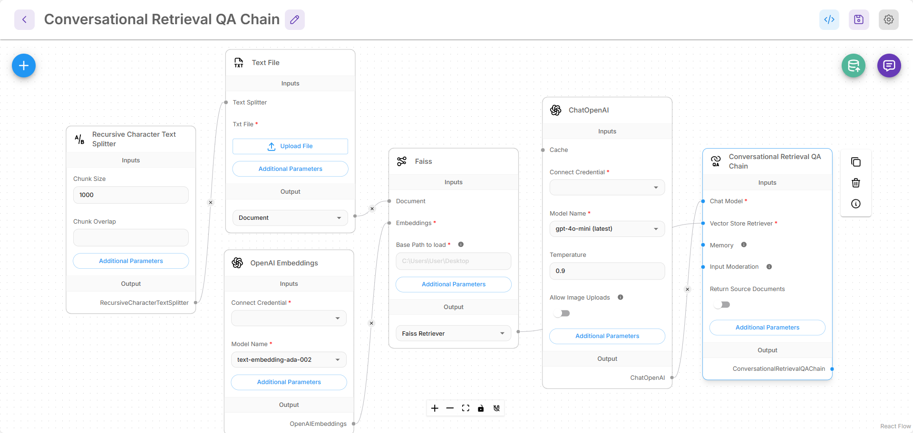
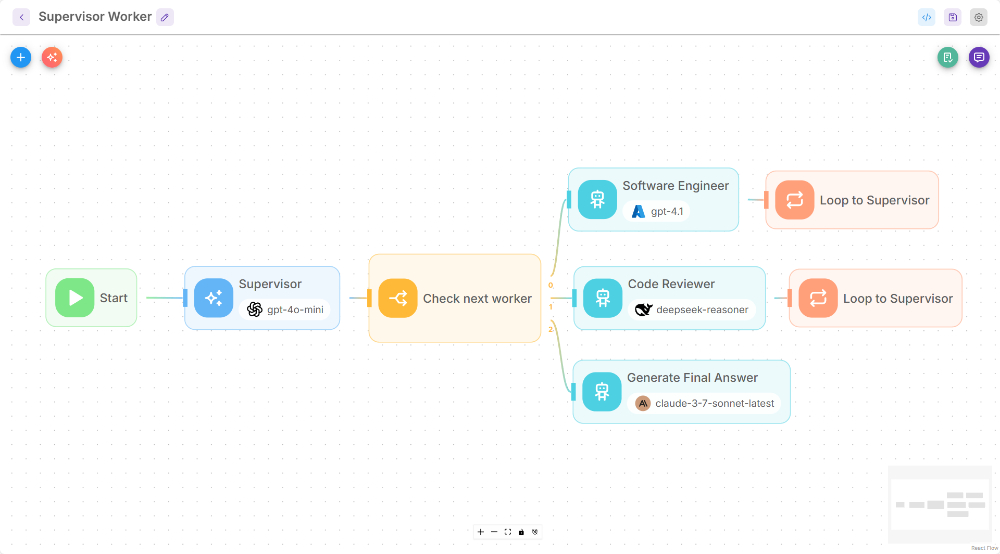

# Introduction

<figure><figcaption></figcaption></figure>

Flowise est une plateforme de développement d'IA générative open source pour la création d'agents IA et de workflows LLM.

Elle offre une solution complète qui inclut :

* [x] Constructeur Visuel
* [x] Suivi & Analytique
* [x] Évaluations
* [x] Humain dans la Boucle
* [x] API, CLI, SDK, Chatbot Intégré
* [x] Équipes & Espaces de Travail

Il existe 3 principaux constructeurs visuels, à savoir :

* Assistant
* Chatflow
* Agentflow

## Assistant

L'Assistant est la manière la plus conviviale de créer un agent IA. Les utilisateurs peuvent créer un assistant de chat capable de suivre des instructions, d'utiliser des outils si nécessaire, et de récupérer des connaissances à partir de fichiers téléchargés ([RAG](https://en.wikipedia.org/wiki/Retrieval-augmented_generation)) pour répondre aux requêtes des utilisateurs.

<figure><picture><source srcset=".gitbook/assets/Screenshot 2025-06-10 232758.png" media="(prefers-color-scheme: dark)"></picture><figcaption></figcaption></figure>

## Chatflow

Chatflow est conçu pour construire des systèmes à agent unique, des chatbots et des flux LLM simples. Il est plus flexible que l'Assistant. Les utilisateurs peuvent utiliser des techniques avancées telles que Graph RAG, Reranker, Retriever, etc.

<figure><picture><source srcset=".gitbook/assets/screely-1749594035877.png" media="(prefers-color-scheme: dark)"></picture><figcaption></figcaption></figure>

## Agentflow

Agentflow est le sur-ensemble de Chatflow et de l'Assistant. Il peut être utilisé pour créer un assistant de chat, un système à agent unique, des systèmes multi-agents et une orchestration de workflows complexes. En savoir plus sur [Agentflow V2](using-flowise/agentflowv2.md)

<figure><picture><source srcset=".gitbook/assets/screely-1749594631028.png" media="(prefers-color-scheme: dark)"></picture><figcaption></figcaption></figure>

## Capacités de Flowise

| Domaine de Fonctionnalité    | Capacités de Flowise                                                                                               |
| ---------------------------- | ------------------------------------------------------------------------------------------------------------------- |
| Orchestration                | Éditeur visuel, prend en charge les modèles open-source et propriétaires, expressions, code personnalisé, logique de branchement/boucle/routage |
| Ingestion et Intégration des Données | Se connecte à plus de 100 sources, outils, bases de données vectorielles, mémoires                                   |
| Surveillance                 | Journaux d'exécution, débogage visuel, diffusion de journaux externes                                               |
| Déploiement                  | Options auto-hébergées, déploiement en environnement isolé                                                         |
| Traitement des Données       | Transformations de données, filtres, agrégats, code personnalisé, pipelines d'indexation RAG                       |
| Mémoire et Planification      | Techniques d'optimisation de mémoire variées et intégrations                                                       |
| Intégration MCP              | Nœuds client/serveur MCP, liste d'outils, SSE, support d'authentification                                         |
| Sécurité et Contrôle         | Modération des entrées et post-traitement des sorties                                                              |
| API, SDK, CLI                | Accès API, SDK JS/Python, Interface en Ligne de Commande                                                           |
| Chatbot Intégré et Partagé    | Widget de chat intégré personnalisable et composant                                                                |
| Modèles et Composants        | Marché de modèles, composants réutilisables                                                                        |
| Contrôles de Sécurité        | RBAC, SSO, identifiants chiffrés, gestionnaires de secrets, limitation de taux, domaines restreints                 |
| Scalabilité                  | Échelle verticale/horizontale, charge de travail/flux élevée                                                       |
| Évaluations                  | Ensembles de données, Évaluateurs et Évaluations                                                                    |
| Support Communautaire        | Forum communautaire actif                                                                                           |
| Support Fournisseur          | Support SLA, consultations, tarification fixe/déterministe                                                         |

## Contribuer

Si vous souhaitez aider ce projet, veuillez envisager de consulter le [Guide de Contribution](broken-reference/).

## Besoin d'aide ?

Pour un support et des discussions supplémentaires, rendez-vous sur notre serveur [Discord](https://discord.gg/jbaHfsRVBW).