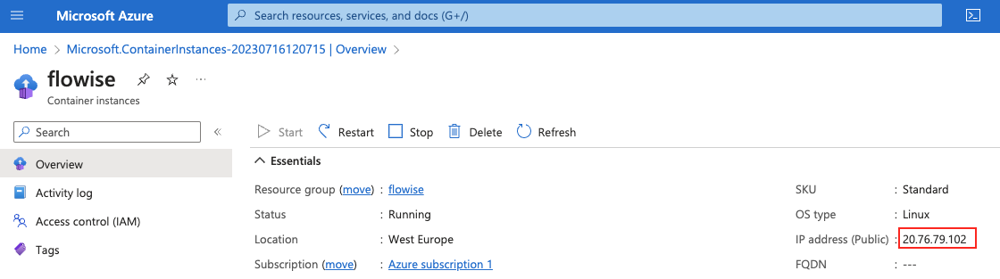

# Azure

***

## Flowise en tant que service d'application Azure avec Postgres : Utilisation de Terraform

### Prérequis

1. **Compte Azure** : Assurez-vous d'avoir un compte Azure avec un abonnement actif. Si vous n'en avez pas, inscrivez-vous sur [Azure Portal](https://portal.azure.com/).
2. **Terraform** : Installez Terraform CLI sur votre machine. Téléchargez-le depuis [le site de Terraform](https://www.terraform.io/downloads.html).
3. **Azure CLI** : Installez Azure CLI. Les instructions se trouvent sur la [page de documentation d'Azure CLI](https://docs.microsoft.com/en-us/cli/azure/install-azure-cli).

### Configuration de votre environnement

1. **Connexion à Azure** : Ouvrez votre terminal ou votre invite de commande et connectez-vous à Azure CLI en utilisant :

```bash
az login --tenant <Your Subscription ID> --use-device-code 
```

Suivez les instructions pour compléter le processus de connexion.

2. **Configurer l'abonnement** : Après vous être connecté, configurez l'abonnement Azure en utilisant :

```bash
az account set --subscription <Your Subscription ID>
```

3. **Initialiser Terraform** :

Créez un fichier `terraform.tfvars` dans votre répertoire de projet Terraform, s'il n'est pas déjà présent, et ajoutez le contenu suivant :

```hcl
subscription_name = "subscrpiton_name"
subscription_id = "subscription id"
project_name = "webapp_name"
db_username = "PostgresUserName"
db_password = "strongPostgresPassword"
flowise_secretkey_overwrite = "longandStrongSecretKey"
webapp_ip_rules = [
  {
    name = "AllowedIP"
    ip_address = "X.X.X.X/32"
    headers = null
    virtual_network_subnet_id = null
    subnet_id = null
    service_tag = null
    priority = 300
    action = "Allow"
  }
]
postgres_ip_rules = {
  "ValbyOfficeIP" = "X.X.X.X"
  // Add more key-value pairs as needed
}
source_image = "flowiseai/flowise:latest"
tagged_image = "flow:v1"
```

Remplacez les espaces réservés par des valeurs réelles pour votre configuration.

La structure de l'arborescence des fichiers est la suivante :

```
flow
├── database.tf
├── main.tf
├── network.tf
├── output.tf
├── providers.tf
├── terraform.tfvars
├── terraform.tfvars.example
├── variables.tf
├── webapp.tf
├── .gitignore // ignore your .tfvars and .lock.hcf, .terraform

```

Chaque fichier `.tf` dans la configuration Terraform contient probablement un aspect différent de l'infrastructure en tant que code :

<details>

<summary>`database.tf` définirait la configuration pour la base de données Postgres.</summary>

```yaml

// database.tf

// Database instance
resource "azurerm_postgresql_flexible_server" "postgres" {
  name                         = "postgresql-${var.project_name}"
  location                     = azurerm_resource_group.rg.location
  resource_group_name          = azurerm_resource_group.rg.name
  sku_name                     = "GP_Standard_D2s_v3"
  storage_mb                   = 32768
  version                      = "11"
  delegated_subnet_id          = azurerm_subnet.dbsubnet.id
  private_dns_zone_id          = azurerm_private_dns_zone.postgres.id
  backup_retention_days        = 7
  geo_redundant_backup_enabled = false
  auto_grow_enabled            = false
  administrator_login          = var.db_username
  administrator_password       = var.db_password
  zone                         = "2"

  lifecycle {
    prevent_destroy = false
  }
}

// Firewall
resource "azurerm_postgresql_flexible_server_firewall_rule" "pg_firewall" {
  for_each         = var.postgres_ip_rules
  name             = each.key
  server_id        = azurerm_postgresql_flexible_server.postgres.id
  start_ip_address = each.value
  end_ip_address   = each.value
}

// Database
resource "azurerm_postgresql_flexible_server_database" "production" {
  name      = "production"
  server_id = azurerm_postgresql_flexible_server.postgres.id
  charset   = "UTF8"
  collation = "en_US.utf8"

  # prevent the possibility of accidental data loss
  lifecycle {
    prevent_destroy = false
  }
}

// Transport off
resource "azurerm_postgresql_flexible_server_configuration" "postgres_config" {
  name      = "require_secure_transport"
  server_id = azurerm_postgresql_flexible_server.postgres.id
  value     = "off"
}
```

</details>

<details>

<summary>Le fichier `main.tf` pourrait être le fichier de configuration principal qui inclut la configuration du fournisseur Azure et définit le groupe de ressources Azure.</summary>

```yaml
// main.tf
resource "random_string" "resource_code" {
  length  = 5
  special = false
  upper   = false
}

// resource group
resource "azurerm_resource_group" "rg" {
  location = var.resource_group_location
  name     = "rg-${var.project_name}"
}

// Storage Account
resource "azurerm_storage_account" "sa" {
  name                     = "${var.subscription_name}${random_string.resource_code.result}"
  resource_group_name      = azurerm_resource_group.rg.name
  location                 = azurerm_resource_group.rg.location
  account_tier             = "Standard"
  account_replication_type = "LRS"

  blob_properties {
    versioning_enabled = true
  }

}

// File share
resource "azurerm_storage_share" "flowise-share" {
  name                 = "flowise"
  storage_account_name = azurerm_storage_account.sa.name
  quota                = 50
}

```

</details>

<details>

<summary>`network.tf` inclurait des ressources réseau telles que des réseaux virtuels, des sous-réseaux et des groupes de sécurité réseau.</summary>

```yaml
// network.tf

// Vnet
resource "azurerm_virtual_network" "vnet" {
  name                = "vn-${var.project_name}"
  location            = azurerm_resource_group.rg.location
  resource_group_name = azurerm_resource_group.rg.name
  address_space       = ["10.3.0.0/16"]
}

resource "azurerm_subnet" "dbsubnet" {
  name                                      = "db-subnet-${var.project_name}"
  resource_group_name                       = azurerm_resource_group.rg.name
  virtual_network_name                      = azurerm_virtual_network.vnet.name
  address_prefixes                          = ["10.3.1.0/24"]
  private_endpoint_network_policies_enabled = true
  delegation {
    name = "delegation"
    service_delegation {
      name = "Microsoft.DBforPostgreSQL/flexibleServers"
    }
  }
  lifecycle {
    ignore_changes = [
      service_endpoints,
      delegation
    ]
  }
}

resource "azurerm_subnet" "webappsubnet" {

  name                 = "web-app-subnet-${var.project_name}"
  resource_group_name  = azurerm_resource_group.rg.name
  virtual_network_name = azurerm_virtual_network.vnet.name
  address_prefixes     = ["10.3.8.0/24"]

  delegation {
    name = "delegation"
    service_delegation {
      name = "Microsoft.Web/serverFarms"
    }
  }
  lifecycle {
    ignore_changes = [
      delegation
    ]
  }
}

resource "azurerm_private_dns_zone" "postgres" {
  name                = "private.postgres.database.azure.com"
  resource_group_name = azurerm_resource_group.rg.name
}

resource "azurerm_private_dns_zone_virtual_network_link" "postgres" {
  name                  = "private-postgres-vnet-link"
  resource_group_name   = azurerm_resource_group.rg.name
  private_dns_zone_name = azurerm_private_dns_zone.postgres.name
  virtual_network_id    = azurerm_virtual_network.vnet.id
}

```

</details>

<details>

<summary>Le fichier `providers.tf` définirait les fournisseurs Terraform, tels qu'Azure.</summary>

```yaml
// providers.tf
terraform {
  required_version = ">=0.12"

  required_providers {
    azurerm = {
      source  = "hashicorp/azurerm"
      version = "=3.87.0"
    }
    random = {
      source  = "hashicorp/random"
      version = "~>3.0"
    }
  }
}

provider "azurerm" {
  subscription_id = var.subscription_id
  features {}
}
```

</details>

<details>

<summary>`variables.tf` déclarera les variables utilisées dans tous les fichiers `.tf`.</summary>

```yaml
// variables.tf
variable "resource_group_location" {
  default     = "westeurope"
  description = "Location of the resource group."
}

variable "container_rg_name" {
  default     = "acrllm"
  description = "Name of container regrestry."
}

variable "subscription_id" {
  type        = string
  sensitive   = true
  description = "Service Subscription ID"
}

variable "subscription_name" {
  type        = string
  description = "Service Subscription Name"
}


variable "project_name" {
  type        = string
  description = "Project Name"
}

variable "db_username" {
  type        = string
  description = "DB User Name"
}

variable "db_password" {
  type        = string
  sensitive   = true
  description = "DB Password"
}

variable "flowise_secretkey_overwrite" {
  type        = string
  sensitive   = true
  description = "Flowise secret key"
}

variable "webapp_ip_rules" {
  type = list(object({
    name                      = string
    ip_address                = string
    headers                   = string
    virtual_network_subnet_id = string
    subnet_id                 = string
    service_tag               = string
    priority                  = number
    action                    = string
  }))
}

variable "postgres_ip_rules" {
  description = "A map of IP addresses and their corresponding names for firewall rules"
  type        = map(string)
  default     = {}
}

variable "flowise_image" {
  type        = string
  description = "Flowise image from Docker Hub"
}

variable "tagged_image" {
  type        = string
  description = "Tag for flowise image version"
}
```

</details>

<details>

<summary>`webapp.tf` Services d'application Azure incluant un plan de service et une application web Linux</summary>

```yaml
// webapp.tf
#Create the Linux App Service Plan
resource "azurerm_service_plan" "webappsp" {
  name                = "asp${var.project_name}"
  resource_group_name = azurerm_resource_group.rg.name
  location            = azurerm_resource_group.rg.location
  os_type             = "Linux"
  sku_name            = "P3v3"
}

resource "azurerm_linux_web_app" "webapp" {
  name                = var.project_name
  resource_group_name = azurerm_resource_group.rg.name
  location            = azurerm_resource_group.rg.location
  service_plan_id     = azurerm_service_plan.webappsp.id

  app_settings = {
    DOCKER_ENABLE_CI                    = true
    WEBSITES_CONTAINER_START_TIME_LIMIT = 1800
    WEBSITES_ENABLE_APP_SERVICE_STORAGE = false
    DATABASE_TYPE                       = "postgres"
    DATABASE_HOST                       = azurerm_postgresql_flexible_server.postgres.fqdn
    DATABASE_NAME                       = azurerm_postgresql_flexible_server_database.production.name
    DATABASE_USER                       = azurerm_postgresql_flexible_server.postgres.administrator_login
    DATABASE_PASSWORD                   = azurerm_postgresql_flexible_server.postgres.administrator_password
    DATABASE_PORT                       = 5432
    FLOWISE_SECRETKEY_OVERWRITE         = var.flowise_secretkey_overwrite
    PORT                                = 3000
    SECRETKEY_PATH                      = "/root"
    DOCKER_IMAGE_TAG                    = var.tagged_image
  }

  storage_account {
    name         = "${var.project_name}_mount"
    access_key   = azurerm_storage_account.sa.primary_access_key
    account_name = azurerm_storage_account.sa.name
    share_name   = azurerm_storage_share.flowise-share.name
    type         = "AzureFiles"
    mount_path   = "/root"
  }


  https_only = true

  site_config {
    always_on              = true
    vnet_route_all_enabled = true
    dynamic "ip_restriction" {
      for_each = var.webapp_ip_rules
      content {
        name       = ip_restriction.value.name
        ip_address = ip_restriction.value.ip_address
      }
    }
    application_stack {
      docker_image_name        = var.flowise_image
      docker_registry_url      = "https://${azurerm_container_registry.acr.login_server}"
      docker_registry_username = azurerm_container_registry.acr.admin_username
      docker_registry_password = azurerm_container_registry.acr.admin_password
    }
  }

  logs {
    http_logs {
      file_system {
        retention_in_days = 7
        retention_in_mb   = 35
      }

    }
  }

  identity {
    type = "SystemAssigned"
  }

  lifecycle {
    create_before_destroy = false

    ignore_changes = [
      virtual_network_subnet_id
    ]
  }

}

resource "azurerm_app_service_virtual_network_swift_connection" "webappvnetintegrationconnection" {
  app_service_id = azurerm_linux_web_app.webapp.id
  subnet_id      = azurerm_subnet.webappsubnet.id

  depends_on = [azurerm_linux_web_app.webapp, azurerm_subnet.webappsubnet]
}

```

</details>

Note : Le répertoire `.terraform` est créé par Terraform lors de l'initialisation d'un projet (`terraform init`) et il contient les plugins et fichiers binaires nécessaires au bon fonctionnement de Terraform. Le fichier `.terraform.lock.hcl` est utilisé pour enregistrer les versions exactes des fournisseurs qui sont utilisées afin d'assurer des installations cohérentes sur différentes machines.

Naviguez vers votre répertoire de projet Terraform et exécutez :

```bash
terraform init
```

This will initialize Terraform and download the required providers.

### Configurer les variables Terraform

### Déployer avec Terraform

1.  **Planifier le déploiement** : Exécutez la commande Terraform plan pour voir quels ressources seront créées :

    ```bash
    terraform plan
    ```
2.  **Appliquer le déploiement** : Si vous êtes satisfait du plan, appliquez les modifications :

    ```bash
    terraform apply
    ```

    Confirmez l'action lorsqu'on vous le demande, et Terraform commencera à créer les ressources.
3. **Vérifier le déploiement** : Une fois que Terraform a terminé, il affichera toutes les sorties définies telles que les adresses IP ou les noms de domaine. Vérifiez que les ressources sont correctement déployées dans votre portail Azure.

***

## Instance de Conteneur Azure : Utilisation de l'interface utilisateur du portail Azure ou de l'Azure CLI

### Prérequis

1. _(Optionnel)_ [Installer l'Azure CLI](https://learn.microsoft.com/en-us/cli/azure/install-azure-cli) si vous souhaitez suivre les commandes basées sur la CLI

## Créer une instance de conteneur sans stockage persistant

Sans stockage persistant, vos données sont conservées en mémoire. Cela signifie qu'après un redémarrage du conteneur, toutes les données que vous avez stockées disparaîtront.

### Dans le portail

1. Recherchez les instances de conteneur dans le Marketplace et cliquez sur Créer :

<figure><figcaption><p>Entrée des instances de conteneur dans le Marketplace d'Azure</p></figcaption></figure>

2. Sélectionnez ou créez un groupe de ressources, un nom de conteneur, une région, une source d'image `Autre registre`, un type d'image, l'image `flowiseai/flowise`, le type de système d'exploitation et la taille. Cliquez ensuite sur "Suivant : Réseau" pour configurer les ports Flowise :

<figure><figcaption><p>Première page de l'assistant de création d'instance de conteneur</p></figcaption></figure>

3. Ajoutez un nouveau port `3000 (TCP)` à côté du port par défaut `80 (TCP)`. Sélectionnez ensuite "Suivant : Avancé" :

<figure><figcaption><p>Deuxième page de l'assistant de création d'instance de conteneur. Elle demande le type de réseau et les ports.</p></figcaption></figure>

4. Définissez la politique de redémarrage sur `En cas d'échec`. Ajoutez l'override de commande `["/bin/sh", "-c", "flowise start"]`. Cliquez enfin sur "Vérifier + créer" :

<figure><figcaption><p>Troisième page de l'assistant de création d'instance de conteneur. Elle demande la politique de redémarrage, les variables d'environnement et la commande à exécuter au démarrage du conteneur.</p></figcaption></figure>

5. Vérifiez les paramètres finaux et cliquez sur "Créer" :

<figure><figcaption><p>Page de révision finale et de création pour une instance de conteneur.</p></figcaption></figure>

6. Une fois la création terminée, cliquez sur "Accéder à la ressource"

<figure><figcaption><p>Page de résultat de création de ressource dans Azure.</p></figcaption></figure>

7. Visitez votre instance Flowise en copiant l'adresse IP et en ajoutant :3000 comme port :

<figure><figcaption><p>Page d'aperçu de l'instance de conteneur</p></figcaption></figure>

<figure><figcaption><p>Application Flowise déployée en tant qu'instance de conteneur</p></figcaption></figure>

### Créer en utilisant l'Azure CLI

1. Créez un groupe de ressources (si vous n'en avez pas déjà un)

```bash
az group create --name flowise-rg --location "West US"
```

2. Créez une instance de conteneur

```bash
az container create -g flowise-rg \
	--name flowise \
	--image flowiseai/flowise \
	--command-line "/bin/sh -c 'flowise start'" \
	--ip-address public \
	--ports 80 3000 \
	--restart-policy OnFailure
```

3. Visitez l'adresse IP (y compris le port :3000) affichée dans la sortie de la commande ci-dessus.

## Créer une instance de conteneur avec stockage persistant

La création d'une instance de conteneur avec stockage persistant n'est possible que via la CLI :

1. Créez un groupe de ressources (si vous n'en avez pas déjà un)

```bash
az group create --name flowise-rg --location "West US"
```
```markdown
2. Créez la ressource de compte de stockage (ou utilisez un compte existant) dans le groupe de ressources ci-dessus. Vous pouvez vérifier comment le faire [ici](https://learn.microsoft.com/en-us/azure/storage/files/storage-how-to-use-files-portal?tabs=azure-portal).
3. Dans Azure Storage, créez un nouveau partage de fichiers. Vous pouvez vérifier comment le faire [ici](https://learn.microsoft.com/en-us/azure/storage/files/storage-how-to-use-files-portal?tabs=azure-portal).
4. Créez une instance de conteneur
``````bash
az container create -g flowise-rg \
	--name flowise \
	--image flowiseai/flowise \
	--command-line "/bin/sh -c 'flowise start'" \
	--environment-variables DATABASE_PATH=/opt/flowise/.flowise SECRETKEY_PATH=/opt/flowise/.flowise LOG_PATH=/opt/flowise/.flowise/logs BLOB_STORAGE_PATH=/opt/flowise/.flowise/storage \
	--ip-address public \
	--ports 80 3000 \
	--restart-policy OnFailure \
	--azure-file-volume-share-name here goes the name of your File share \
	--azure-file-volume-account-name here goes the name of your Storage Account \
	--azure-file-volume-account-key here goes the access key to your Storage Account \
	--azure-file-volume-mount-path /opt/flowise/.flowise
```

5. Visitez l'adresse IP (y compris le port :3000) affichée dans la sortie de la commande ci-dessus.  
6. À partir de maintenant, vos données seront stockées dans une base de données SQLite que vous pouvez trouver dans votre partage de fichiers.  

Regardez le tutoriel vidéo sur le déploiement sur Azure Container Instance :  


