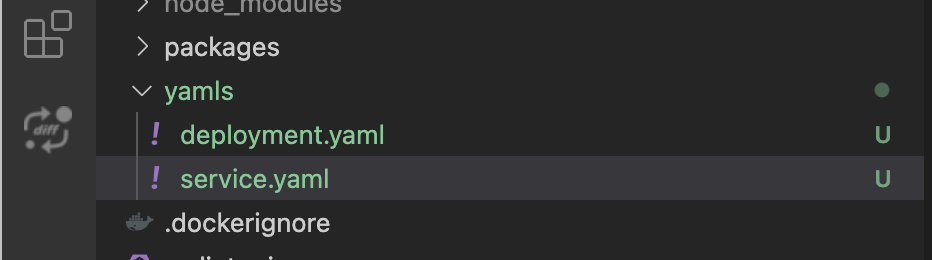
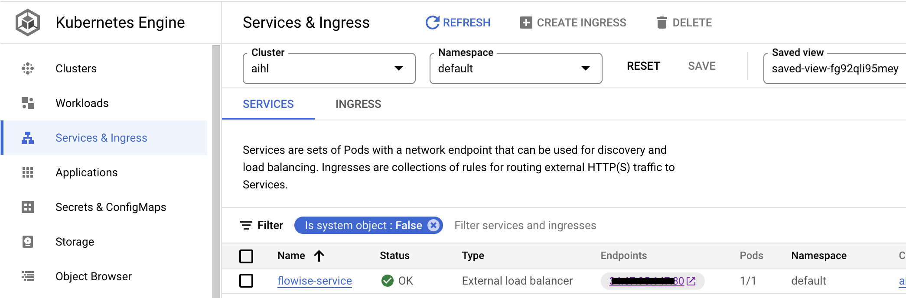

# GCP

***

## Prérequis

1. Notez votre Google Cloud \[ProjectId]
2. Installez [Git](https://git-scm.com/book/en/v2/Getting-Started-Installing-Git)
3. Installez le [Google Cloud CLI](https://cloud.google.com/sdk/docs/install-sdk)
4. Installez [Docker Desktop](https://docs.docker.com/desktop/)

## Configuration du Cluster Kubernetes

1. Créez un Cluster Kubernetes si vous n'en avez pas.

<figure><figcaption><p>Cliquez sur `Clusters` pour en créer un.</p></figcaption></figure>

2. Nommez le Cluster, choisissez le bon emplacement des ressources, utilisez le mode `Autopilot` et conservez toutes les autres configurations par défaut.
3. Une fois le Cluster créé, cliquez sur le menu 'Connecter' dans le menu des actions.

<figure><figcaption></figcaption></figure>

4. Copiez la commande et collez-la dans votre terminal, puis appuyez sur entrée pour connecter votre cluster.
5. Exécutez la commande ci-dessous et sélectionnez le bon nom de contexte, qui ressemble à `gke_[ProjectId]_[DataCenter]_[ClusterName]`

```
kubectl config get-contexts
```

6. Définir le contexte actuel

```
kubectl config use-context gke_[ProjectId]_[DataCenter]_[ClusterName]
```

## Construire et pousser l'image Docker

Exécutez les commandes suivantes pour construire et pousser l'image Docker vers le registre de conteneurs GCP.

1. Clonez Flowise

```
git clone https://github.com/FlowiseAI/Flowise.git
```

2. Construire le Flowise

```
cd Flowise
pnpm install
pnpm build
```

3. Mettez à jour légèrement le fichier `Dockerfile`.

> Specify the platform of nodejs
>
> ```
> FROM --platform=linux/amd64 node:18-alpine
> ```
>
> Add python3, make and g++ to install
>
> ```
> RUN apk add --no-cache python3 make g++
> ```

3. Construire en tant qu'image Docker, assurez-vous que l'application Docker Desktop est en cours d'exécution

```
docker build -t gcr.io/[ProjectId]/flowise:dev .
```

4. Poussez l'image Docker vers le registre de conteneurs GCP.

```
docker push gcr.io/[ProjectId]/flowise:dev
```

## Déploiement sur GCP

1. Créez un dossier racine `yamls` dans le projet.
2. Ajoutez le fichier `deployment.yaml` dans ce dossier.

```
# deployment.yaml
apiVersion: apps/v1
kind: Deployment
metadata:
  name: flowise
  labels:
    app: flowise
spec:
  selector:
    matchLabels:
      app: flowise
  replicas: 1
  template:
    metadata:
      labels:
        app: flowise
    spec:
      containers:
      - name: flowise
        image: gcr.io/[ProjectID]/flowise:dev
        imagePullPolicy: Always
        resources: 
          requests:
            cpu: "1"
            memory: "1Gi"
```

3. Ajoutez le fichier `service.yaml` dans ce dossier.

```
# service.yaml
apiVersion: "v1"
kind: "Service"
metadata:
  name: "flowise-service"
  namespace: "default"
  labels:
    app: "flowise"
spec:
  ports:
  - protocol: "TCP"
    port: 80
    targetPort: 3000
  selector:
    app: "flowise"
  type: "LoadBalancer"

```

It ressemblera à ce qui suit.

<figure><figcaption></figcaption></figure>

4. Déployez les fichiers yaml en exécutant les commandes suivantes.

```
kubectl apply -f yamls/deployment.yaml
kubectl apply -f yamls/service.yaml
```

5. Allez dans `Workloads` dans le GCP, vous pouvez voir que votre pod est en cours d'exécution.

<figure><figcaption></figcaption></figure>

6. Allez dans `Services & Ingress`, vous pouvez cliquer sur le `Endpoint` où Flowise est hébergé.

<figure><figcaption></figcaption></figure>

## Félicitations !

Vous avez réussi à héberger les applications Flowise sur GCP [🥳](https://emojipedia.org/partying-face/)

## Délai d'attente

Par défaut, un délai d'attente de 30 secondes est attribué au proxy par GCP. Cela a causé des problèmes lorsque la réponse prenait plus de 30 secondes pour revenir. Pour résoudre ce problème, apportez les modifications suivantes aux fichiers YAML :

Remarque : Pour définir le délai d'attente à 10 minutes (par exemple) -- nous spécifions 600 secondes ci-dessous.

1. Créez un fichier `backendconfig.yaml` avec le contenu suivant :

```yaml
apiVersion: cloud.google.com/v1
kind: BackendConfig
metadata:
  name: flowise-backendconfig
  namespace: your-namespace
spec:
  timeoutSec: 600
```

2. Problème : `kubectl apply -f backendconfig.yaml`  
3. Mettez à jour votre fichier `service.yaml` avec la référence suivante au `BackendConfig` :

```yaml
apiVersion: v1
kind: Service
metadata:
  annotations:
    cloud.google.com/backend-config: '{"default": "flowise-backendconfig"}'
  name: flowise-service
  namespace: your-namespace
...
```

4. Problème : `kubectl apply -f service.yaml`
