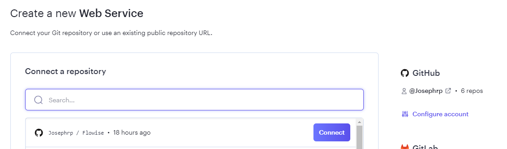
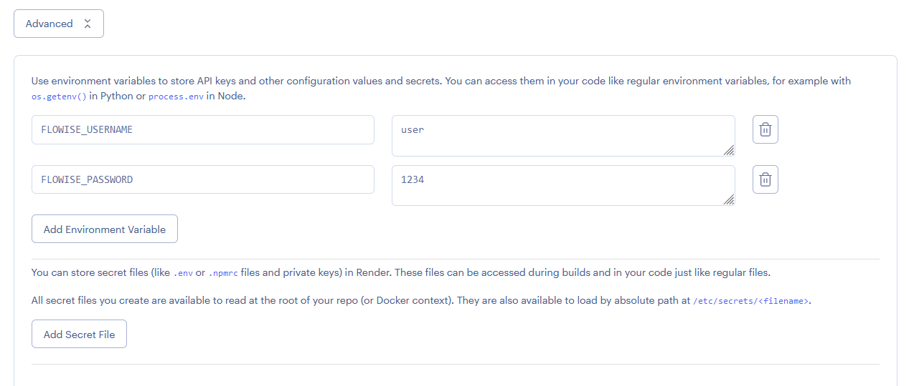
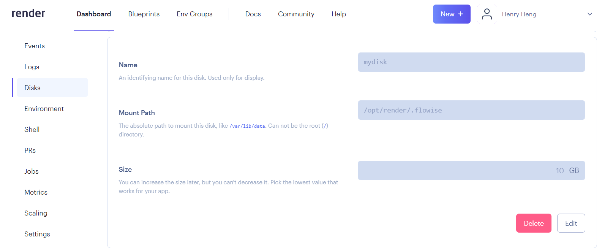
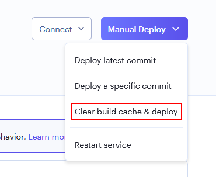

# Render

***

1. Forkez le [dépôt officiel de Flowise](https://github.com/FlowiseAI/Flowise)
2. Visitez votre profil GitHub pour vous assurer que vous avez bien effectué un fork
3. Connectez-vous à [Render](https://dashboard.render.com)
4. Cliquez sur **Nouveau +**

<figure><figcaption></figcaption></figure>

5. Sélectionnez **Service Web**

<figure><figcaption></figcaption></figure>

6. Connectez votre compte GitHub
7. Sélectionnez votre dépôt Flowise forké et cliquez sur **Connecter**

<figure><figcaption></figcaption></figure>

8. Remplissez votre **Nom** et **Région** préférés.
9. Sélectionnez `Docker` comme votre **Runtime**

<figure><figcaption></figcaption></figure>

9. Sélectionnez une **Instance**

<figure><figcaption></figcaption></figure>

10. _(Optionnel)_ Ajoutez une autorisation au niveau de l'application, cliquez sur **Avancé** et ajoutez `Variable d'environnement`

* FLOWISE\_USERNAME
* FLOWISE\_PASSWORD

<figure><figcaption></figcaption></figure>

Ajoutez `NODE_VERSION` avec la valeur `18.18.1` comme version de node pour exécuter l'instance.

Il y a une liste de variables d'environnement que vous pouvez configurer. Consultez [environment-variables.md](../environment-variables.md "mention")

11. Cliquez sur **Créer un service web**

<figure><figcaption></figcaption></figure>

12. Accédez à l'URL déployée et c'est tout [🚀](https://emojipedia.org/rocket/)[🚀](https://emojipedia.org/rocket/)

<figure><figcaption></figcaption></figure>

## Disque Persistant

Le système de fichiers par défaut pour les services fonctionnant sur Render est éphémère. Les données de Flowise ne sont pas conservées entre les déploiements et les redémarrages. Pour résoudre ce problème, nous pouvons utiliser [Render Disk](https://render.com/docs/disks).

1. Dans la barre latérale gauche, cliquez sur **Disques**
2. Nommez votre disque et spécifiez le **Chemin de montage** à `/opt/render/.flowise`

<figure><figcaption></figcaption></figure>

3. Cliquez sur la section **Environnement**, et ajoutez ces nouvelles variables d'environnement :

* HOST - `0.0.0.0`
* DATABASE\_PATH - `/opt/render/.flowise`
* APIKEY\_PATH - `/opt/render/.flowise`
* LOG\_PATH - `/opt/render/.flowise/logs`
* SECRETKEY\_PATH - `/opt/render/.flowise`
* BLOB\_STORAGE\_PATH - `/opt/render/.flowise/storage`

<figure><figcaption></figcaption></figure>

4. Cliquez sur **Déploiement manuel** puis sélectionnez **Effacer le cache de construction et déployer**

<figure><figcaption></figcaption></figure>

5. Essayez maintenant de créer un flux et de l'enregistrer dans Flowise. Ensuite, essayez de redémarrer le service ou de redéployer, vous devriez toujours pouvoir voir le flux que vous avez enregistré précédemment.

Regardez comment déployer sur Render



