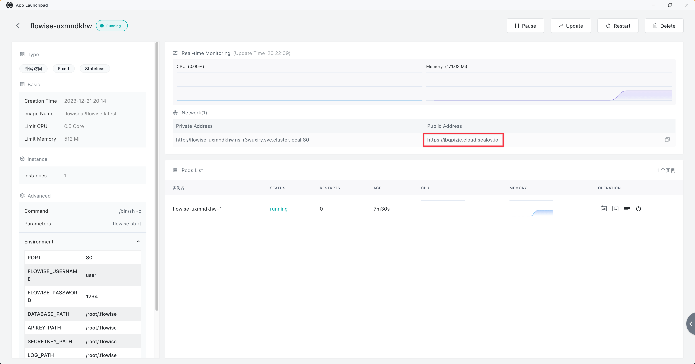

# Sealos

***

1. Cliquez sur le [modèle](https://template.sealos.io/deploy?templateName=flowise) préconstruit ci-dessous ou sur le bouton ci-dessous.

2. Ajoutez l'autorisation
   * FLOWISE\_USERNAME
   * FLOWISE\_PASSWORD

<figure><figcaption></figcaption></figure>

3. Cliquez sur "Déployer l'application" sur la page du modèle pour commencer le déploiement.
4. Une fois le déploiement terminé, cliquez sur "Détails" pour accéder aux détails de l'application.

<figure><figcaption></figcaption></figure>

5. Attendez que le statut de l'application passe à "en cours d'exécution". Ensuite, cliquez sur le lien externe pour ouvrir l'interface Web de l'application directement via le domaine externe.

<figure><figcaption></figcaption></figure>

## Volume Persistant

Cliquez sur "Mettre à jour" en haut à droite de la page des détails de l'application, puis cliquez sur "Avancé" -> "Ajouter un volume", remplissez la valeur du "chemin de montage" : `/root/.flowise`.

<figure><figcaption></figcaption></figure>

Pour terminer, cliquez sur le bouton "Déployer".

Essayez maintenant de créer un flux et de l'enregistrer dans Flowise. Ensuite, essayez de redémarrer le service ou de redéployer, vous devriez toujours pouvoir voir le flux que vous avez enregistré précédemment.