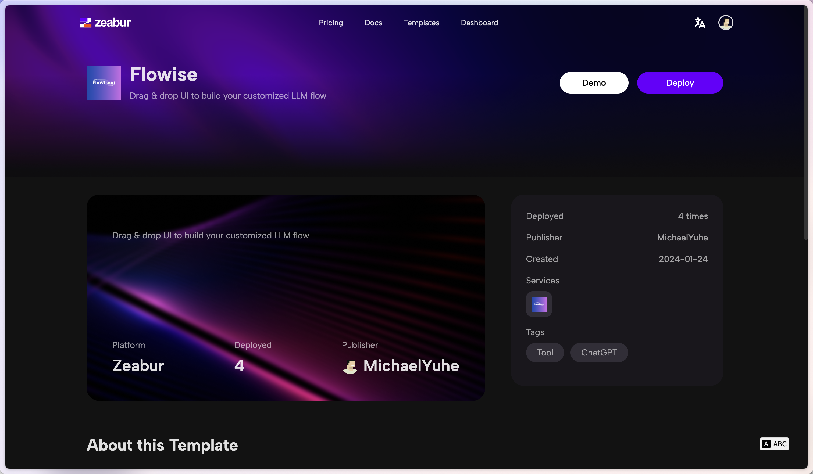
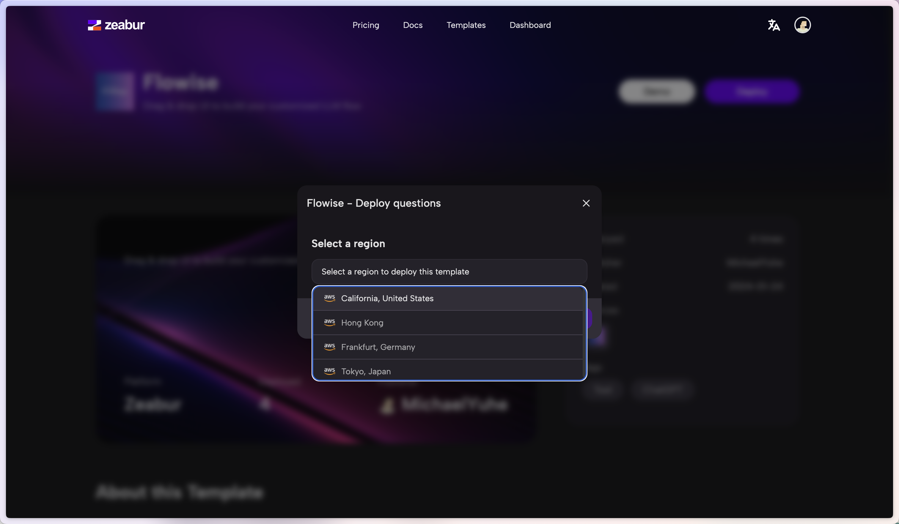

# Zeabur

***


Veuillez noter que le modèle suivant créé par Zeabur est obsolète (du 2024-01-24).


1. Cliquez sur le [modèle](https://zeabur.com/templates/2JYZTR) préconstruit ci-dessous ou sur le bouton ci-dessous.

2. Cliquez sur Déployer

<figure><figcaption></figcaption></figure>

3. Sélectionnez votre région préférée et continuez

<figure><figcaption></figcaption></figure>

4. Vous serez redirigé vers le tableau de bord de Zeabur et vous verrez le processus de déploiement

<figure><figcaption></figcaption></figure>

5. Pour ajouter une autorisation, allez dans l'onglet Variables et ajoutez :

* FLOWISE\_USERNAME
* FLOWISE\_PASSWORD

<figure><figcaption></figcaption></figure>

6. Il existe une liste de variables d'environnement que vous pouvez configurer. Consultez [environment-variables.md](../environment-variables.md "mention")

C'est tout ! Vous avez maintenant déployé Flowise sur Zeabur [🎉](https://emojipedia.org/party-popper/)[🎉](https://emojipedia.org/party-popper/)

## Volume Persistant

Zeabur créera automatiquement un volume persistant pour vous, donc vous n'avez pas à vous en soucier.