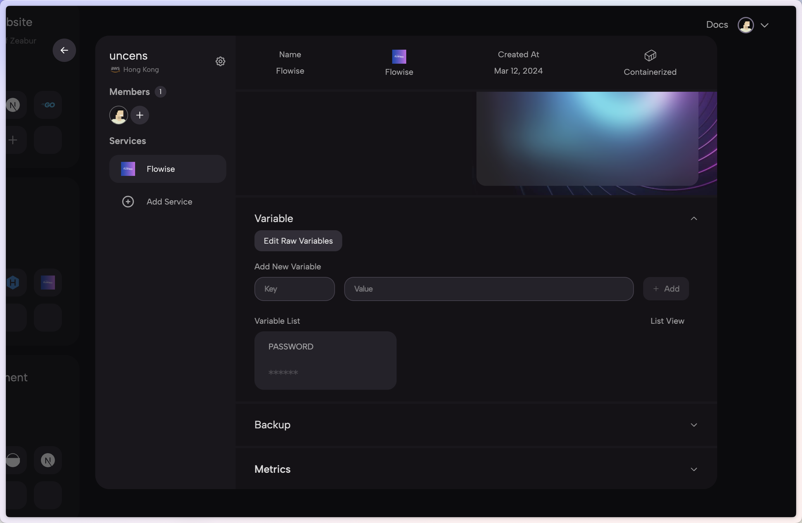

# Zeabur

***


Please note that the following template made by Zeabur is outdated (from 2024-01-24).


1. Click the following prebuilt [template](https://zeabur.com/templates/2JYZTR) or the button below.

2. Click Deploy

<figure><figcaption></figcaption></figure>

3. Select your favorite region and continue

<figure><figcaption></figcaption></figure>

4. You will be redirected to Zeabur's dashboard and you will see the deployment process

<figure><figcaption></figcaption></figure>

5. To add authorization, navigate to Variables tab and add:

* FLOWISE\_USERNAME
* FLOWISE\_PASSWORD

<figure><figcaption></figcaption></figure>

6. There are list of env variables you can configure. Refer to [environment-variables.md](../environment-variables.md "mention")

That's it! You now have a deployed Flowise on Zeabur [🎉](https://emojipedia.org/party-popper/)[🎉](https://emojipedia.org/party-popper/)

## Persistent Volume

Zeabur will automatically create a persistent volume for you so you don't have to worry about it.
