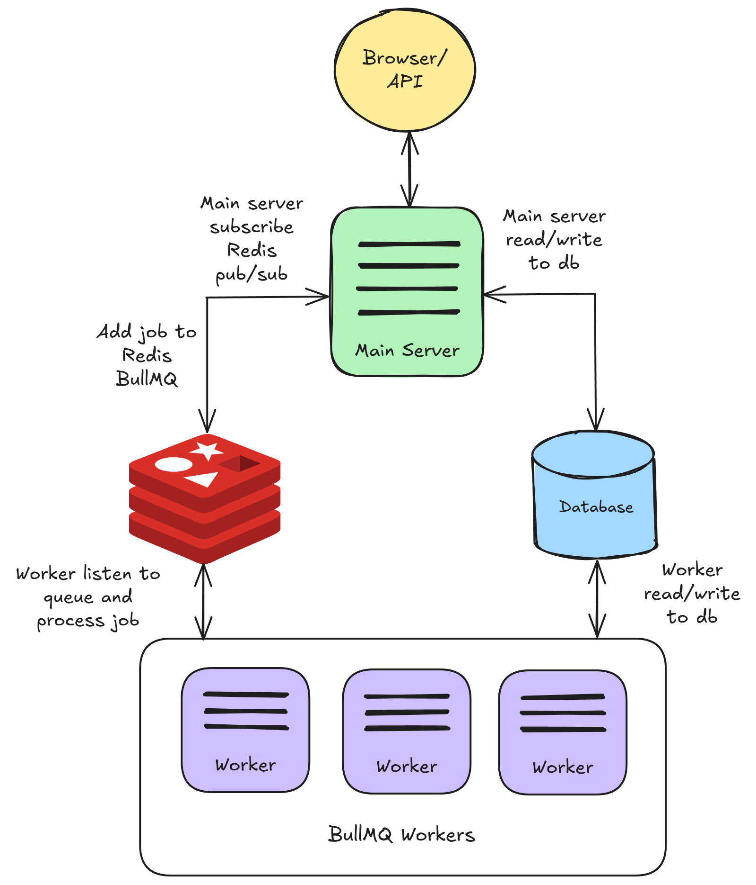
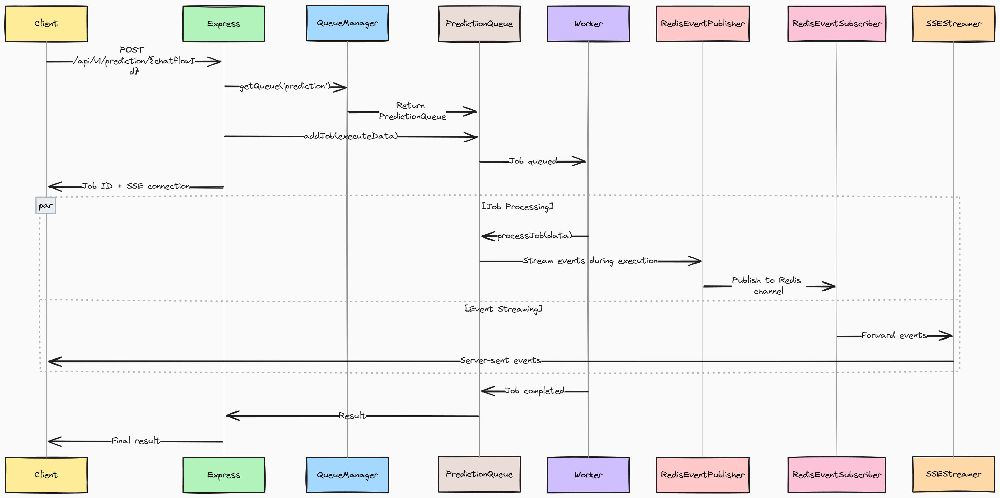

# Exécution de Flowise en mode Queue

Par défaut, Flowise s'exécute dans un thread principal NodeJS. Cependant, avec un grand nombre de prédictions, cela ne s'adapte pas bien. Il existe donc 2 modes que vous pouvez configurer : `main` (par défaut) et `queue`.

## Mode Queue

Avec les variables d'environnement suivantes, vous pouvez exécuter Flowise en mode `queue`.

<table><thead><tr><th width="263">Variable</th><th>Description</th><th>Type</th><th>Par défaut</th></tr></thead><tbody><tr><td>MODE</td><td>Mode d'exécution de Flowise</td><td>Enum String : <code>main</code>, <code>queue</code></td><td><code>main</code></td></tr><tr><td>WORKER_CONCURRENCY</td><td>Nombre de tâches autorisées à être traitées en parallèle pour un travailleur. Si vous avez 1 travailleur, cela signifie combien de tâches de prédiction simultanées il peut gérer. Plus <a href="https://docs.bullmq.io/guide/workers/concurrency">d'infos</a></td><td>Nombre</td><td>10000</td></tr><tr><td>QUEUE_NAME</td><td>Le nom de la file de messages</td><td>String</td><td>flowise-queue</td></tr><tr><td>QUEUE_REDIS_EVENT_STREAM_MAX_LEN</td><td>Le flux d'événements est automatiquement réduit afin que sa taille ne croisse pas trop. Plus <a href="https://docs.bullmq.io/guide/events">d'infos</a></td><td>Nombre</td><td>10000</td></tr><tr><td>REDIS_URL</td><td>URL Redis</td><td>String</td><td></td></tr><tr><td>REDIS_HOST</td><td>Hôte Redis</td><td>String</td><td>localhost</td></tr><tr><td>REDIS_PORT</td><td>Port Redis</td><td>Nombre</td><td>6379</td></tr><tr><td>REDIS_USERNAME</td><td>Nom d'utilisateur Redis (optionnel)</td><td>String</td><td></td></tr><tr><td>REDIS_PASSWORD</td><td>Mot de passe Redis (optionnel)</td><td>String</td><td></td></tr><tr><td>REDIS_TLS</td><td>Connexion TLS Redis (optionnel) Plus <a href="https://redis.io/docs/latest/operate/oss_and_stack/management/security/encryption/">d'infos</a></td><td>Boolean</td><td>false</td></tr><tr><td>REDIS_CERT</td><td>Certificat auto-signé Redis</td><td>String</td><td></td></tr><tr><td>REDIS_KEY</td><td>Fichier clé du certificat auto-signé Redis</td><td>String</td><td></td></tr><tr><td>REDIS_CA</td><td>Fichier CA du certificat auto-signé Redis</td><td>String</td><td></td></tr></tbody></table>

En mode `queue`, le serveur principal sera responsable du traitement des demandes, en envoyant des tâches à la file de messages. Le serveur principal n'exécutera pas la tâche. Un ou plusieurs travailleurs reçoivent des tâches de la file, les exécutent et renvoient les résultats.

Cela permet une mise à l'échelle dynamique : vous pouvez ajouter des travailleurs pour gérer des charges de travail accrues ou les retirer pendant les périodes plus légères.

Voici comment cela fonctionne :

1. Le serveur principal reçoit des demandes de prédiction ou d'autres demandes du web, les ajoutant comme tâches à la file.
2. Ces files de tâches sont des listes essentielles de tâches en attente d'être traitées. Les travailleurs, qui sont essentiellement des processus ou des threads séparés, prennent ces tâches et les exécutent.
3. Une fois la tâche terminée, le travailleur :
   * Écrit les résultats dans la base de données.
   * Envoie un événement pour indiquer l'achèvement de la tâche.
4. Le serveur principal reçoit l'événement et renvoie le résultat à l'interface utilisateur.
5. Redis pub/sub est également utilisé pour diffuser des données vers l'interface utilisateur.

<figure><figcaption></figcaption></figure>

## Diagramme de Flux

<figure><figcaption></figcaption></figure>

#### 1. Point d'Entrée de la Demande

Une demande de prédiction atteint le serveur Express et vérifie immédiatement si `MODE=QUEUE`. Si c'est vrai, il passe de l'exécution directe au traitement asynchrone en file d'attente.

#### 2. Création de Tâche & Canaux Doubles

Le système crée deux chemins parallèles :

* **Canal de Tâche** : Les données de la demande deviennent une tâche Redis via BullMQ, le thread HTTP attend l'achèvement
* **Canal de Flux** : Connexion SSE établie pour des mises à jour en temps réel via la publication/souscription Redis

#### 3. Traitement par le Travailleur

Des processus de travailleurs indépendants interrogent Redis pour des tâches. Lorsqu'une tâche est assignée :

* Reconstruire le contexte d'exécution complet (DB, composants, contrôleurs d'abandon)
* Exécuter le flux de travail avec un traitement nœud par nœud
* Publier des événements en temps réel (tokens, outils, progrès) sur les canaux Redis

#### 4. Communication en Temps Réel

Pendant l'exécution :

* [**RedisEventPublisher**](https://github.com/FlowiseAI/Flowise/blob/main/packages/server/src/queue/RedisEventPublisher.ts) diffuse des événements du travailleur vers Redis
* [**RedisEventSubscriber**](https://github.com/FlowiseAI/Flowise/blob/main/packages/server/src/queue/RedisEventSubscriber.ts) transmet des événements de Redis aux clients SSE
* [**SSEStreamer**](https://github.com/FlowiseAI/Flowise/blob/main/packages/server/src/utils/SSEStreamer.ts) livre des événements au navigateur en temps réel

#### 5. Achèvement & Réponse

La tâche se termine, le résultat est stocké dans Redis :

* Le thread HTTP se débloque, reçoit le résultat
* La connexion SSE se ferme proprement
* Les ressources sont nettoyées (contrôleurs d'abandon, connexions)

## Configuration Locale

### Démarrer Redis

Avant de démarrer le serveur principal et les travailleurs, Redis doit d'abord être en cours d'exécution. Vous pouvez exécuter Redis sur une machine séparée, mais assurez-vous qu'il est accessible par les instances de serveur et de travailleurs.

Par exemple, vous pouvez faire fonctionner Redis sur votre Docker en suivant ce [guide](https://www.docker.com/blog/how-to-use-the-redis-docker-official-image/).

### Démarrer le Serveur Principal

C'est la même procédure que celle que vous suivriez pour exécuter Flowise par défaut, à l'exception de la configuration des variables d'environnement mentionnées ci-dessus.

```bash
pnpm start
```

### Démarrer le Travailleur

Tout comme pour le serveur principal, les variables d'environnement ci-dessus doivent être configurées. Nous recommandons d'utiliser le même fichier `.env` pour les instances principales et de travail. La seule différence réside dans la façon de lancer les travailleurs. Ouvrez un autre terminal et exécutez :

```bash
pnpm run start-worker
```


Le serveur principal et le worker doivent partager la même clé secrète. Référez-vous à [#for-credentials](environment-variables.md#for-credentials "mention"). Pour la production, nous recommandons d'utiliser Postgres comme base de données pour des performances optimales.


## Configuration de Docker

### Méthode 1 : Images préconstruites (Recommandée)

Cette méthode utilise des images Docker préconstruites depuis Docker Hub, ce qui en fait l'option de déploiement la plus rapide et la plus fiable.

**Étape 1 : Configurer l'environnement**

Créez un fichier `.env` dans le répertoire `docker` :

```bash
# Basic Configuration
PORT=3000
WORKER_PORT=5566

# Queue Configuration (Required)
MODE=queue
QUEUE_NAME=flowise-queue
REDIS_URL=redis://redis:6379

# Optional Queue Settings
WORKER_CONCURRENCY=5
REMOVE_ON_AGE=24
REMOVE_ON_COUNT=1000
QUEUE_REDIS_EVENT_STREAM_MAX_LEN=1000
ENABLE_BULLMQ_DASHBOARD=false

# Database (Optional - defaults to SQLite)
DATABASE_PATH=/root/.flowise

# Storage
BLOB_STORAGE_PATH=/root/.flowise/storage

# Secret Keys
SECRETKEY_PATH=/root/.flowise

# Logging
LOG_PATH=/root/.flowise/logs
```

**Étape 2 : Déployer**

```bash
cd docker
docker compose -f docker-compose-queue-prebuilt.yml up -d
```

**Étape 3 : Vérifier le déploiement**

```bash
# Check container status
docker compose -f docker-compose-queue-prebuilt.yml ps

# View logs
docker compose -f docker-compose-queue-prebuilt.yml logs -f flowise
docker compose -f docker-compose-queue-prebuilt.yml logs -f flowise-worker
```

### Méthode 2 : Construire à partir du code source

Cette méthode construit Flowise à partir du code source, utile pour le développement ou les modifications personnalisées.

**Étape 1 : Configurer l'environnement**

Créez le même fichier `.env` que dans [Méthode 1](running-flowise-using-queue.md#method-1-pre-built-images-recommended).

**Étape 2 : Déployer**

```bash
cd docker
docker compose -f docker-compose-queue-source.yml up -d
```

**Étape 3 : Processus de construction**

La construction source va :

* Construire l'application principale Flowise à partir du code source
* Construire l'image du worker à partir du code source
* Configurer Redis et le réseau

**Étape 4 : Surveiller la construction**

```bash
# Watch build progress
docker compose -f docker-compose-queue-source.yml logs -f

# Check final status
docker compose -f docker-compose-queue-source.yml ps
```

### Vérifications de santé

Tous les fichiers compose incluent des vérifications de santé :

```bash
# Check main instance health
curl http://localhost:3000/api/v1/ping

# Check worker health
curl http://localhost:5566/healthz
```

## Tableau de bord des files d'attente

Définir `ENABLE_BULLMQ_DASHBOARD` sur true permettra aux utilisateurs de voir tous les travaux, l'état, le résultat et les données en naviguant vers `<your-flowise-url.com>/admin/queues`

<figure><figcaption></figcaption></figure>
