# Zapier Zaps

***

## Prérequis

1. [Connectez-vous](https://zapier.com/app/login) ou [inscrivez-vous](https://zapier.com/sign-up) à Zapier
2. Consultez [le déploiement](../../configuration/deployment/) pour créer une version hébergée dans le cloud de Flowise.

## Configuration

1. Allez sur [Zapier Zaps](https://zapier.com/app/zaps)
2. Cliquez sur **Créer**

<figure><figcaption></figcaption></figure>

### Recevoir le message de déclenchement

1.  Cliquez ou recherchez **Discord**

    <figure>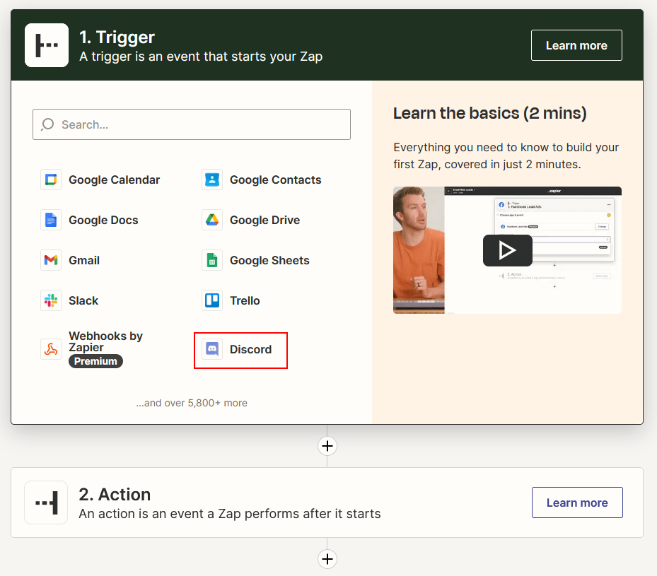<figcaption></figcaption></figure>
2.  Sélectionnez **Nouveau message posté dans le canal** comme événement, puis cliquez sur **Continuer**

    <figure>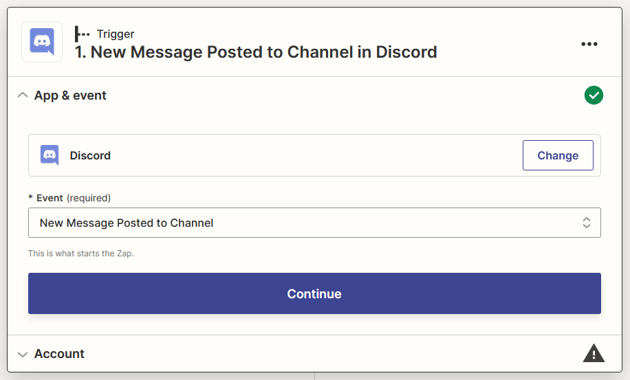<figcaption></figcaption></figure>
3.  **Connectez-vous** à votre compte Discord

    <figure>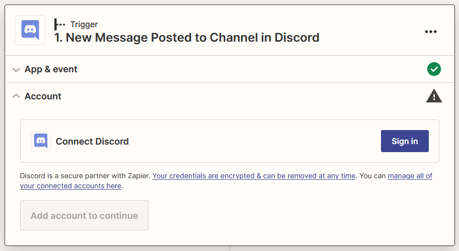<figcaption></figcaption></figure>
4.  Ajoutez le **Bot Zapier** à votre serveur préféré

    <figure>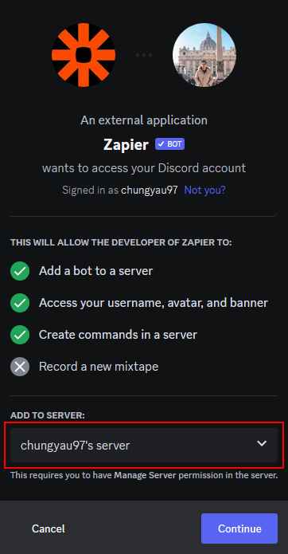<figcaption></figcaption></figure>
5.  Accordez les autorisations appropriées et cliquez sur **Autoriser**, puis cliquez sur **Continuer**

    <figure><figcaption></figcaption></figure>

    <figure>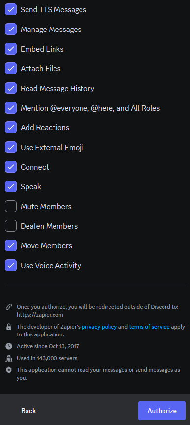<figcaption></figcaption></figure>
6.  Sélectionnez votre **canal préféré** pour interagir avec le Bot Zapier, puis cliquez sur **Continuer**

    <figure>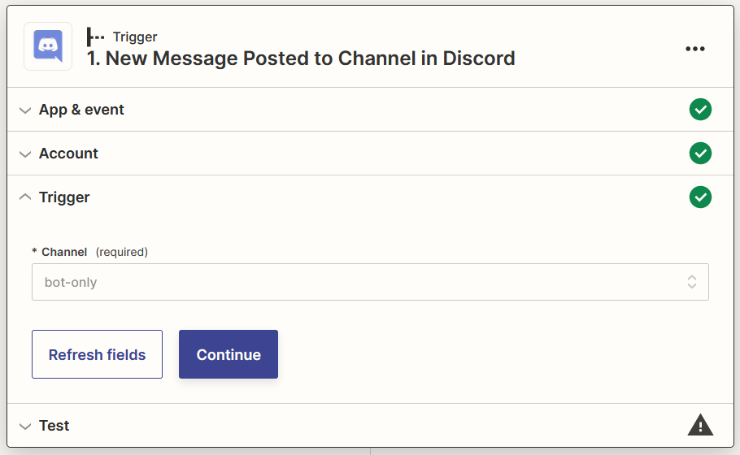<figcaption></figcaption></figure>
7.  **Envoyez un message** à votre canal sélectionné à l'étape 8

    <figure><figcaption></figcaption></figure>
8.  Cliquez sur **Tester le déclencheur**

    <figure><figcaption></figcaption></figure>
9.  Sélectionnez votre message, puis cliquez sur **Continuer avec l'enregistrement sélectionné**

    <figure><figcaption></figcaption></figure>

### Filtrer le message du Bot Zapier

1.  Cliquez ou recherchez **Filtre**

    <figure>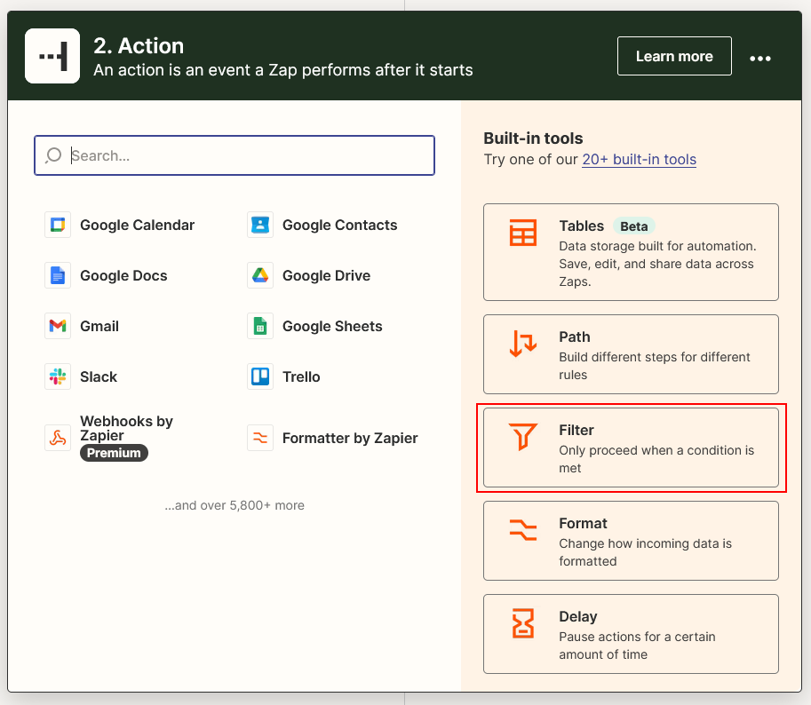<figcaption></figcaption></figure>
2.  Configurez le **Filtre** pour ne pas continuer si le message reçu provient du **Bot Zapier**, puis cliquez sur **Continuer**

    <figure>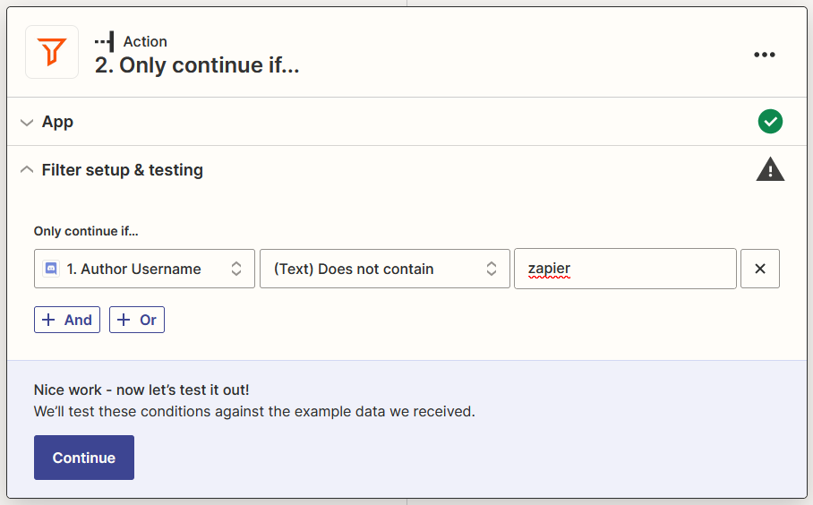<figcaption></figcaption></figure>

### FlowiseAI génère le message de résultat

1.  Cliquez sur **+**, cliquez ou recherchez **FlowiseAI**

    <figure><figcaption></figcaption></figure>
2.  Sélectionnez **Faire une prédiction** comme événement, puis cliquez sur **Continuer**

    <figure><figcaption></figcaption></figure>
3.  Cliquez sur **Se connecter** et saisissez vos informations, puis cliquez sur **Oui, continuer vers FlowiseAI**

    <figure>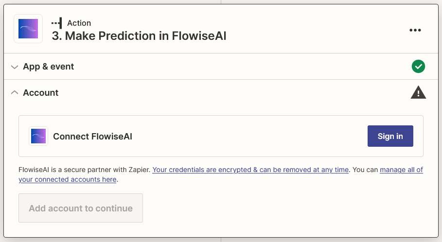<figcaption></figcaption></figure>

    <figure><figcaption></figcaption></figure>
4.  Sélectionnez **Contenu** de Discord et votre ID Flow, puis cliquez sur **Continuer**

    <figure><figcaption></figcaption></figure>
5.  Cliquez sur **Tester l'action** et attendez votre résultat

    <figure><figcaption></figcaption></figure>

### Envoyer un message de résultat

1.  Cliquez sur **+**, cliquez ou recherchez **Discord**

    <figure><figcaption></figcaption></figure>
2.  Sélectionnez **Envoyer un message dans le canal** comme événement, puis cliquez sur **Continuer**

    <figure><figcaption></figcaption></figure>
3.  Sélectionnez le compte Discord auquel vous êtes connecté, puis cliquez sur **Continuer**

    <figure><figcaption></figcaption></figure>
4.  Sélectionnez votre canal préféré pour le canal et choisissez **Texte** et **Source de chaîne** (si disponible) de FlowiseAI pour le texte du message, puis cliquez sur **Continuer**

    <figure>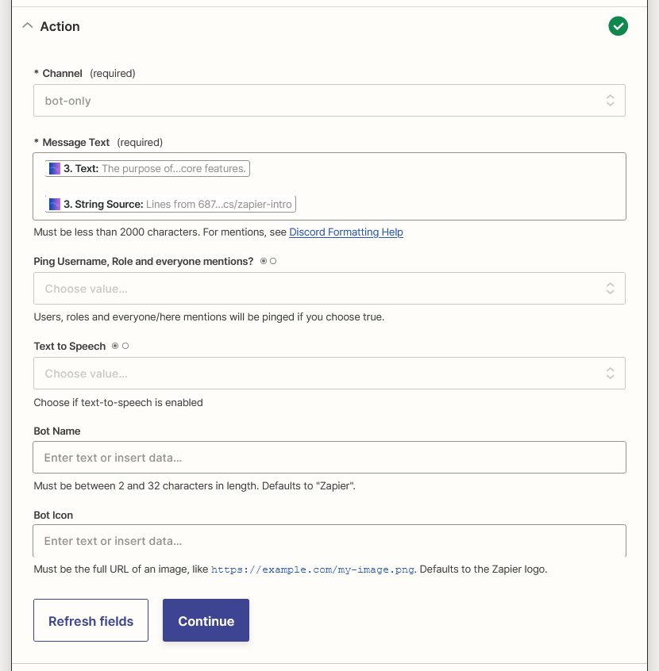<figcaption></figcaption></figure>
5.  Cliquez sur **Tester l'action**

    <figure>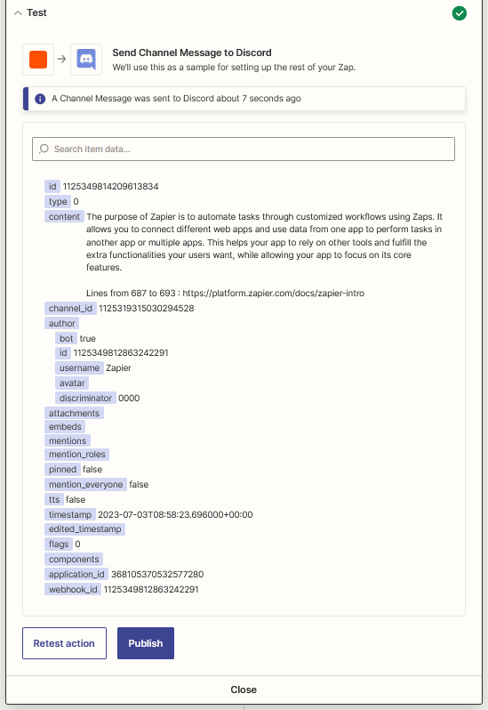<figcaption></figcaption></figure>
6.  Voilà [🎉](https://emojipedia.org/party-popper/) vous devriez voir le message arriver dans votre canal Discord

    <figure>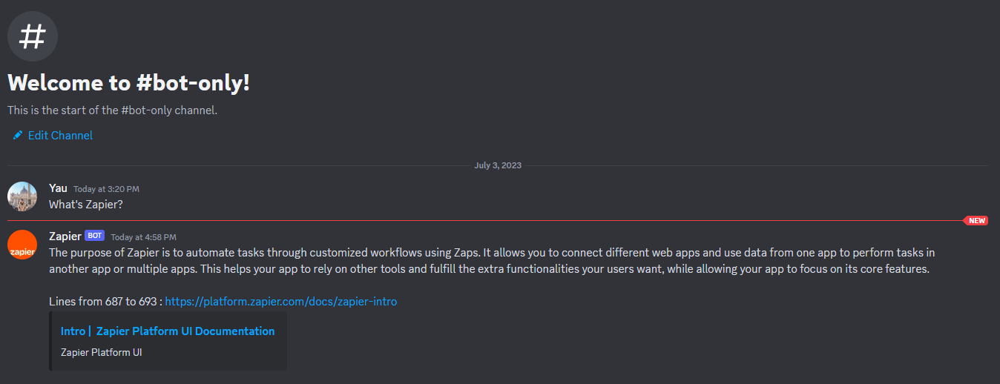<figcaption></figcaption></figure>
7.  Enfin, renommez votre Zap et publiez-le

    <figure><figcaption></figcaption></figure>