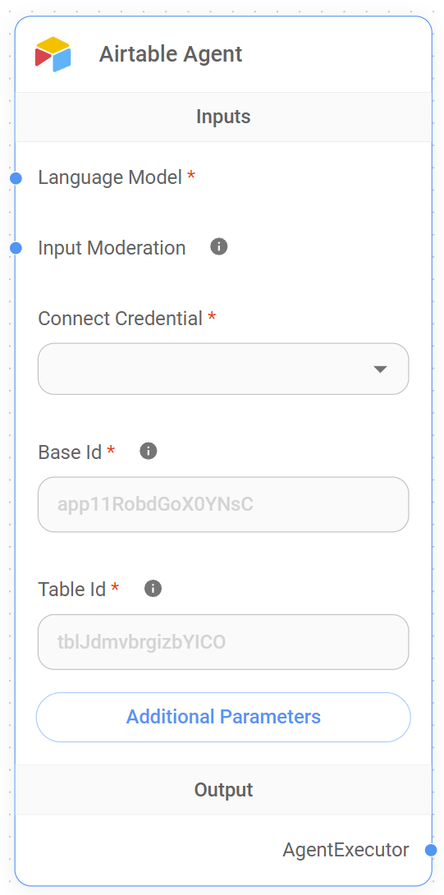

# Agent Airtable

<figure><figcaption>
Node de l'Agent Airtable
</figcaption></figure>

## Fonctionnalité de l'Agent Airtable

L'Agent Airtable est conçu pour faciliter les interactions entre Flowise AI et les tables Airtable, permettant aux utilisateurs de consulter les données d'Airtable de manière conversationnelle. En utilisant cet agent, les utilisateurs peuvent poser des questions sur le contenu de leur base Airtable et recevoir des réponses pertinentes basées sur les données stockées. Cela peut être particulièrement utile pour extraire rapidement des informations spécifiques, automatiser des flux de travail ou générer des résumés à partir des données stockées dans Airtable.

Par exemple, l'Agent Airtable peut être utilisé pour répondre à des questions telles que :

* "Combien de tâches sont encore incomplètes dans ma table de suivi de projet ?"
* "Quels sont les détails de contact des clients listés dans le CRM ?"
* "Donnez-moi un résumé de tous les enregistrements ajoutés au cours de la semaine dernière."

Cette fonctionnalité aide les utilisateurs à obtenir des informations de leurs bases Airtable sans avoir besoin de naviguer dans l'interface Airtable, rendant ainsi la gestion et l'analyse de leurs données plus faciles et interactives.

## Entrées

L'Agent Airtable nécessite les entrées suivantes pour fonctionner efficacement :

* **Modèle de Langue** : Le modèle de langue à utiliser pour traiter les requêtes. Cette entrée est requise et aide à déterminer la qualité et l'exactitude des réponses fournies par l'agent.
* **Modération des Entrées** : Entrée optionnelle qui permet la modération du contenu. Cela aide à garantir que les requêtes sont appropriées et ne contiennent pas de contenu offensant ou nuisible.
* **Identifiant de Connexion** : Entrée requise pour se connecter à Airtable. Les utilisateurs doivent sélectionner l'identifiant approprié qui a les permissions pour accéder à leurs données Airtable.
* **ID de Base** : L'ID de la base Airtable à laquelle se connecter. C'est un champ requis et peut être trouvé dans la documentation API d'Airtable ou dans les paramètres de la base. Si l'URL de votre table ressemble à `https://airtable.com/app11RobdGoX0YNsC/tblJdmvbrgizbYlCO/viw9UrP77idOCE4ee`, `app11RobdGoX0YNsC` est l'ID de la Base. Il est utilisé pour spécifier quelle base Airtable contient les données à interroger.
* **ID de Table** : L'ID de la table spécifique au sein de la base Airtable. C'est également un champ requis et aide l'agent à cibler la bonne table pour la récupération des données. Dans l'URL d'exemple `https://airtable.com/app11RobdGoX0YNsC/tblJdmvbrgizbYlCO/viw9UrP77idOCE4ee`, `tblJdmvbrgizbYlCO` est l'ID de la Table.
* **Paramètres Supplémentaires** : Paramètres optionnels qui peuvent être utilisés pour personnaliser le comportement de l'agent. Ces paramètres peuvent être configurés en fonction de cas d'utilisation spécifiques.
  * **Retourner Tout** : Cette option permet aux utilisateurs de retourner tous les enregistrements de la table spécifiée. Si activée, tous les enregistrements seront récupérés, sinon, seul un nombre limité sera retourné.
  * **Limite** : Spécifie le nombre maximum d'enregistrements à retourner si **Retourner Tout** n'est pas activé. La valeur par défaut est `100`.

**Remarque** : Cette section est en cours de développement. Nous apprécions toute aide que vous pouvez fournir pour compléter cette section. Veuillez consulter notre [Guide de Contribution](broken-reference) pour commencer.