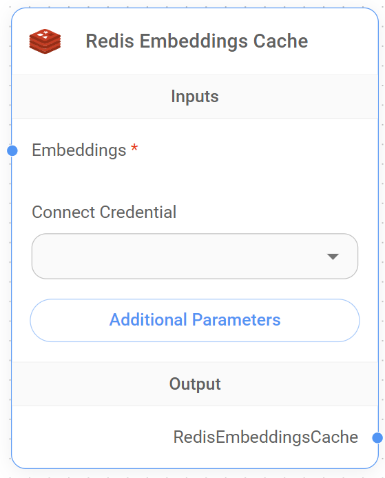

# Cache d'Embeddings Redis

<figure><figcaption>
Noeud de Cache d'Embeddings Redis
</figcaption></figure>


Cette section est en cours de développement. Nous apprécions toute aide que vous pouvez apporter pour compléter cette section. Veuillez consulter notre [Guide de Contribution](broken-reference) pour commencer.
