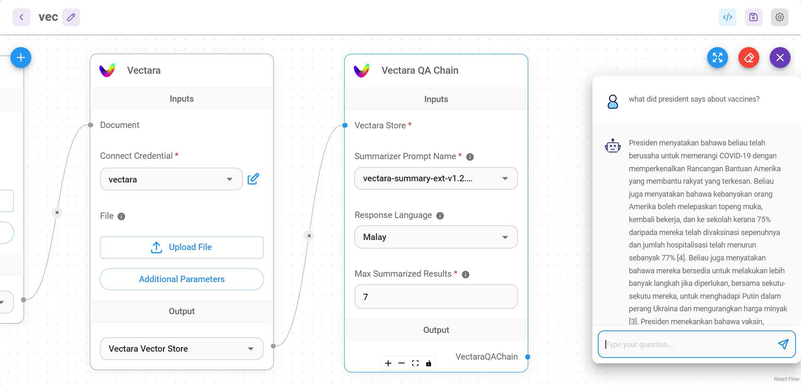

# Vectara QA Chain

Une chaîne pour effectuer des tâches de question-réponse avec Vectara.

<figure><figcaption></figcaption></figure>

## Définitions

**Une chaîne de question-réponse basée sur la récupération**, qui s'intègre à un composant de récupération Vectara et vous permet de configurer les paramètres d'entrée et d'effectuer des tâches de question-réponse.

## Entrées

* [Vectara Store](../vector-stores/vectara.md)

## Paramètres

| Nom                   | Description                                                   |
| ---------------------- | ------------------------------------------------------------- |
| Nom du Prompt de Résumé | modèle à utiliser pour générer le résumé                     |
| Langue de la Réponse  | langue souhaitée pour la réponse                              |
| Résultats Résumés Max | nombre de résultats principaux à utiliser dans le résumé (par défaut 7) |

## Sorties

| Nom               | Description                   |
| ----------------- | ----------------------------- |
| VectaraQAChain    | Noeud final pour retourner la réponse |