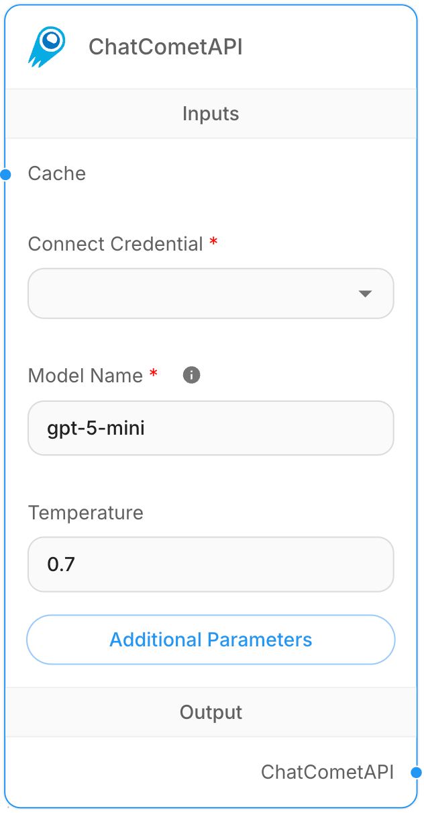

# ChatCometAPI

## Description
CometAPI is a unified API platform that provides access to 500+ AI models including GPT, Claude, Gemini, Qwen, DeepSeek, Midjourney, and others through a single integration. It offers simplified access with consistent API formats across different model providers.

## Prerequisite
1. Refer to official [docs](https://api.cometapi.com/doc) from CometAPI.
2. Get your API key from [CometAPI Console](https://api.cometapi.com/console/token).

## Step by Step Guide
<figure><figcaption>
ChatCometAPI Node
</figcaption></figure>

1. **Chat Models** > Drag the **ChatCometAPI** node.
2. Create a new credential with CometAPI API key.
3. Click **Additional Parameters** on ChatCometAPI node.
4. Change the Base Path to: `https://api.cometapi.com/v1/`.