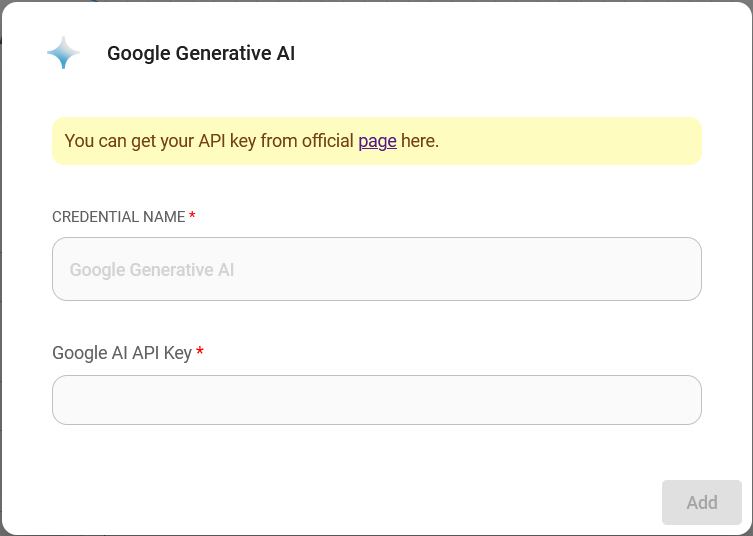

# ChatGoogleGenerativeAI

## Prérequis

1. Inscrivez-vous pour un compte [Google](https://accounts.google.com/InteractiveLogin)
2. Créez une [clé API](https://aistudio.google.com/app/apikey)

## Configuration

1. **Modèles de Chat** > faites glisser le nœud **ChatGoogleGenerativeAI**

<figure><figcaption></figcaption></figure>

2. **Connecter les Identifiants** > cliquez sur **Créer Nouveau**

<figure><figcaption></figcaption></figure>

3. Remplissez les identifiants **Google AI**

<figure><figcaption></figcaption></figure>

4. Voilà [🎉](https://emojipedia.org/party-popper/), vous pouvez maintenant utiliser le nœud **ChatGoogleGenerativeAI** dans Flowise

<figure><figcaption></figcaption></figure>

## Configuration des Attributs de Sécurité

1. Cliquez sur **Paramètres Supplémentaires**

<figure><figcaption></figcaption></figure>

* Lors de la configuration des **Attributs de Sécurité**, le nombre de sélections dans **Catégorie de Dommages** et **Seuil de Blocage de Dommages** doit être le même. Sinon, une erreur sera générée : `La Catégorie de Dommages et le Seuil de Blocage de Dommages ne sont pas de la même longueur`

* La combinaison des **Attributs de Sécurité** ci-dessous entraînera que `Dangereux` est défini sur `Faible et Au-dessus` et `Harcèlement` est défini sur `Moyen et Au-dessus`

<figure><figcaption></figcaption></figure>

## Ressources

* [LangChain JS ChatGoogleGenerativeAI](https://js.langchain.com/docs/integrations/chat/google_generativeai)
* [Google AI pour les Développeurs](https://ai.google.dev/)
* [Documentation de l'API Gemini](https://ai.google.dev/docs)