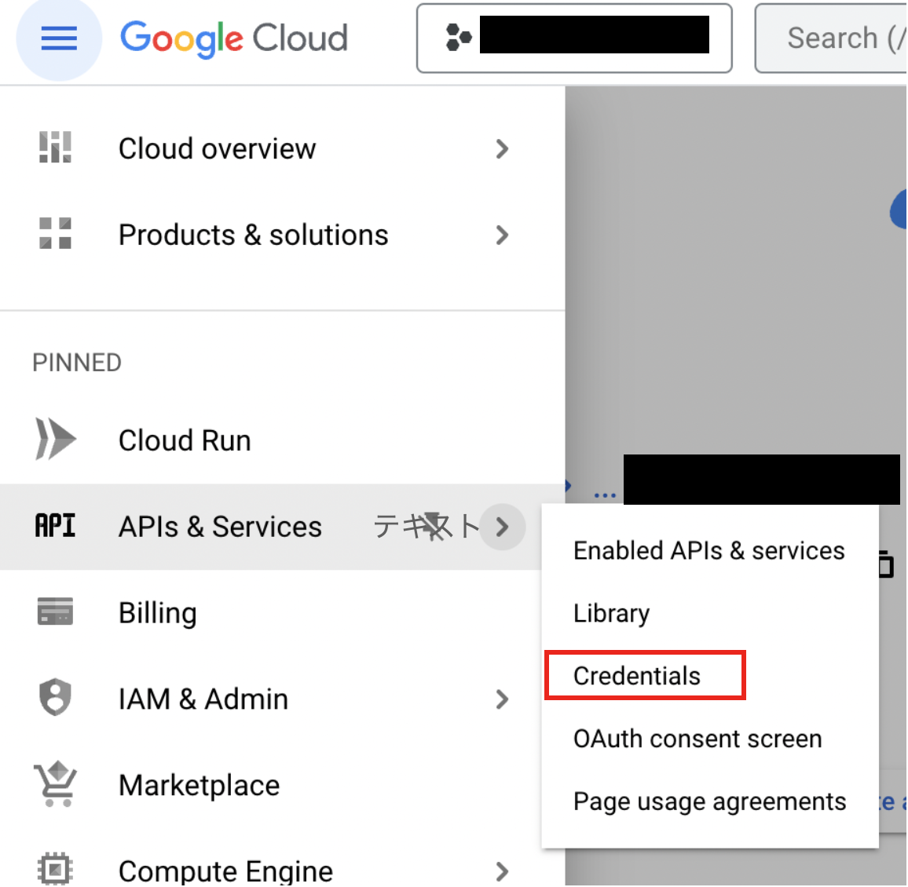
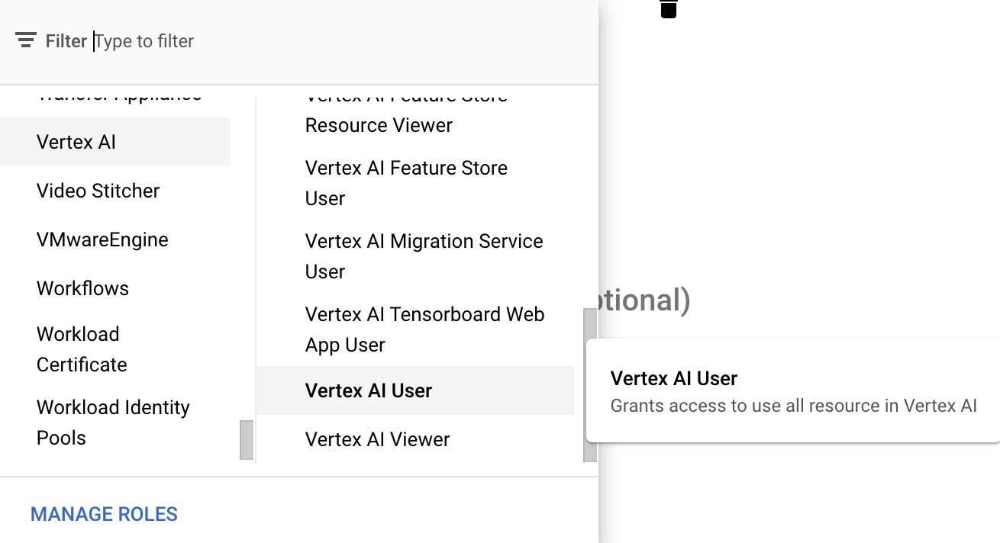

# Google VertexAI

## Prérequis

1. [Commencez votre GCP](https://cloud.google.com/docs/get-started)
2. Installez le [Google Cloud CLI](https://cloud.google.com/sdk/docs/install-sdk)

## Configuration

### Activer l'API Vertex AI

1. Allez sur Vertex AI dans GCP et cliquez sur **"ACTIVER TOUTES LES API RECOMMANDÉES"**

<figure><figcaption></figcaption></figure>

## Créer un fichier d'identification _(Optionnel)_

Il existe 2 façons de créer un fichier d'identification

### No. 1 : Utiliser le GCP CLI

1. Ouvrez le terminal et exécutez la commande suivante

```bash
gcloud auth application-default login
```
```markdown
2. Connectez-vous à votre compte GCP
3. Vérifiez votre fichier d'identification. Vous pouvez trouver votre fichier d'identification dans `~/.config/gcloud/application_default_credentials.json`

### No. 2 : Utiliser la console GCP

1. Allez sur la console GCP et cliquez sur **"CRÉER DES IDENTIFIANTS"**

<figure><figcaption></figcaption></figure>

2. Créez un compte de service

<figure><figcaption></figcaption></figure>

3. Remplissez le formulaire des détails du compte de service et cliquez sur **"CRÉER ET CONTINUER"**
4. Sélectionnez le rôle approprié (par exemple, Utilisateur Vertex AI) et cliquez sur **"FAIRE"**

<figure><figcaption></figcaption></figure>

5. Cliquez sur le compte de service que vous avez créé et cliquez sur **"AJOUTER UNE CLÉ" -> "Créer une nouvelle clé"**

<figure><figcaption></figcaption></figure>

6. Sélectionnez JSON et cliquez sur **"CRÉER"**, puis vous pourrez télécharger votre fichier d'identification

<figure><figcaption></figcaption></figure>

## Flowise

<figure><figcaption></figcaption></figure>

### Sans fichier d'identification

Si vous utilisez un service GCP comme Cloud Run, ou si vous avez installé des identifiants par défaut sur votre machine locale, vous n'avez pas besoin de définir cet identifiant.

### Avec fichier d'identification

1. Allez sur la page des identifiants sur Flowise et cliquez sur **"Ajouter un identifiant"**
2. Cliquez sur Google Vertex Auth

<figure><figcaption></figcaption></figure>

3. Enregistrez votre fichier d'identification. Il y a 2 façons d'enregistrer votre fichier d'identification.

<figure><figcaption></figcaption></figure>

* **Option 1 : Entrez le chemin de votre fichier d'identification**
  * Si vous avez un fichier d'identification sur votre machine, vous pouvez entrer le chemin de votre fichier d'identification dans `Chemin du fichier d'identification Google Application`
* **Option 2 : Collez le texte de votre fichier d'identification**
  * Ou vous pouvez copier tout le texte du fichier d'identification et le coller dans `Objet JSON d'identification Google`

4. Enfin, cliquez sur le bouton "Ajouter".
5. **🎉**Vous pouvez maintenant utiliser ChatGoogleVertexAI avec l'identifiant dans Flowise !

### Ressources

* [LangChain JS GoogleVertexAI](https://js.langchain.com/docs/api/llms_googlevertexai/classes/GoogleVertexAI)
* [Aperçu des comptes de service Google](https://cloud.google.com/iam/docs/service-account-overview?)
* [Essayez Google Vertex AI Palm 2 avec Flowise : Sans coder pour tirer parti de l'intuition](https://tech.beatrust.com/entry/2023/08/22/Try_Google_Vertex_AI_Palm_2_with_Flowise%3A_Without_Coding_to_Leverage_Intuition)
```