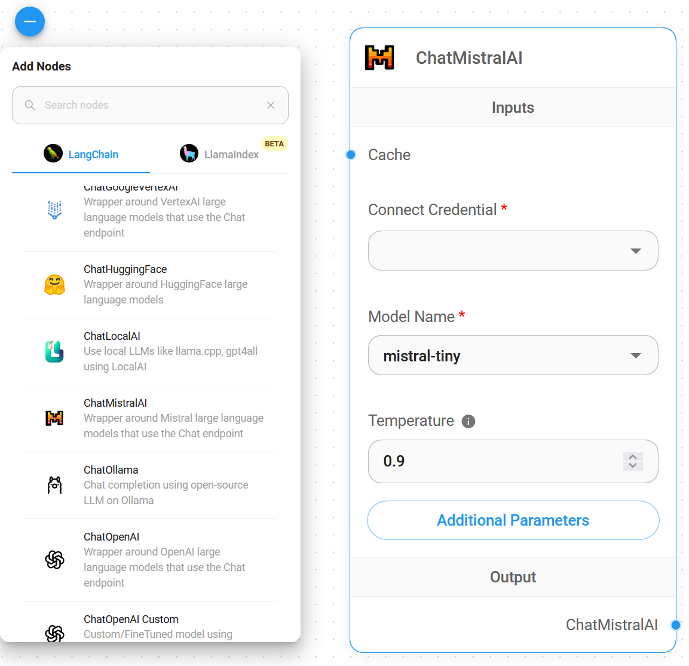
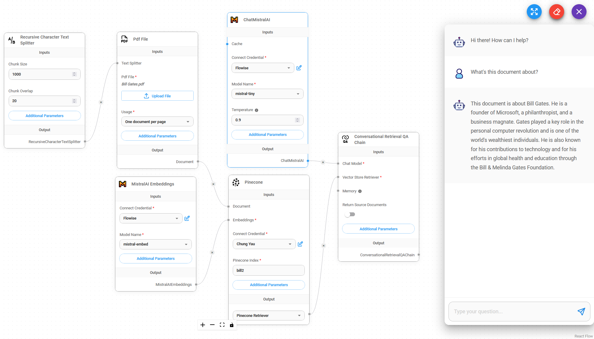

# ChatMistralAI

## Prérequis

1. Inscrivez-vous pour un compte [Mistral AI](https://mistral.ai/)
2. Créez une [clé API](https://console.mistral.ai/user/api-keys/)

## Configuration

1. **Modèles de Chat** > faites glisser le nœud **ChatMistralAI**

<figure><figcaption></figcaption></figure>

2. **Connecter les Identifiants** > cliquez sur **Créer Nouveau**

<figure><figcaption></figcaption></figure>

3. Remplissez les identifiants **Mistral AI**

<figure><figcaption></figcaption></figure>

4. Voilà [🎉](https://emojipedia.org/party-popper/), vous pouvez maintenant utiliser le **nœud ChatMistralAI** dans Flowise

<figure><figcaption></figcaption></figure>

## Ressources

* [LangChain JS ChatMistralAI](https://js.langchain.com/docs/integrations/chat/mistral)
* [Mistral AI](https://mistral.ai/)
* [Documentation Mistral AI](https://docs.mistral.ai/)