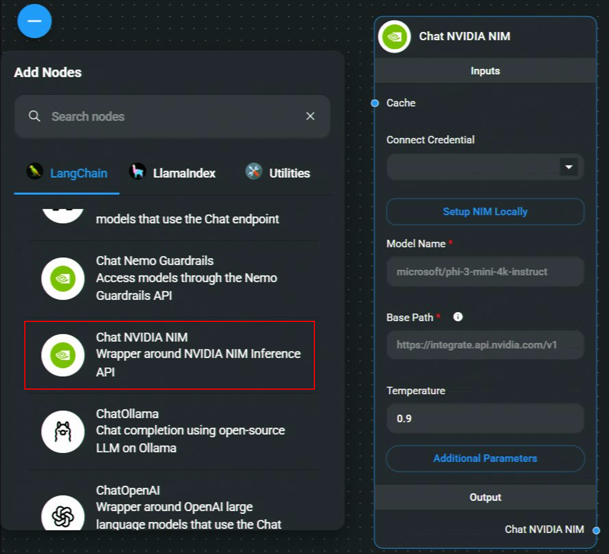
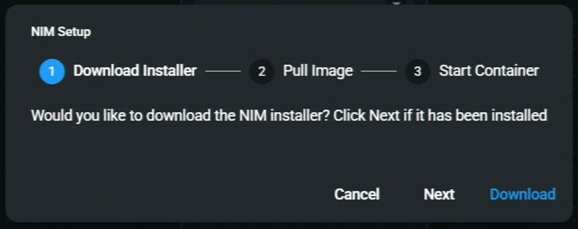
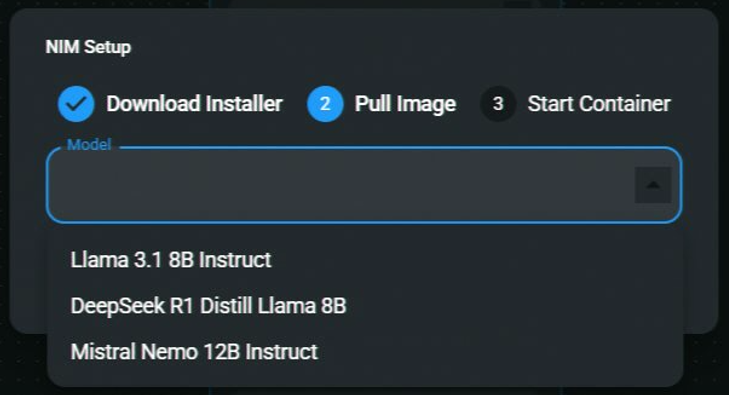
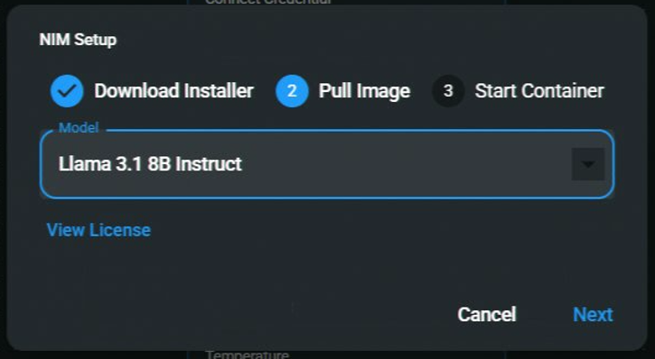
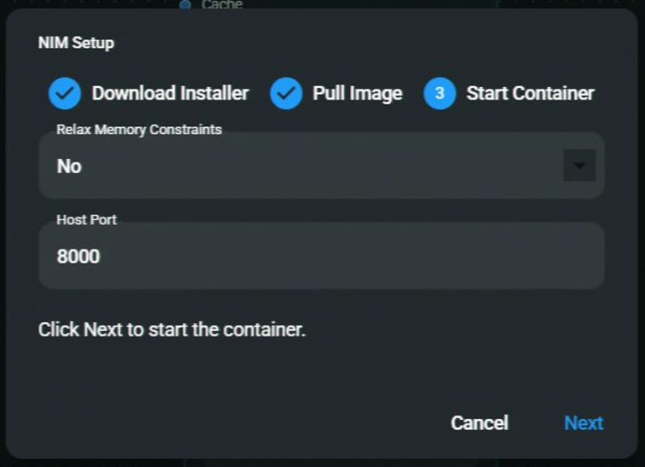
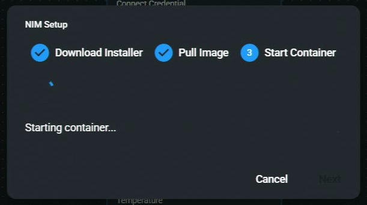
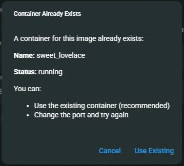
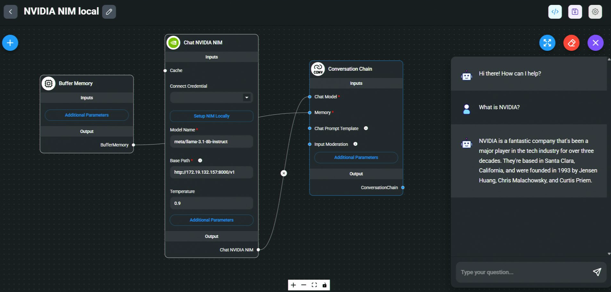

# NVIDIA NIM

## Local

### Important Note on Running NIM with Flowise

If an existing NIM instance is already running (e.g., via NVIDIA’s ChatRTX), starting another instance through Flowise **without checking for an existing endpoint** may cause conflicts. This issue occurs when multiple `podman run` commands are executed on the same NIM, leading to failures.

For support, refer to:

- **[NVIDIA Developer Forums](https://forums.developer.nvidia.com/)** – For technical issues and questions.
- **[NVIDIA Developer Discord](https://discord.gg/nvidiadeveloper)** – For community engagement and [announcements](https://discord.com/channels/1019361803752456192/1340013505834647572).

### Prerequisite

1. Setup [NVIDIA NIM locally with WSL2](https://docs.nvidia.com/nim/wsl2/1.0.0/getting-started.html).

### Flowise

1. **Chat Models** > Drag the **Chat NVIDIA NIM** node > Click **Setup NIM Locally**.

<figure><figcaption></figcaption></figure>

2. If NIM is already installed, click **Next**. Otherwise, click **Download** to start the installer.

<figure><figcaption></figcaption></figure>

3. Select a model image to download.

<figure><figcaption></figcaption></figure>

4. Once selected, click **Next** to proceed with the download.

<figure><figcaption></figcaption></figure>

5. **Downloading Image** – Duration depends on internet speed.

<figure><figcaption></figcaption></figure>

6. Learn more about [Relax Memory Constraints](https://docs.nvidia.com/nim/large-language-models/1.7.0/configuration.html#environment-variables).  
   The **Host Port** is the port for the container to map to the local machine.

<figure><figcaption></figcaption></figure>

7. **Starting the container...**

<figure><figcaption></figcaption></figure>

_Note: If you already have a container running with the selected model, Flowise will ask you if you want to reuse the running container. You can choose to reuse the running container or start a new one with a different port._

<figure><figcaption></figcaption></figure>

8. **Save the chatflow**

9. [🎉](https://emojipedia.org/party-popper/) **Voila!** Your **Chat NVIDIA NIM** node is now ready to use in Flowise!

<figure><figcaption></figcaption></figure>

## Cloud

### Prerequisite

1. Log in or sign up to [NVIDIA](https://build.nvidia.com/).
2. From the top navigation bar, click NIM:

<figure><figcaption></figcaption></figure>

3. Search for the model you would like to use. To download it locally, we will be using Docker:

<figure><figcaption></figcaption></figure>

4. Follow the instructions from the Docker setup. You must first get an API Key to pull the Docker image:

<figure><figcaption></figcaption></figure>

### Flowise

1. **Chat Models** > drag **Chat NVIDIA NIM** node

<figure><figcaption></figcaption></figure>

2. If you are using NVIDIA hosted endpoint, you must have your API key. **Connect Credential** > click **Create New.** However if you are using local setup, this is optional.

<figure><figcaption></figcaption></figure> <figure><figcaption></figcaption></figure>

3. Put in the model name and voila [🎉](https://emojipedia.org/party-popper/), your **Chat NVIDIA NIM node** is now ready to be used in Flowise!

<figure><figcaption></figcaption></figure>

### Resources

- [NVIDIA LLM Getting Started](https://docs.nvidia.com/nim/large-language-models/latest/getting-started.html)
- [NVIDIA NIM](https://build.nvidia.com/microsoft/phi-3-mini-4k?snippet_tab=Docker)
