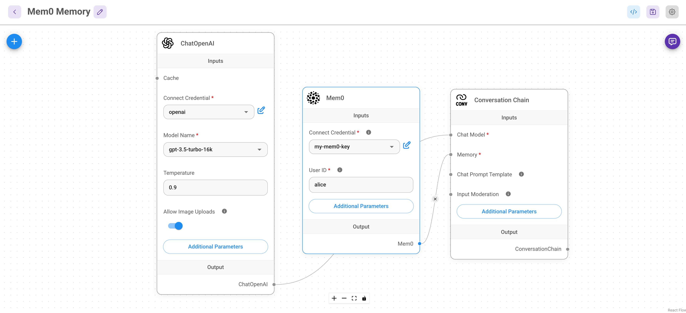
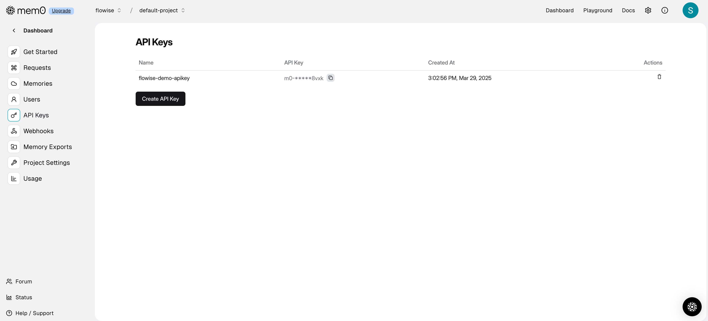
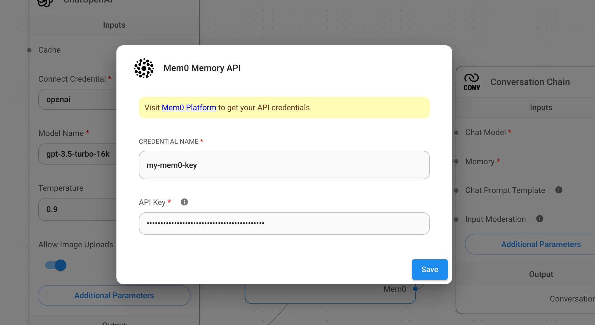
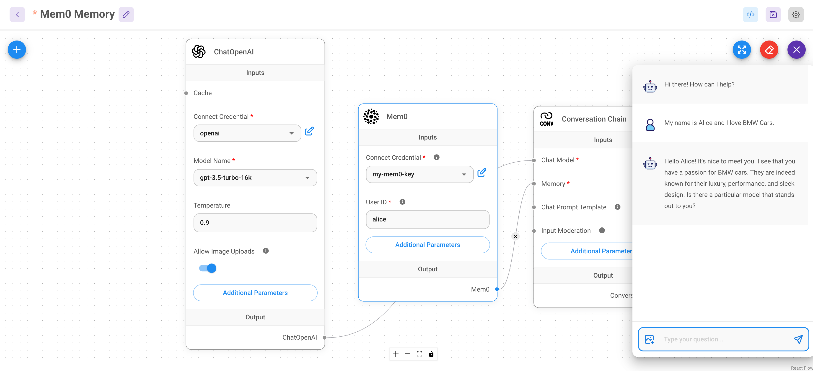
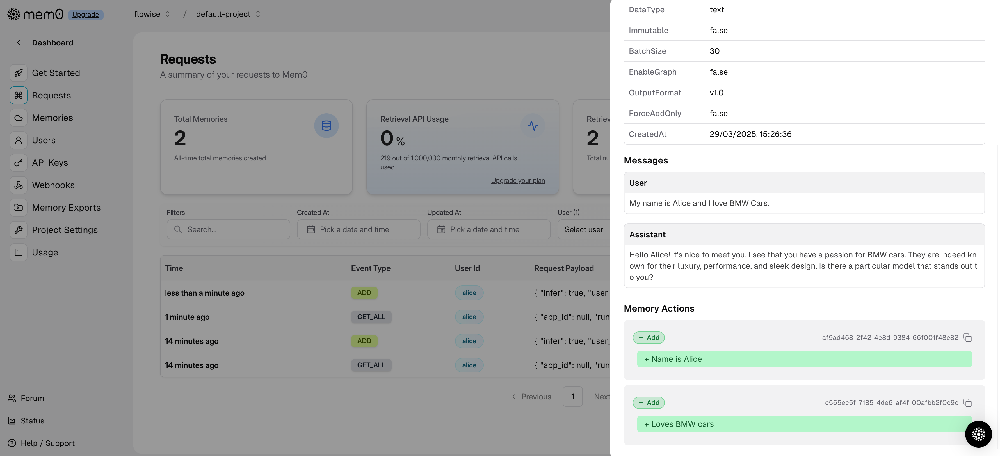
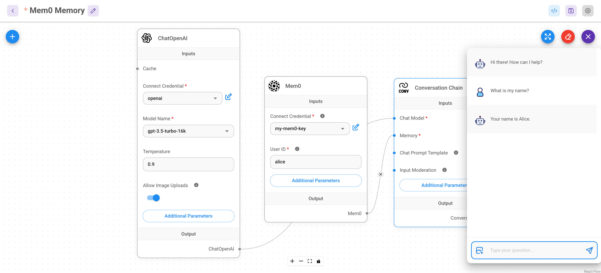
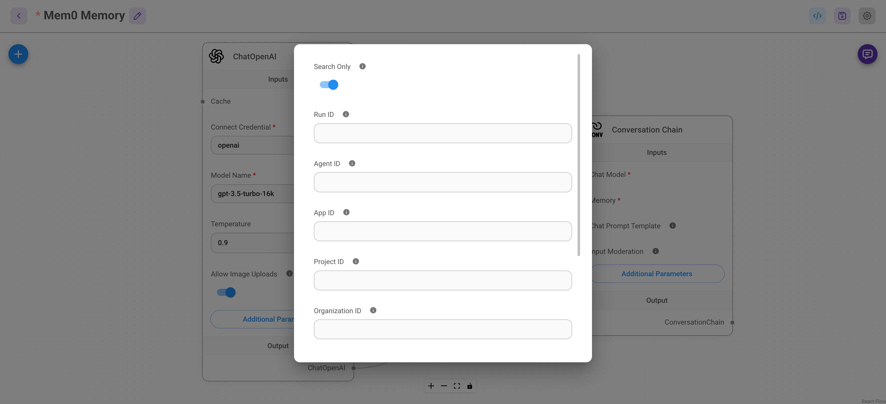
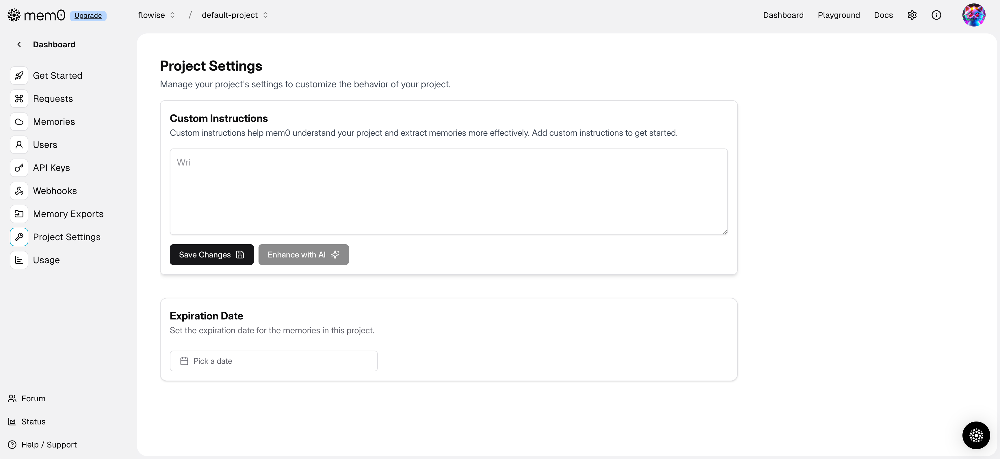

# Mem0 Memory

[Mem0](https://github.com/mem0ai/mem0) (pronounced "mem-zero") enhances AI assistants and agents with an intelligent memory layer, enabling personalized AI interactions. It remembers user preferences, adapts to individual needs, and continuously improves over time. This makes it ideal for applications such as customer support chatbots, AI assistants, and autonomous AI agents.

Mem0 offers a comprehensive suite of memory management features, allowing seamless integration into various AI-driven applications.

---

## Using Mem0 with Flowise

Follow these steps to integrate Mem0 with Flowise:

### 1. Set Up Flowise

1. Open the Flowise application and create a new canvas, or select a template from the Flowise marketplace.
2. In this example, we use the **Conversation Chain** template.
3. Replace the default **Buffer Memory** with **Mem0 Memory**.

<figure><figcaption>Flowise Integration with Mem0</figcaption></figure>

### 2. Obtain Your Mem0 API Key

1. Navigate to the [Mem0 API Key dashboard](https://app.mem0.ai/dashboard/api-keys).
2. Generate or copy your existing Mem0 API Key.

<figure><figcaption>Retrieve API Key from Mem0</figcaption></figure>

### 3. Configure Mem0 Credentials in Flowise

1. Enter the **Mem0 API Key** in the Mem0 Credentials section.

<figure><figcaption>Configure API Credentials</figcaption></figure>

### 4. Save and Test the Chatflow

1. Save your Flowise configuration.
2. Run a test chat and store some information.

<figure><figcaption>Testing Memory Storage</figcaption></figure>

### 5. Verify Stored Memories in Mem0 Dashboard

1. Visit the [Mem0 Dashboard](https://app.mem0.ai/dashboard/requests) to review stored memories.

<figure><figcaption>Reviewing Stored Memories</figcaption></figure>

### 6. Validate Memory Retention

1. Clear the chat history in Flowise.
2. Ask a question based on previously stored information to confirm retention.

<figure><figcaption>Confirming Memory Persistence</figcaption></figure>

---

## Additional Settings

Mem0 provides various customization options:

<figure><figcaption>Mem0 Configuration Options</figcaption></figure>

1. **Search Only Mode**: Enables memory retrieval without creating new memories. Chat history remains until manually cleared.
2. **Mem0 Entities**: Utilize identifiers such as `user_id`, `run_id`, `app_id`, and `agent_id` for granular memory control.
3. **Project ID**: Assign memory storage to a specific project. Manage projects via [Mem0 Projects](https://app.mem0.ai/settings/projects/overview).
4. **Organization ID**: Assign memory storage to a specific organization. Manage organizations via [Mem0 Organizations](https://app.mem0.ai/settings/organizations/overview).

---

## Mem0 Platform Configurations

Additional configurations are available under [Mem0 Project Settings](https://app.mem0.ai/dashboard/project-settings):

1. **Custom Instructions**: Define project-level instructions to refine memory extraction. Example: Extract only academic details.
2. **Expiration Date**: Set an expiration period for stored memories, allowing for automatic data disposal when necessary.

<figure><figcaption>Customize Project-Level Settings</figcaption></figure>

---

## Configuring Mem0 Credentials in Flowise

To add credentials in Flowise:

1. Navigate to the credential settings.
2. Add a new credential entry for Mem0.
3. Paste your [Mem0 API Key](https://app.mem0.ai/dashboard/api-keys) in the API Key field.

<figure><figcaption>Entering API Key in Flowise</figcaption></figure>

---

With these configurations, your Flowise setup will integrate seamlessly with Mem0, providing enhanced memory retention and personalized AI interactions.

