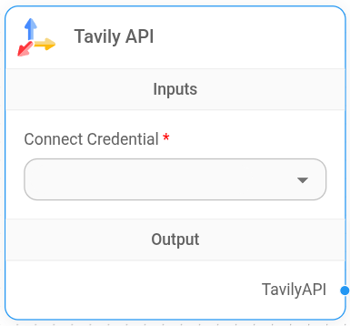
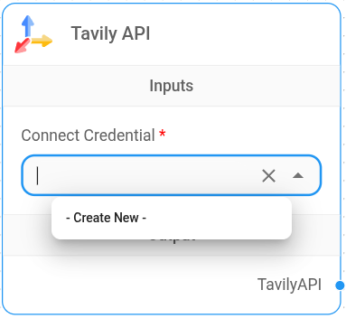
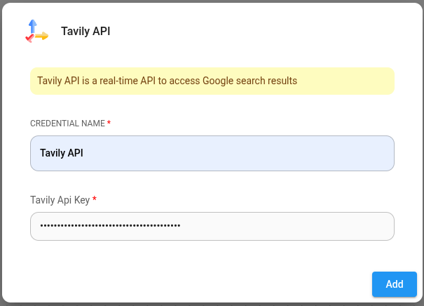

# TavilyAI

<figure><figcaption>
Tavily Node
</figcaption></figure>

## Setup

1. To add the Tavily API node. click the Add Nodes button, **LangChain** > **Tools** > **Tavily API**

2. Create credentials for Tavily. Refer to the [official guide](https://docs.tavily.com/guides/quickstart) on how to get the Tavily API key.

<figure><figcaption></figcaption></figure>

<figure><figcaption></figcaption></figure>

3. You can now connect this node to any node that accepts tool inputs to get real-time search results.
