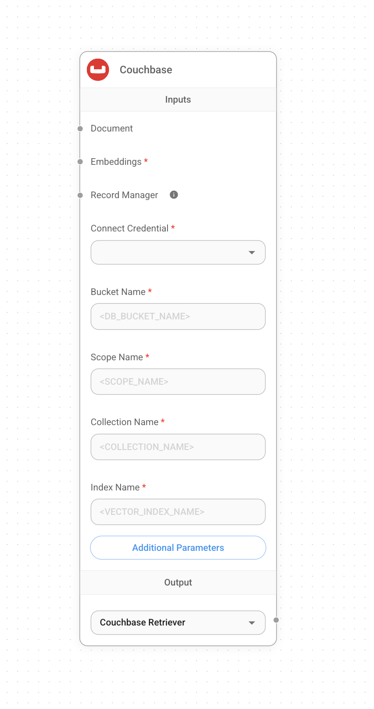

# Couchbase

## Prerequisite

### Requirements

1. Couchbase Cluster (Self Managed or Capella) version **7.6+** with [Search Service](https://docs.couchbase.com/server/current/search/search.html).
2.  Capella Setup: To know more about connecting to your Capella cluster, please follow the [instructions](https://docs.couchbase.com/cloud/get-started/connect.html?_gl=1*1yhpmel*_gcl_au*MTMzNDE3NTQxLjE3MzY5MjA5MzQ.).

    Specifically, you need to do the following:

    * Create the [database credentials](https://docs.couchbase.com/cloud/clusters/manage-database-users.html?_gl=1*19zk7vq*_gcl_au*MTMzNDE3NTQxLjE3MzY5MjA5MzQ.) to access cluster.
    * [Allow access](https://docs.couchbase.com/cloud/clusters/allow-ip-address.html?_gl=1*19zk7vq*_gcl_au*MTMzNDE3NTQxLjE3MzY5MjA5MzQ.) to the Cluster from the IP on which the application is running.

    Self Managed Setup:

    * Follow [Couchbase Installation Options](https://developer.couchbase.com/tutorial-couchbase-installation-options) for installing the latest Couchbase Database Server Instance. Make sure to add the Search Service.
3. Search Index Creation on the Full Text Service in Couchbase.

### Importing Search Index

#### [Couchbase Capella](\(https:/docs.couchbase.com/cloud/search/import-search-index.html)

Follow these steps to import a Search Index in Capella:

* Copy the index definition to a new file named `index.json`.
* Import the file in Capella following the instructions in the documentation.
* Click Create Index to finalize the index creation.

#### [Couchbase Server](\(https:/docs.couchbase.com/server/current/search/import-search-index.html)

Follow these steps for Couchbase Server:

* Navigate to Search → Add Index → Import.
* Copy the provided Index definition into the Import screen.
* Click Create Index to finalize the index creation.

You may also create a vector index using Search UI on both [Couchbase Capella](https://docs.couchbase.com/cloud/vector-search/create-vector-search-index-ui.html?_gl=1*1rglcpj*_gcl_au*MTMzNDE3NTQxLjE3MzY5MjA5MzQ.) and [Couchbase Self Managed Server](https://docs.couchbase.com/server/current/vector-search/create-vector-search-index-ui.html?_gl=1*t7aeet*_gcl_au*MTMzNDE3NTQxLjE3MzY5MjA5MzQ.).

### Index Definition

Here, we are creating the index `vector-index` on the documents. The Vector field is set to `embedding` with 1536 dimensions and the text field set to `text`. We are also indexing and storing all the fields under `metadata` in the document as a dynamic mapping to account for varying document structures. The similarity metric is set to `dot_product`. If there is a change in these parameters, please adapt the index accordingly.

```json
{
  "name": "vector-index",
  "type": "fulltext-index",
  "params": {
    "doc_config": {
      "docid_prefix_delim": "",
      "docid_regexp": "",
      "mode": "scope.collection.type_field",
      "type_field": "type"
    },
    "mapping": {
      "default_analyzer": "standard",
      "default_datetime_parser": "dateTimeOptional",
      "default_field": "_all",
      "default_mapping": {
        "dynamic": true,
        "enabled": false
      },
      "default_type": "_default",
      "docvalues_dynamic": false,
      "index_dynamic": true,
      "store_dynamic": false,
      "type_field": "_type",
      "types": {
        "_default._default": {
          "dynamic": true,
          "enabled": true,
          "properties": {
            "embedding": {
              "enabled": true,
              "dynamic": false,
              "fields": [
                {
                  "dims": 1536,
                  "index": true,
                  "name": "embedding",
                  "similarity": "dot_product",
                  "type": "vector",
                  "vector_index_optimized_for": "recall"
                }
              ]
            },
            "metadata": {
              "dynamic": true,
              "enabled": true
            },
            "text": {
              "enabled": true,
              "dynamic": false,
              "fields": [
                {
                  "index": true,
                  "name": "text",
                  "store": true,
                  "type": "text"
                }
              ]
            }
          }
        }
      }
    },
    "store": {
      "indexType": "scorch",
      "segmentVersion": 16
    }
  },
  "sourceType": "gocbcore",
  "sourceName": "pdf-chat",
  "sourceParams": {},
  "planParams": {
    "maxPartitionsPerPIndex": 64,
    "indexPartitions": 16,
    "numReplicas": 0
  }
}

```

## Setup

1. Add a new **Couchbase** node on canvas and fill in the Bucket Name, Scope Name, Collection Name and Index Name

<figure><figcaption></figcaption></figure>

2. Add new credential and fill in the parameters:
   * Couchbase Connection String
   * Cluster Username
   * Cluster Password

<figure><figcaption></figcaption></figure>

3. Add additional nodes to canvas and start the upsert process
   * **Document** can be connected with any node under [**Document Loader**](../document-loaders/) category
   * **Embeddings** can be connected with any node under [**Embeddings** ](../embeddings/)category

<figure><figcaption></figcaption></figure>

<figure><figcaption></figcaption></figure>

5. Verify from the Couchbase UI to see if data has been successfully upserted!

## Resources

* LangChain Couchbase vectorstore integrations
  * [Python](https://python.langchain.com/docs/integrations/vectorstores/couchbase/)
  * [NodeJS](https://js.langchain.com/docs/integrations/vectorstores/couchbase/)
* Refer to the [Couchbase Documentation](https://docs.couchbase.com/home/index.html) to learn about Couchbase.
