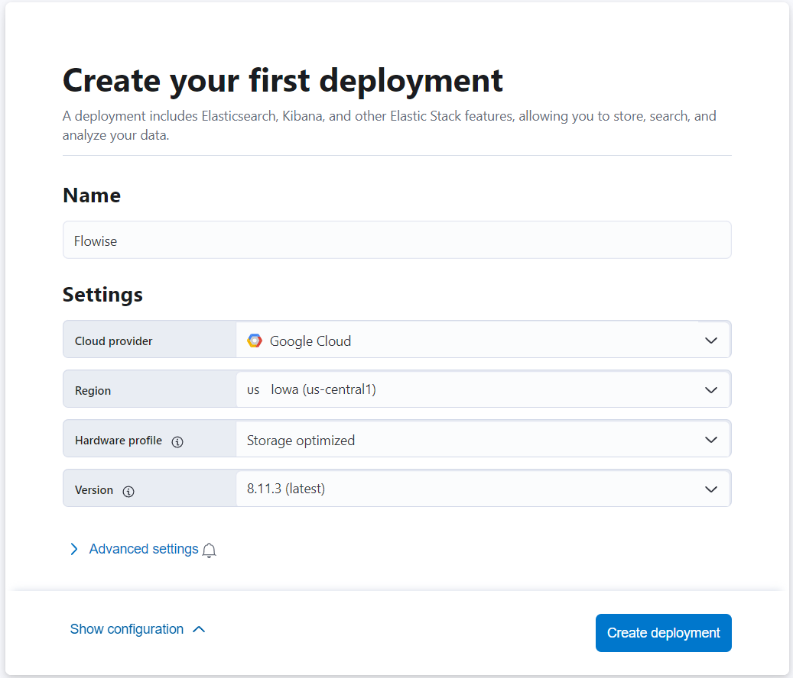
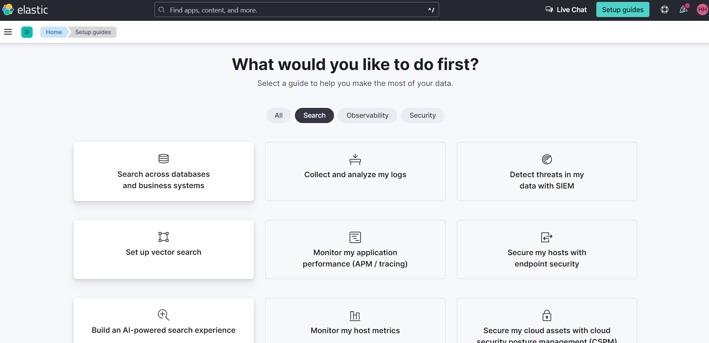
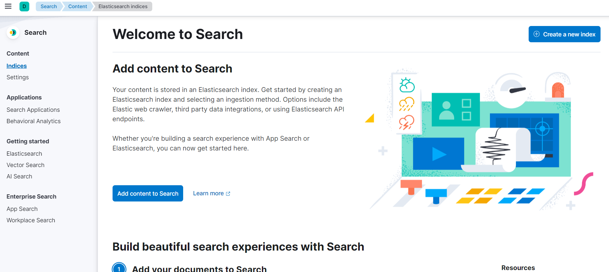
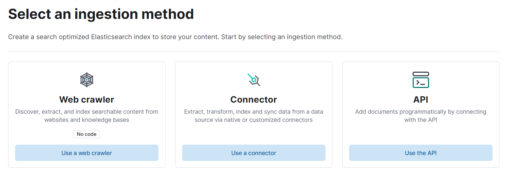
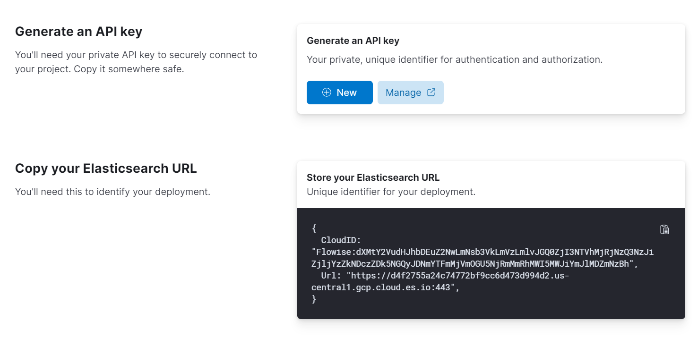

# Elastic

## Prerequisite

1. You can use the [official Docker image](https://www.elastic.co/guide/en/elasticsearch/reference/current/docker.html) to get started, or you can use [Elastic Cloud](https://www.elastic.co/cloud/), Elastic's official cloud service. In this guide, we will be using cloud version.
2. [Register](https://cloud.elastic.co/registration) an account or [login](https://cloud.elastic.co/login) with existing account on Elastic cloud.

<figure><figcaption></figcaption></figure>

3. Click **Create deployment**. Then, name your deployment, and choose the provider.

<figure><figcaption></figcaption></figure>

4. After deployment is finished, you should be able to see the setup guides as shown below. Click the **Set up vector search** option.

<figure><figcaption></figcaption></figure>

5. You should now see the **Getting started** page for **Vector Search**.

<figure><figcaption></figcaption></figure>

6. On the left hand side bar, click **Indices**. Then, **Create a new index**.

<figure><figcaption></figcaption></figure>

7. Select **API** ingestion method

<figure><figcaption></figcaption></figure>

8. Name your search index name, then **Create Index**

<figure><figcaption></figcaption></figure>

9. After the index has been created, generate a new API key, take note of both generated API key and the URL

<figure><figcaption></figcaption></figure>

## Flowise Setup

1. Add a new **Elasticsearch** node on canvas and fill in the **Index Name**

<figure><figcaption></figcaption></figure>

2. Add new credential via **Elasticsearch API**

<figure><figcaption></figcaption></figure>

3. Take the URL and API Key from Elasticsearch, fill in the fields

<figure><figcaption></figcaption></figure>

4. After credential has been created successfully, you can start upserting the data

<figure><figcaption></figcaption></figure>

<figure><figcaption></figcaption></figure>

5. After data has been upserted successfully, you can verify it from Elastic dashboard:

<figure><figcaption></figcaption></figure>

6. Voila! You can now start asking question in the chat

<figure><figcaption></figcaption></figure>

## Resources

* [LangChain JS Elastic](https://js.langchain.com/docs/integrations/vectorstores/elasticsearch)
* [Vector Search (kNN) Implementation Guide - API Edition](https://www.elastic.co/search-labs/blog/articles/vector-search-implementation-guide-api-edition)
