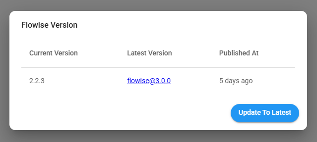

# Cloud Migration

This guide is to help users to migrate from Cloud V1 to V2.

In Cloud V1, the URL of the apps looks like <mark style="color:blue;">**https://\<your-instance-name>.app.flowiseai.com**</mark>

In Cloud V2, the URL of the apps is <mark style="color:blue;">**https://cloud.flowiseai.com**</mark>

Why Cloud V2? We have re-written cloud from scratch, that has 5x speed improvement, ability to have multiple workspaces, organization members, and most importantly it is highly scalable with [production-ready architecture](../configuration/running-in-production.md).

1. Login to Cloud V1 via [https://flowiseai.com/auth/login](https://flowiseai.com/auth/login)
2. In your dashboard, at the top right corner:

<figure><figcaption></figcaption></figure>

3. **Select Version, then update to the latest version.**

<figure><figcaption></figcaption></figure>

4. Select Export, select the data you would like to export:

<figure><figcaption></figcaption></figure>

5. Save the exported JSON file.
6. Navigate to Cloud V2 [https://cloud.flowiseai.com](https://cloud.flowiseai.com/)
7. Cloud V2 account does not sync with your existing account in Cloud V1, you'll have to register again or sign in with Google/Github.

<figure><figcaption></figcaption></figure>

8. Once logged in, from the dashboard top right corner, click Import and upload the exported JSON file.

<figure><figcaption></figcaption></figure>

9. New user by default is on the **Free Plan** with a limitation of 2 flows and assistants (for each). If your exported data has more than that, importing the exported JSON file will throw an error. This is why we are giving <mark style="color:orange;">**FIRST MONTH FREE**</mark> on **Starter Plan** which has unlimited flows & assistants!

<figure><figcaption></figcaption></figure>

10. Click the **Get Started** button, and add your preferred payment method:

<figure><figcaption></figcaption></figure>

<figure><figcaption></figcaption></figure>

11. After added payment method, navigate back to Flowise, click Get Started on the selected plan and Confirm Change:

<figure><figcaption></figcaption></figure>

12. If everything goes smoothly, you should be on Starter Plan with unlimited flows & assistants! Hooray :tada: Try importing the JSON file again if it was failing previously due to the free plan limitation.


All the IDs from exported data remain the same, so you don't have to worry about updating the ID for the API, you just need to update the URL such as [https://cloud.flowiseai.com/api/v1/prediction/69fb1055-ghj324-ghj-0a4ytrerf](https://cloud.flowiseai.com/api/v1/prediction/69fb1055-ghj324-ghj-0a4ytrerf)



Credentials are not exported. You will have to create new credentials and use those in the flows and assistants.


13. After you have verified everything is working as expected, you can now cancel the Cloud V1 subscription.
14. From the left side panel, click Account Settings, scroll to the bottom, and you will see **Cancel Previous Subscription**:

<figure><figcaption></figcaption></figure>

15. Enter your previous email that was used to sign up the Cloud V1, and hit **Send Instructions**.
16. You will then receive an email to cancel your previous subscription:

<figure><figcaption></figcaption></figure>

17. Clicking the **Manage Subscription** button will bring you to a portal where you can cancel the Cloud V1 subscription. Your Cloud V1 app will then get shut down on the next billing cycle.

<figure><figcaption></figcaption></figure>

We sincerely apologize for any inconvenience we have caused during the process of migration. If anything we would love to help, don't hesitate to reach us at support@flowiseai.com.
