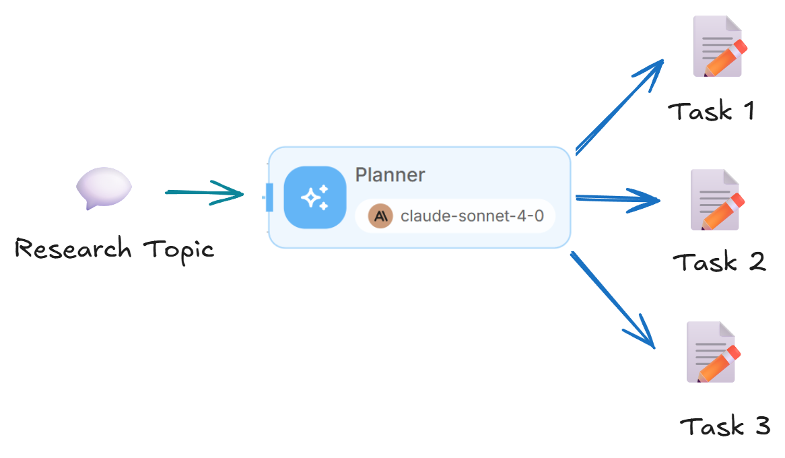
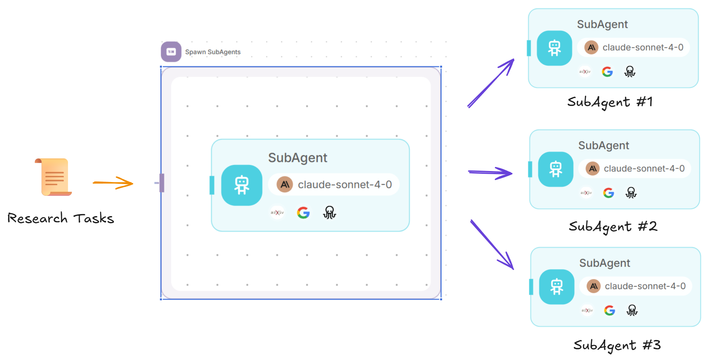
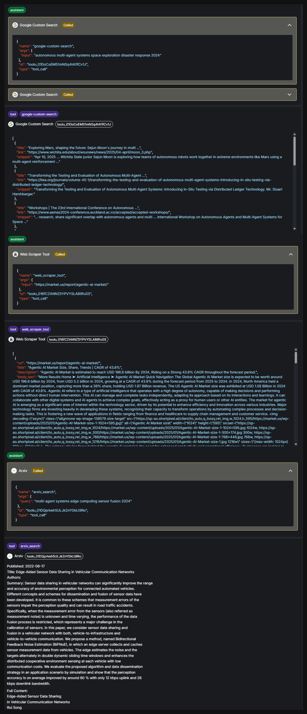
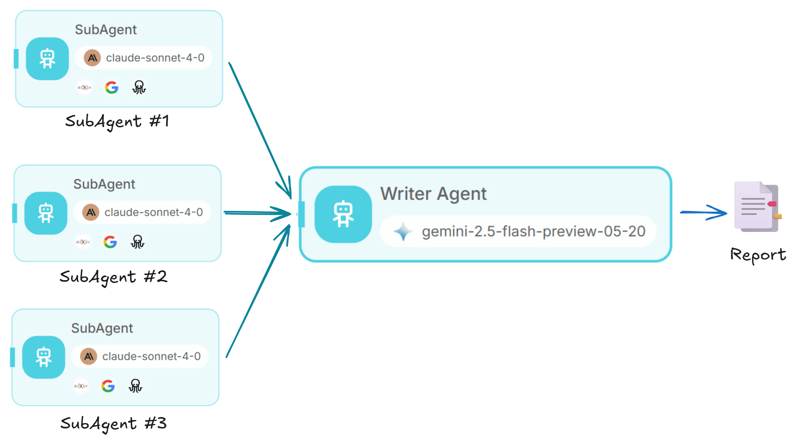
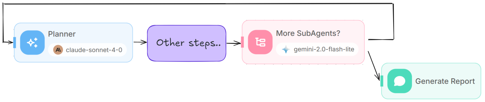

# Deep Research

Deep Research Agent is a sophisticated multi-agent system that can conduct comprehensive research on any topic by breaking down complex queries into manageable tasks, deploying specialized research agents, and synthesizing findings into detailed reports.

This approach is inspired by Anthropic's blog - [How we built our multi-agent research system](https://www.anthropic.com/engineering/built-multi-agent-research-system)

## Overview

The Deep Research Agent workflow consists of several key components working together:

1. **Planner Agent**: Analyzes the research query and generates a list of specialized research tasks
2. **Iteration**: Creates multiple research agents to work on different aspects of the query
3. **Research SubAgents**: Individual agents that conduct focused research using web search and other tools
4. **Writer Agent**: Synthesizes all findings into a coherent, comprehensive report
5. **Condition Agent**: Determines if additional research is needed or if the findings are sufficient
6. **Loop**: Loop back to Planner Agent to improve research quality

<figure><figcaption></figcaption></figure>

### Step 1: Create the Start Node

<figure><figcaption></figcaption></figure>

1. Begin by adding a **Start** node to your canvas
2. Configure the Start node with **Form Input** to collect the research query from users
3. Set up the form with the following configuration:
   * **Form Title**: "Research"
   * **Form Description**: "A research agent that takes in a query, and return a detailed report"
   * **Form Input Types**: Add a string input with label "Query" and variable name "query"
4. Initialize the Flow State with two key variables:
   * `subagents`: To store the list of research tasks to be carried out by subagents
   * `findings`: To accumulate research results

<figure><figcaption></figcaption></figure>

### Step 2: Add the Planner Agent

<figure><figcaption></figcaption></figure>

1. Connect an **LLM** node to the Start node.
2. Set up the system prompt to act as an expert research lead with the following key responsibilities:
   * Analyze and break down user queries
   * Create detailed research plans
   * Generate specific tasks for subagents
   * Example prompt - [research\_lead\_agent.md](https://github.com/anthropics/anthropic-cookbook/blob/main/patterns/agents/prompts/research_lead_agent.md)

<figure><figcaption></figcaption></figure>

3. Configure **JSON Structured Output** to return a list of subagent tasks:

```json
{
  "task": {
    "type": "string", 
    "description": "The research task for subagent"
  }
}
```

4. Update the flow state by storing the generated subagents list

<figure><figcaption></figcaption></figure>

### Step 3: Create the SubAgent Iteration Block

<figure><figcaption></figcaption></figure>

1. Add an **Iteration** node.
2. Connect it to the Planner output
3. Configure the iteration input to the flow state: `{{ $flow.state.subagents }}`. For each item in the array, a subagent will be spawned to carry out the research task. Example:

<figure><figcaption></figcaption></figure>

```json
{
  "subagents": [
    {
      "task": "Research the current state and recent developments in autonomous multi-agent systems technology. Focus on defining what autonomous multi-agent systems are, key technical components (coordination algorithms, communication protocols, decision-making frameworks), major technological advances in the last 2-3 years, and leading research institutions/companies working in this space. Use web search to find recent academic papers, industry reports, and technical documentation. Prioritize sources from IEEE, ACM, Nature, Science, and major tech companies' research divisions. Compile findings into a comprehensive technical overview covering definitions, core technologies, recent breakthroughs, and key players in the field."
    },
    {
      "task": "Investigate real-world applications and deployments of autonomous multi-agent systems across different industries. Research specific use cases in robotics (swarm robotics, warehouse automation), transportation (autonomous vehicle fleets, traffic management), manufacturing (coordinated production systems), defense/military applications, smart cities, and any other domains where these systems are actively deployed. For each application area, identify specific companies, products, success stories, and quantitative results where available. Focus on practical implementations rather than theoretical research. Use web search to find case studies, company announcements, industry reports, and news articles about actual deployments."
    }
  ]
}  
```

### Step 4: Build the Research SubAgent

1. Inside the iteration block, add an **Agent** node.
2. Configure the system prompt to act as a focused research subagent with:
   * Clear task understanding capabilities
   * Efficient research planning (2-5 tool calls per task)
   * Source quality evaluation
   * Parallel tool usage for efficiency
   * Example prompt - [research\_subagent.md](https://github.com/anthropics/anthropic-cookbook/blob/main/patterns/agents/prompts/research_subagent.md)

<figure><figcaption></figcaption></figure>

3. Add the following research tools, you can use your own preferred tools:
   * **Google Search**: For web search links
   * **Web Scraper**: For web content extraction. This will scrape the content of the links from Google Search.
   * **ArXiv Search**: For searching and loading content of academic papers

<figure><figcaption></figcaption></figure>

4. Set the user message to pass the current iteration task: `{{ $iteration.task }}`

### Step 5: Add the Writer Agent

<figure><figcaption></figcaption></figure>

1. Connect a **LLM** node after the iteration completes.
2. A larger context LLM like Gemini with 1-2 millions context size is needed to synthesize all findings and generate the report.
3. Set up the system prompt to act as an expert research writer that:
   * Preserves full context from research findings
   * Maintains citation integrity
   * Adds structure and clarity
   * Outputs professional Markdown reports
4. Configure the user message to include:
   * Research topic: `{{ $form.query }}`
   * Existing findings: `{{ $flow.state.findings }}`
   * New findings: `{{ iterationAgentflow_0 }}`

<figure><figcaption></figcaption></figure>

4. Update the `{{ $flow.state.findings }}` with the output of Write Agent.

<figure><figcaption></figcaption></figure>

### Step 6: Implement the Condition Check

<figure><figcaption></figcaption></figure>

1. Add a **Condition Agent.**
2. Set up the condition logic to determine if additional research is needed
3. Configure two scenarios:
   * "More subagents are needed"
   * "Findings are sufficient"
4. Provide input context including:
   * Research topic
   * Current subagents list
   * Accumulated findings

<figure><figcaption></figcaption></figure>

### Step 7: Create the Loop Mechanism

1. For the **"More subagents needed"** path, add a **Loop** node
2. Configure it to loop back to the Planner node
3. Set a maximum loop count of 5 to prevent infinite loops
4. Planner Agent will look at the current report, and generate additional research tasks.

<figure><figcaption></figcaption></figure>

### Step 8: Add the Final Output

1. For the "**Findings are sufficient**" path, add a **Direct Reply**
2. Configure it to output the final report: `{{ $flow.state.findings }}`

<figure><figcaption></figcaption></figure>

<figure><figcaption></figcaption></figure>

## Testing the Flow

1. Start with a simple topic like "Autonomous Multi-Agent Systems in Real-World Environments"
2. Observe how the Planner breaks down the research into focused tasks
3. Monitor the SubAgents as they conduct parallel research
4. Review the Writer Agent's synthesis of findings
5. Note whether the Condition Agent requests additional research

<figure><figcaption></figcaption></figure>

**Report Generated:**



## Complete Flow Structure



## Walkthrough

1. 🧠 Planner Agent - analyzes the research query and generates a list of specialized research tasks
2. 🖧 Subagents - creates multiple research subagents, conduct focused research using web search, web scrape, and arxiv tools
3. ✍️ Writer Agent - synthesizes all findings into a coherent, comprehensive report with citations
4. ⇄ Condition Agent - determines if additional research is needed or if the findings are sufficient
5. 🔄 Loop back to Planner Agent to generate more subagents

### 🧠 Planner Agent

Act as an expert research lead to:

* Analyze and break down user queries
* Create detailed research plans
* Generate specific tasks for subagents

Output an array of research tasks.

<figure><figcaption></figcaption></figure>

### 🖧 Subagents

For each task in the tasklist, a new subagent will be spawned to conduct focused research.

Each subagent has:

* Clear task understanding capabilities
* Efficient research planning (2-5 tool calls per task)
* Source quality evaluation
* Parallel tool usage for efficiency

<figure><figcaption></figcaption></figure>

Subagent has access to web search, web scrape, and arxiv tools.

* 🌐 Google Search - for web search links
* 🗂️ Web Scraper - for web content extraction. This will scrape the content of the links from Google Search.
* 📑 ArXiv - search, download and read content of arxiv papers

<figure><figcaption></figcaption></figure>

### ✍️ Writer Agent

Act as a research writer that turn raw findings into a clear, structured Markdown report. Preserve all context and citations.

We find Gemini to be the best for this, thanks to its large context window that allows it to synthesize all the findings effectively.

<figure><figcaption></figcaption></figure>

### ⇄ Condition Agent

With the generated report, we let the LLM determine whether additional research is needed or if the findings are sufficient.

If more is needed, the Planner Agent reviews all messages, identifies areas for improvement, generates follow-up research tasks, and the loop continues.

If the findings are sufficient, we simply return the final report from the Writer Agent as the output.

<figure><figcaption></figcaption></figure>

## Advanced Configuration

#### Customizing Research Depth

You can adjust the research depth by modifying the Planner's system prompt to:

* Increase the number of SubAgents for complex topics (up to 10-20)
* Adjust the tool call budget per SubAgent
* Modify the loop count for more iterative research

But this also comes with extra cost for more token consumption.

#### Adding Specialized Tools

Enhance research capabilities by adding domain-specific tools:

* Personal tools like Gmail, Slack, Google Calendar, Teams etc
* Other web scraper, web search tools like Firecrawl, Exa, Apify etc

#### Adding RAG Context

You can add more context to the LLM with [RAG](rag.md). This allows LLM to pull information from relevant existing knowledge sources when needed.

## Best Practices

* Model selection and fallback options are crucial due to the large amount of findings that causes token overflow.
* Prompting is key. Anthropic open-sourced their entire prompt structure, covering task delegation, parallel tool usage, and thought processes - [https://github.com/anthropics/anthropic-cookbook/blob/main/patterns/agents/prompts](https://github.com/anthropics/anthropic-cookbook/blob/main/patterns/agents/prompts)
* Tools need to be carefully crafted, when to use, how to limit the length of results returned from tool executions.
* This is very similar to Trade-off Triangle, where optimizing two of the tree often negatively impacts another, in this case - Speed, Quality, Cost.
