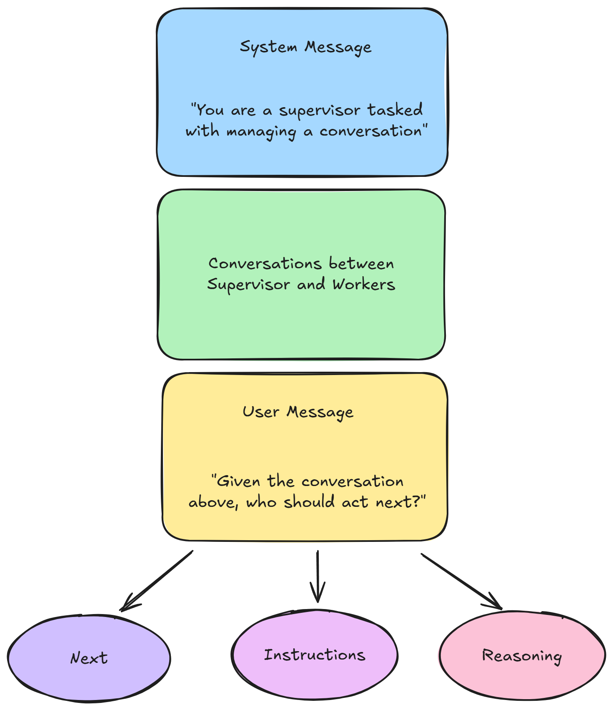

# Supervisor and Workers

The Supervisor Worker pattern is a powerful workflow design where a supervisor agent coordinates multiple specialized worker agents to complete complex tasks. This pattern allows for better task delegation, specialized expertise, and iterative refinement of solutions.

## Overview

In this tutorial, we'll build a collaborative system with:

* **Supervisor**: An LLM that analyzes tasks and decides which worker should act next
* **Software Engineer**: Specialized in designing and implementing software solutions
* **Code Reviewer**: Focused on reviewing code quality and providing feedback
* **Final Answer Generator**: Compiles the collaborative work into a comprehensive solution

<figure><figcaption></figcaption></figure>

### Step 1: Create the Start Node

<figure><figcaption></figcaption></figure>

The flow begins with a **Start** node that captures user input and initializes the workflow state.

1. Add a **Start** node to your canvas
2. Configure the **Input Type** as "Chat Input"
3. Set up **Flow State** with these initial variables:
   * `next`: To keep track of the next agent
   * `instruction`: Instruction for the next agent on what to do

<figure><figcaption></figcaption></figure>

### Step 2: Add the Supervisor LLM

<figure><figcaption></figcaption></figure>

The **Supervisor** is the orchestrator that decides which worker should handle each part of the task.

1. Connect a **LLM** node after the Start node
2. Label it "Supervisor"
3. Configure the system message, for example:

```
You are a supervisor tasked with managing a conversation between the following workers:
- Software Engineer  
- Code Reviewer

Given the following user request, respond with the worker to act next.
Each worker will perform a task and respond with their results and status.
When finished, respond with FINISH.
Select strategically to minimize the number of steps taken.
```

4. Set up **JSON Structured Output** with these fields:
   * `next`: Enum with values "FINISH, SOFTWARE, REVIEWER"
   * `instructions`: The specific instructions of the sub-task the next worker should accomplish
   * `reasoning`: The reason why next worker is tasked to do the job
5. Configure **Update Flow State** to store:
   * `next`: `{{ output.next }}`
   * `instruction`: `{{ output.instructions }}`
6. Set the **Input Message** to: _"Given the conversation above, who should act next? Or should we FINISH? Select one of: SOFTWARE, REVIEWER."_ The Input Message will be inserted at the end, as if the user is asking the supervisor to assign the next agent.

<figure><figcaption></figcaption></figure>

### Step 3: Create the Routing Condition

<figure><figcaption></figcaption></figure>

The **Check next worker** condition node routes the flow based on the supervisor's decision.

1. Add a **Condition** node after the Supervisor
2. Set up two conditions:
   * **Condition 0**: `{{ $flow.state.next }}` equals "SOFTWARE"
   * **Condition 1**: `{{ $flow.state.next }}` equals "REVIEWER"
3. The "Else" branch (Condition 2) will handle the "FINISH" case

This creates three output paths: one for each worker and one for completion.

<figure><figcaption></figcaption></figure>

### Step 4: Configure the Software Engineer Agent

<figure><figcaption></figcaption></figure>

The **Software Engineer** specializes in designing and implementing software solutions.

1. Connect an **Agent** node to Condition 0 output
2. Configure the system message:

```
As a Senior Software Engineer, you are a pivotal part of our innovative development team. Your expertise and leadership drive the creation of robust, scalable software solutions that meet the needs of our diverse clientele.

Your goal is to lead the development of high-quality software solutions.

Design and implement new features for the given task, ensuring it integrates seamlessly with existing systems and meets performance requirements. Use your understanding of React, TailwindCSS, NodeJS to build this feature. Make sure to adhere to coding standards and follow best practices.

The output should be a fully functional, well-documented feature that enhances our product's capabilities. Include detailed comments in the code.
```

4. Set **Input Message** to: `{{ $flow.state.instruction }}` . The Input Message will be inserted at the end, as if the user is giving an instruction to the Software Engineer Agent.

<figure><figcaption></figcaption></figure>

<figure><figcaption></figcaption></figure>

### Step 5: Configure the Code Reviewer Agent

<figure><figcaption></figcaption></figure>

The **Code Reviewer** focuses on quality assurance and code review.

1. Connect an **Agent** node to Condition 1 output
2. Configure the system message:

```
As a Quality Assurance Engineer, you are an integral part of our development team, ensuring that our software products are of the highest quality. Your meticulous attention to detail and expertise in testing methodologies are crucial in identifying defects and ensuring that our code meets the highest standards.

Your goal is to ensure the delivery of high-quality software through thorough code review and testing.

Review the codebase for the new feature designed and implemented by the Senior Software Engineer. Provide constructive feedback, guiding contributors towards best practices and fostering a culture of continuous improvement. Your approach ensures the delivery of high-quality software that is robust, scalable, and aligned with strategic goals.
```

4. Set **Input Message** to: `{{ $flow.state.instruction }}` . The Input Message will be inserted at the end, as if the user is giving an instruction to the Code Reviewer Agent.

<figure><figcaption></figcaption></figure>

### Step 6: Add Loop Back Connections

<figure><figcaption></figcaption></figure>

Both worker agents need to loop back to the Supervisor for continued coordination.

1. Add a **Loop** node after the Software Engineer
   * Set **Loop Back To** as "Supervisor"
   * Set **Max Loop Count** to 5
2. Add another **Loop** node after the Code Reviewer
   * Set **Loop Back To** as "Supervisor"
   * Set **Max Loop Count** to 5

These loops enable iterative collaboration between the agents.

### Step 7: Create the Final Answer Generator

<figure><figcaption></figcaption></figure>

The final agent compiles all the collaborative work into a comprehensive solution.

1. Connect an **Agent** node to Condition 2 output (the "Else" branch)
2. It is recommended to use a higher context size LLM like Gemini, due to the back-and-forth nature of the conversation, which consumes a large number of tokens.
3. Set **Input Message.** This is important because Input Message will be inserted at the end, as if the user is giving an instruction to the Final Answer Generator to look at all the conversations, and generate a final response.

```
Given the above conversations, generate a detail solution developed by the software engineer and code reviewer.

Your guiding principles:
1. **Preserve Full Context**
   Include all code implementations, improvements and review from the conversation. Do not omit, summarize, or oversimplify key information.

2. **Markdown Output Only** 
   Your final output must be in Markdown format.
```

## How It Works

The Supervisor Worker pattern enables several key benefits:

**Intelligent Task Delegation**: The supervisor uses context and reasoning to assign the most appropriate worker for each sub-task.

**Iterative Refinement**: Workers can build upon each other's output, with the software engineer implementing features and the code reviewer providing feedback for improvements.

**Stateful Coordination**: The flow maintains state across iterations, allowing the supervisor to make informed decisions about what should happen next.

**Specialized Expertise**: Each agent has a focused role and specialized prompt, leading to higher quality outputs in their domain.

## Example Interaction

Here's how a typical interaction might flow:

1. **User**: "Create a React component for user authentication with form validation"
2. **Supervisor**: Decides SOFTWARE should act first to implement the component
3. **Software Engineer**: Creates a React authentication component with validation logic
4. **Supervisor**: Decides REVIEWER should examine the implementation
5. **Code Reviewer**: Reviews the code and suggests improvements for security and UX
6. **Supervisor**: Decides SOFTWARE should implement the suggested improvements
7. **Software Engineer**: Updates the component based on feedback
8. **Supervisor**: Determines the task is complete and routes to FINISH
9. **Final Answer Generator**: Compiles the complete solution with implementation and review feedback

<figure><figcaption></figcaption></figure>

## Complete Flow Structure



## Best Practices

* This architecture consumes a lot of tokens due to the back and forth communications between agents, hence it is not suitable for every cases. It is particularly effective for:
  * Software development tasks requiring both implementation and review
  * Complex problem-solving that benefits from multiple perspectives
  * Workflows where quality and iteration are important
  * Tasks that require coordination between different types of expertise
* Ensure each agent has a well-defined, specific role. Avoid overlapping responsibilities that could lead to confusion or redundant work.
* Establish standard formats for how agents communicate their progress, findings, and recommendations. This helps the supervisor make better routing decisions.
* Use memory settings appropriately to maintain conversation context while avoiding token limit issues. Consider using memory optimization settings like "Conversation Summary Buffer" for longer workflows.

## Video Tutorial


