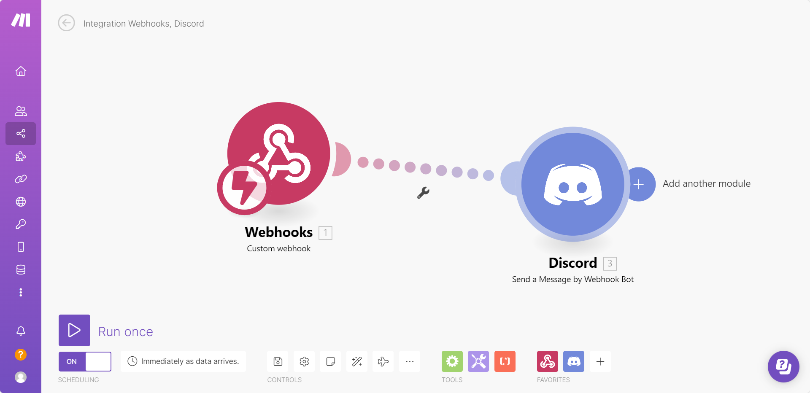

# Calling Webhook

***

This tutorial walks you through creating a custom tool in FlowiseAI that calls a webhook endpoint, passing the necessary parameters in the request body. We will use [Make.com](https://www.make.com/en) to set up a webhook workflow that sends messages to a Discord channel.

## Setting Up a Webhook in Make.com

1. Sign up or log in to [Make.com](https://www.make.com/en).
2. Create a new workflow containing a **Webhook** module and a **Discord** module, as shown below:

   <figure><figcaption></figcaption></figure>

3. From the **Webhook** module, copy the webhook URL:

   <figure><figcaption></figcaption></figure>

4. In the **Discord** module, configure it to pass the `message` from the webhook body as the message sent to the Discord channel:

   <figure><figcaption></figcaption></figure>

5. Click **Run Once** to start listening for incoming requests.
6. Send a test POST request with the following JSON body:

   ```json
   {
       "message": "Hello Discord!"
   }
   ```

   <figure><figcaption></figcaption></figure>

7. If successful, you will see the message appear in your Discord channel:

   <figure><figcaption></figcaption></figure>

Congratulations! You have successfully set up a webhook workflow that sends messages to Discord. 🎉

## Creating a Webhook Tool in FlowiseAI

Next, we will create a custom tool in FlowiseAI to send webhook requests.

### Step 1: Add a New Tool

1. Open the **FlowiseAI** dashboard.
2. Click **Tools**, then select **Create**.

   <figure><figcaption></figcaption></figure>

3. Fill in the following fields:

   | Field | Value |
   |-------|-------|
   | **Tool Name** | `make_webhook` (must be in snake_case) |
   | **Tool Description** | Useful when you need to send messages to Discord |
   | **Tool Icon Src** | [Flowise Tool Icon](https://github.com/FlowiseAI/Flowise/assets/26460777/517fdab2-8a6e-4781-b3c8-fb92cc78aa0b) |

4. Define the **Input Schema**:

   <figure><figcaption></figcaption></figure>

### Step 2: Add Webhook Request Logic

Enter the following JavaScript function:

```javascript
const fetch = require('node-fetch');
const webhookUrl = 'https://hook.eu1.make.com/abcdef';
const body = {
    "message": $message
};
const options = {
    method: 'POST',
    headers: {
        'Content-Type': 'application/json'
    },
    body: JSON.stringify(body)
};
try {
    const response = await fetch(webhookUrl, options);
    const text = await response.text();
    return text;
} catch (error) {
    console.error(error);
    return '';
}
```

5. Click **Add** to save your custom tool.

   <figure><figcaption></figcaption></figure>

### Step 3: Build a Chatflow with Webhook Integration

1. Create a new canvas and add the following nodes:
   - **Buffer Memory**
   - **ChatOpenAI**
   - **Custom Tool** (select `make_webhook`)
   - **OpenAI Function Agent**

2. Connect them as shown:

   <figure><figcaption></figcaption></figure>

3. Save the chatflow and start testing it.

### Step 4: Sending Messages via Webhook

Try asking the chatbot a question like:

> _"How to cook an egg?"_

Then, request the agent to send this information to Discord:

   <figure><figcaption></figcaption></figure>

You should see the message appear in your Discord channel:

   <figure><figcaption></figcaption></figure>

### Alternative Webhook Testing Tools

If you want to test webhooks without Make.com, consider using:

- [Beeceptor](https://beeceptor.com) – Quickly set up a mock API endpoint.
- [Webhook.site](https://webhook.site) – Inspect and debug HTTP requests in real-time.
- [Pipedream RequestBin](https://pipedream.com/requestbin) – Capture and analyze incoming webhooks.

## More Tutorials

- Watch a step-by-step guide on using webhooks with Flowise custom tools:
  

- Learn how to connect Flowise to Google Sheets using webhooks:
  

- Learn how to connect Flowise to Microsoft Excel using webhooks:
  

By following this guide, you can trigger webhook workflows dynamically and extend automation to various services like Gmail, Google Sheets, and more.
