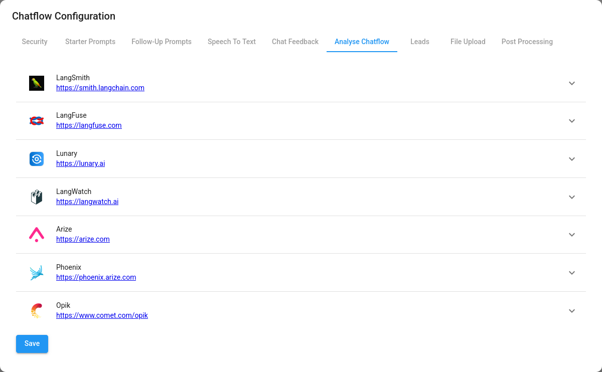
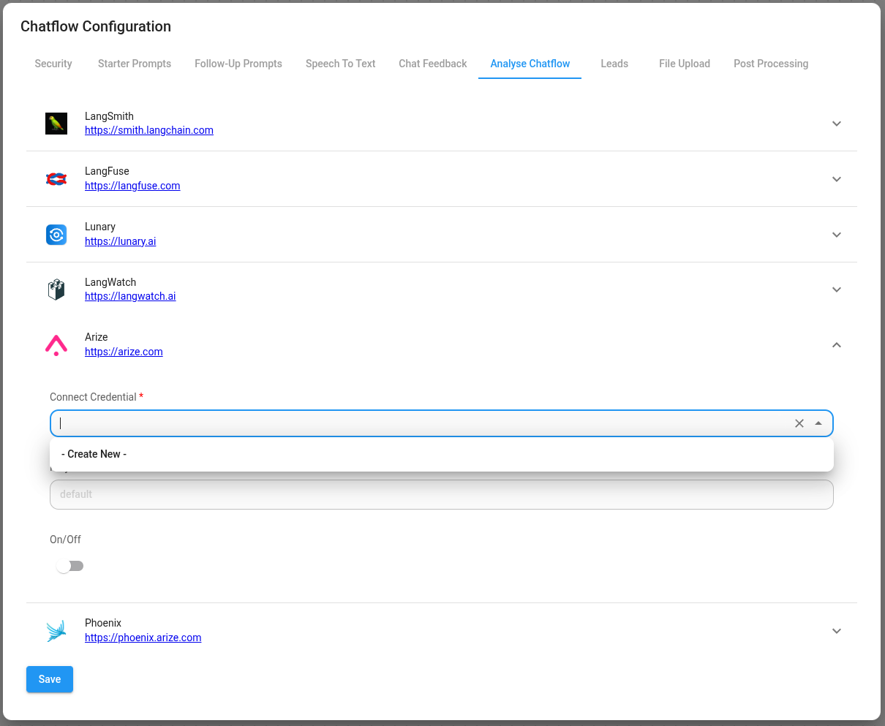
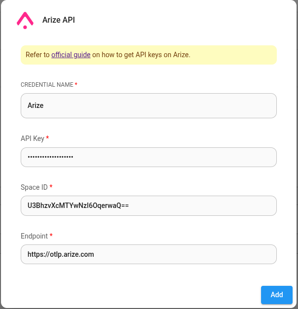
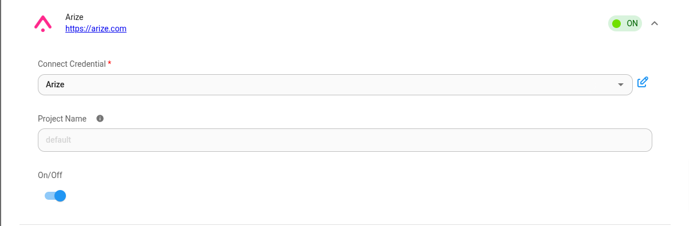

# Arize

***

[Arize AI](https://docs.arize.com/arize) is a production-grade observability platform for monitoring, debugging, and improving LLM applications and AI Agents at scale. For a free, open-source alternative, explore [Phoenix](https://docs.flowiseai.com/using-flowise/analytics/phoenix).

## Setup

1. At the top right corner of your Chatflow or Agentflow, click **Settings** > **Configuration**

<figure><figcaption></figcaption></figure>

2. Then go to the Analyse Chatflow section

<figure><figcaption></figcaption></figure>

3. You will see a list of providers, along with their configuration fields. Click on Arize.

<figure><figcaption></figcaption></figure>

4. Create credentials for Arize. Refer to the [official guide](https://docs.arize.com/arize/llm-tracing/quickstart-llm#get-your-api-keys) on how to get the Arize API key.

<figure><figcaption></figcaption></figure>

5. Fill in other configuration details, then turn the provider **ON**

<figure><figcaption></figcaption></figure>
