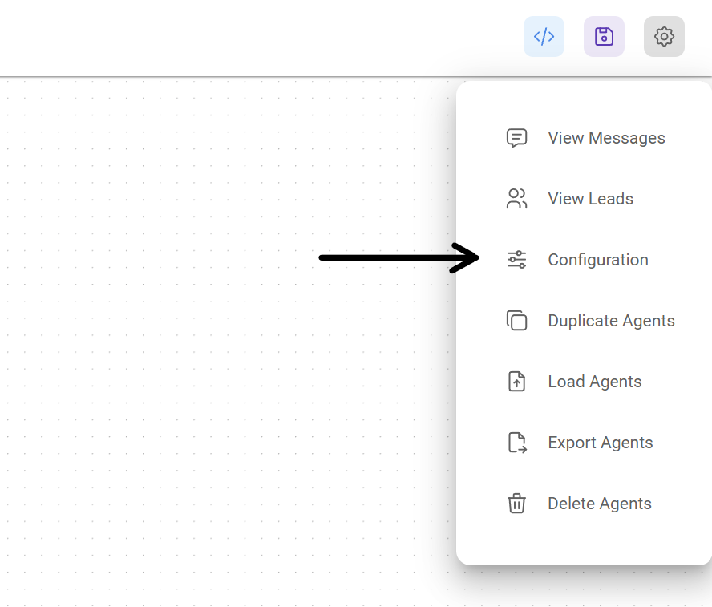
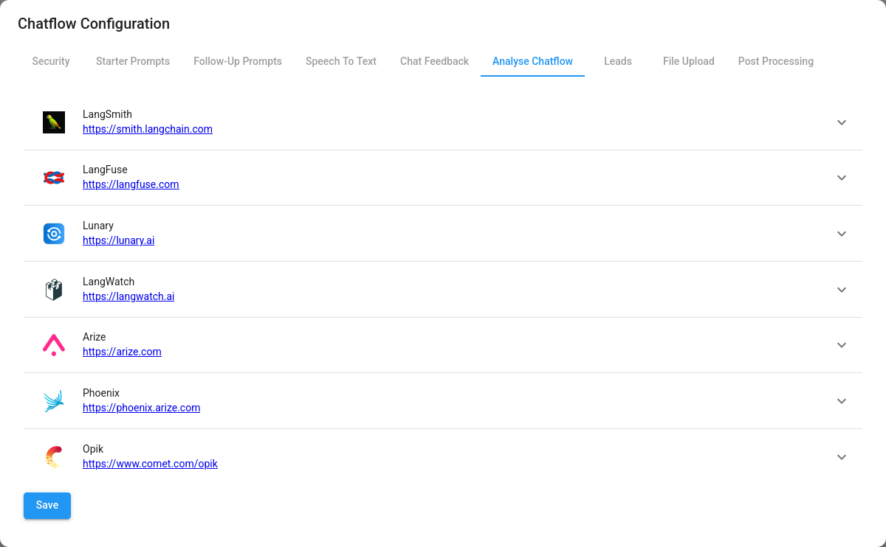
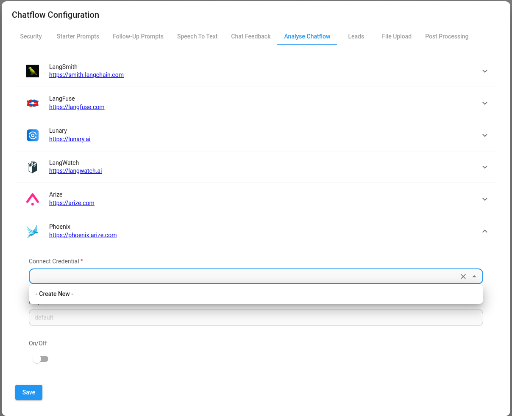
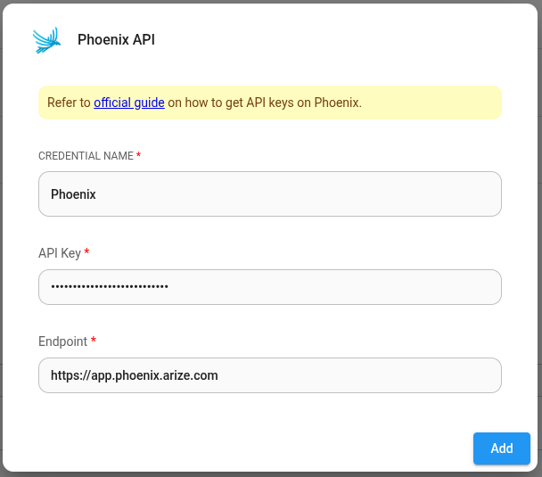

# Phoenix

***

[Phoenix](https://docs.arize.com/phoenix/self-hosting) is an open-source observability tool designed for experimentation, evaluation, and troubleshooting of AI and LLM applications. It can be access in its [Cloud](https://app.phoenix.arize.com/login) form online, or self-hosted and run on your own machine or server.

## Setup

1. At the top right corner of your Chatflow or Agentflow, click **Settings** > **Configuration**

<figure><figcaption></figcaption></figure>

2. Then go to the Analyse Chatflow section

<figure><figcaption></figcaption></figure>

3. You will see a list of providers, along with their configuration fields. Click on Phoenix.

<figure><figcaption></figcaption></figure>

4. Create credentials for Phoenix. Refer to the [official guide](https://docs.arize.com/phoenix/environments) on how to get the Phoenix API key.

<figure><figcaption></figcaption></figure>

5. Fill in other configuration details, then turn the provider **ON**. Click Save.

<figure><figcaption></figcaption></figure>
