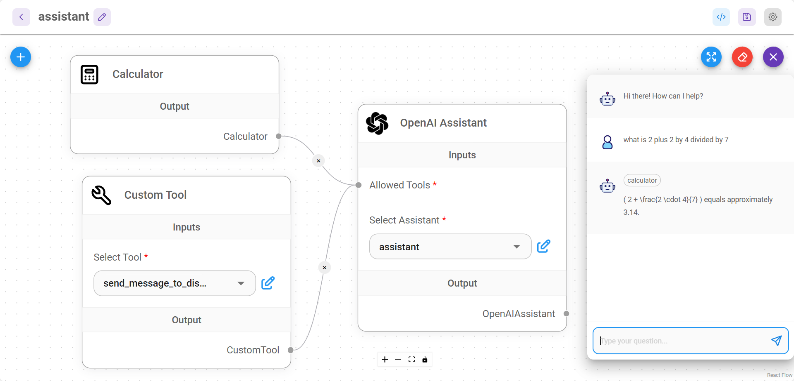

# Threads

Los [Threads](https://platform.openai.com/docs/assistants/how-it-works/managing-threads-and-messages) solo se utilizan cuando se está usando un OpenAI Assistant. Es una sesión de conversación entre un Assistant y un usuario. Los Threads almacenan mensajes y manejan automáticamente el truncamiento para ajustar el contenido al contexto del modelo.

<figure><figcaption></figcaption></figure>

## Conversaciones separadas para múltiples usuarios

### UI & Embedded Chat

Por defecto, la UI y el Embedded Chat separarán automáticamente los threads para las conversaciones de múltiples usuarios. Esto se hace generando un **`chatId`** único para cada nueva interacción. Esa lógica es manejada internamente por Flowise.

### Prediction API

POST /`api/v1/prediction/{your-chatflowid}`, especifica el **`chatId`**. El mismo thread se usará para el mismo chatId.

```json
{
    "question": "hello!",
    "chatId": "user1"
}
```

### Message API

* GET `/api/v1/chatmessage/{your-chatflowid}`
* DELETE `/api/v1/chatmessage/{your-chatflowid}`

También puedes filtrar por **`chatId`** - `/api/v1/chatmessage/{your-chatflowid}?chatId={your-chatid}`

Todas las conversaciones pueden ser visualizadas y gestionadas desde la UI también:

<figure><figcaption></figcaption></figure>
