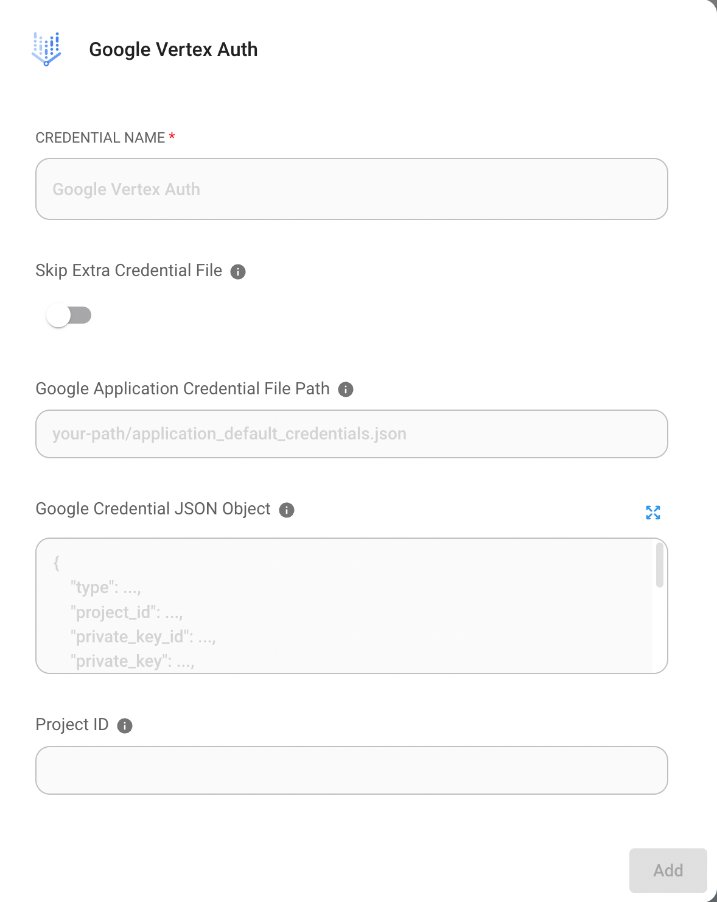

# Google VertexAI

## Prerequisitos

1. [Inicia tu GCP](https://cloud.google.com/docs/get-started)
2. Instala el [Google Cloud CLI](https://cloud.google.com/sdk/docs/install-sdk)

## Configuración

### Habilitar la API de Vertex AI

1. Ve a Vertex AI en GCP y haz clic en **"ENABLE ALL RECOMMENDED API"**

<figure><figcaption></figcaption></figure>

## Crear archivo de credenciales _(Opcional)_

Hay 2 formas de crear el archivo de credenciales

### No. 1: Usar GCP CLI

1. Abre la terminal y ejecuta el siguiente comando

```bash
gcloud auth application-default login
```

2. Inicia sesión en tu cuenta de GCP
3. Verifica tu archivo de credenciales. Puedes encontrar tu archivo de credenciales en `~/.config/gcloud/application_default_credentials.json`

### No. 2: Usar la consola de GCP

1. Ve a la consola de GCP y haz clic en **"CREATE CREDENTIALS"**

<figure><figcaption></figcaption></figure>

2. Crea una cuenta de servicio

<figure><figcaption></figcaption></figure>

3. Completa el formulario de detalles de la cuenta de servicio y haz clic en **"CREATE AND CONTINUE"**
4. Selecciona el rol apropiado (por ejemplo, Vertex AI User) y haz clic en **"DONE"**

<figure><figcaption></figcaption></figure>

5. Haz clic en la cuenta de servicio que creaste y haz clic en **"ADD KEY" -> "Create new key"**

<figure><figcaption></figcaption></figure>

6. Selecciona JSON y haz clic en **"CREATE"**, luego podrás descargar tu archivo de credenciales

<figure><figcaption></figcaption></figure>

## Flowise

<figure><figcaption></figcaption></figure>

### Sin archivo de credenciales

Si estás usando un servicio de GCP como Cloud Run, o si has instalado credenciales predeterminadas en tu máquina local, no necesitas configurar esta credencial.

### Con archivo de credenciales

1. Ve a la página de Credenciales en Flowise y haz clic en **"Add credential"**
2. Haz clic en Google Vertex Auth

<figure><figcaption></figcaption></figure>

3. Registra tu archivo de credenciales. Hay 2 formas de registrar tu archivo de credenciales.

<figure><figcaption></figcaption></figure>

* **Opción 1: Ingresa la ruta de tu archivo de credenciales**
  * Si tienes el archivo de credenciales en tu máquina, puedes ingresar la ruta en `Google Application Credential File Path`
* **Opción 2: Pega el texto de tu archivo de credenciales**
  * O puedes copiar todo el texto del archivo de credenciales y pegarlo en `Google Credential JSON Object`

4. Finalmente, haz clic en el botón "Add".
5. **🎉**¡Ahora puedes usar ChatGoogleVertexAI con las credenciales en Flowise!

### Recursos

* [LangChain JS GoogleVertexAI](https://js.langchain.com/docs/api/llms_googlevertexai/classes/GoogleVertexAI)
* [Descripción general de las cuentas de servicio de Google](https://cloud.google.com/iam/docs/service-account-overview?)
* [Prueba Google Vertex AI Palm 2 con Flowise: Sin codificación para aprovechar la intuición](https://tech.beatrust.com/entry/2023/08/22/Try_Google_Vertex_AI_Palm_2_with_Flowise%3A_Without_Coding_to_Leverage_Intuition)
