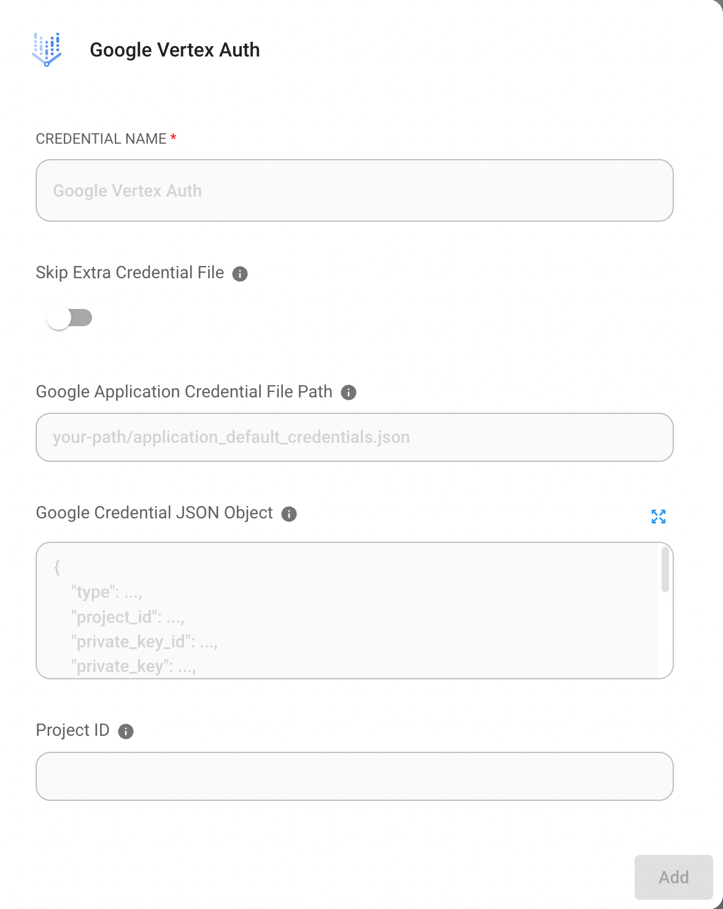

# Google VertexAI

## Prerequisites

1. [Start your GCP](https://cloud.google.com/docs/get-started)
2. Install the [Google Cloud CLI](https://cloud.google.com/sdk/docs/install-sdk)

## Setup

### Enable vertex AI API

1. Go to Vertex AI on GCP and click **"ENABLE ALL RECOMMENDED API"**

<figure><figcaption></figcaption></figure>

## Create credential file _(Optional)_

There are 2 ways to create credential file

### No. 1 : Use GCP CLI

1. Open terminal and run the following command

```bash
gcloud auth application-default login
```

2. Login to your GCP account
3. Check your credential file. You can find your credential file in `~/.config/gcloud/application_default_credentials.json`

### No. 2 : Use GCP console

1. Go to GCP console and click **"CREATE CREDENTIALS"**

<figure><figcaption></figcaption></figure>

2. Create service account

<figure><figcaption></figcaption></figure>

3. Fill in the form of Service account details and click **"CREATE AND CONTINUE"**
4. Select proper role (for example Vertex AI User) and click **"DONE"**

<figure><figcaption></figcaption></figure>

5. Click service account that you created and click **"ADD KEY" -> "Create new key"**

<figure><figcaption></figcaption></figure>

6. Select JSON and click **"CREATE"** then you can download your credential file

<figure><figcaption></figcaption></figure>

## Flowise

<figure><figcaption></figcaption></figure>

### Without credential file

If you are using a GCP service like Cloud Run, or if you have installed default credentials on your local machine, you do not need to set this credential.

### With credential file

1. Go to Credential page on Flowise and click **"Add credential"**
2. Click Google Vertex Auth

<figure><figcaption></figcaption></figure>

3. Register your credential file. There are 2 ways to register your credential file.

<figure><figcaption></figcaption></figure>

* **Option 1 : Enter path of your credential file**
  * If you have credential file on your machine, you can enter the path of your credential file into `Google Application Credential File Path`
* **Option 2 : Paste text of your credential file**
  * Or you can copy all text in the credential file and paste it into `Google Credential JSON Object`

4. Finally, click "Add" button.
5. **🎉**You can now use ChatGoogleVertexAI with the credential in Flowise now!

### Resources

* [LangChain JS GoogleVertexAI](https://js.langchain.com/docs/api/llms\_googlevertexai/classes/GoogleVertexAI)
* [Google Service accounts overview](https://cloud.google.com/iam/docs/service-account-overview?)
* [Try Google Vertex AI Palm 2 with Flowise: Without Coding to Leverage Intuition](https://tech.beatrust.com/entry/2023/08/22/Try\_Google\_Vertex\_AI\_Palm\_2\_with\_Flowise%3A\_Without\_Coding\_to\_Leverage\_Intuition)
