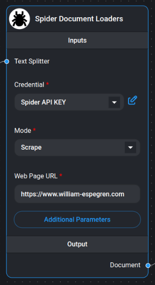

# Spider Web Scraper/Crawler

<figure><figcaption>
Spider Web Scraper/Crawler Node
</figcaption></figure>

[Spider](https://spider.cloud/?ref=flowise) is the fastest open source web scraper & crawler that returns LLM-ready data. To get started using this node you need an API key from [Spider.cloud](https://spider.cloud/?ref=flowise).

## Get Started

1. Go to the [Spider.cloud](https://spider.cloud/?ref=flowise) website and sign up for a free account.
2. Then go to the [API Keys](https://spider.cloud/api-keys) and create a new API key.
3. Copy the API key and paste it into the "Credential" field in the Spider node.

## Scrape & Crawl

1. Choose either "Scrape" or "Crawl" in the mode dropdown.
2. Enter the URL you want to scrape or crawl in the "Web Page URL" field.
3. If you chose "Crawl", enter the maximum amount of pages you want to crawl in the "Limit" field. If no value or 0 is entered, the crawler will crawl all pages.

## Example

<figure><figcaption>
Example on using Spider node
</figcaption></figure>
