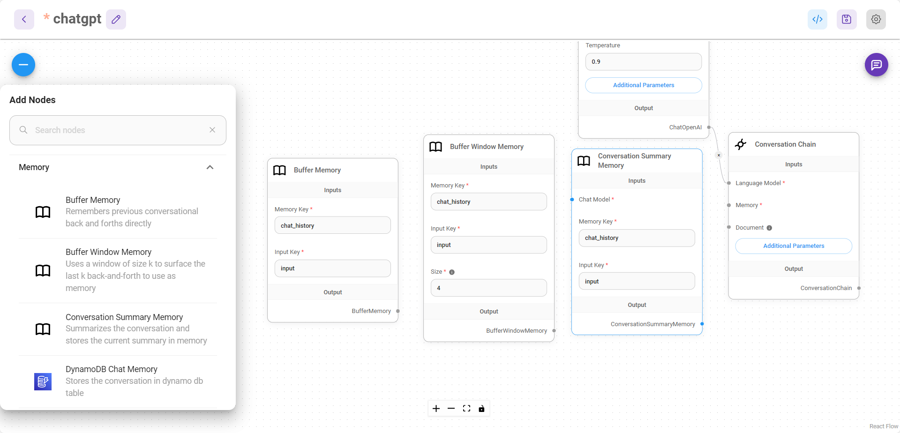

# Short Term Memory

Short Term Memory in Flowise refers to ephemeral memory nodes that are only capable of storing past conversations in RAM. It simply stores the conversations in an array. When Flowise instance got restarted, everything will be lost.

There are 3 short term memory nodes in Flowise:

* BufferMemory
* BufferWindowMemory
* ConversationSummaryMemory

<figure><figcaption></figcaption></figure>

## BufferMemory

The simplest amongst all. Store conversations into an array, and later pass it on to LLM.

## BufferWindowMemory

Sometimes when conversations are too long, you might face issues where token limit exceeded. This is because there is simply too much text to fit into a limited context size of LLM.

Instead of storing all conversations, store only `K` number of conversations. This uses a sliding window implementation to get the most recent `K` interactions.

## ConversationSummaryMemory

This uses a LLM to create a summary of the conversations. It is useful for condensing information from the conversation over time.&#x20;


## Separate conversations for multiple users

### UI & Embedded Chat

By default, UI and Embedded Chat will automatically separate different users conversations. This is done by providing a list of `history` to the API. That logic is handled under the hood by Flowise.

### Prediction API

You can separate the conversations for multiple users by providing a list of **`history`**:

In the `/api/v1/prediction/{your-chatflowid}` POST body request, specify the **`history`** array:

```json
{
    "question": "hello!",
    "history": [
        {
            "message": "Hello, how can I assist you?",
            "type": "apiMessage"
        },
        {
            "type": "userMessage",
            "message": "Hello I am Bob"
        },
        {
            "type": "apiMessage",
            "message": "Hello Bob! how can I assist you?"
        }
    ]
}
```

### Message API

* GET `/api/v1/chatmessage/{your-chatflowid}`
* DELETE `/api/v1/chatmessage/{your-chatflowid}`

<table><thead><tr><th>Query Param</th><th width="192">Type</th><th>Value</th></tr></thead><tbody><tr><td>sort</td><td>enum</td><td>ASC or DESC</td></tr><tr><td>startDate</td><td>string</td><td></td></tr><tr><td>endDate</td><td>string</td><td></td></tr></tbody></table>

All conversations can be visualized and managed from UI as well:

<figure><figcaption></figcaption></figure>
