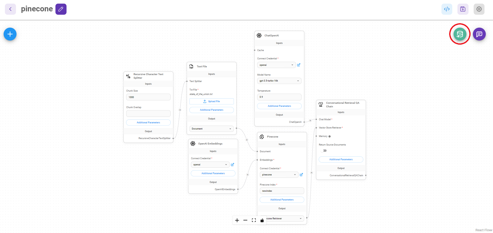

# Supabase

## Prerequisite

1. Register an account for [Supabase](https://supabase.com/)
2. Click **New project**

<figure><figcaption></figcaption></figure>

3. Input required fields

| Field Name                | Description                                       |
| ------------------------- | ------------------------------------------------- |
| **Name**                  | name of the project to be created. (e.g. Flowise) |
| **Database** **Password** | password to your postgres database                |

<figure><figcaption></figcaption></figure>

4. Click **Create new project** and wait for the project to finish setting up
5. Click **SQL Editor**

<figure><figcaption></figcaption></figure>

6. Click **New query**

<figure><figcaption></figcaption></figure>

7. Copy and Paste the below SQL query and run it by `Ctrl + Enter` or click **RUN**. Take note of the table name and function name.

* **Table name**: `documents`
* **Query name**: `match_documents`

```plsql
-- Enable the pgvector extension to work with embedding vectors
create extension vector;

-- Create a table to store your documents
create table documents (
  id bigserial primary key,
  content text, -- corresponds to Document.pageContent
  metadata jsonb, -- corresponds to Document.metadata
  embedding vector(1536) -- 1536 works for OpenAI embeddings, change if needed
);

-- Create a function to search for documents
create function match_documents (
  query_embedding vector(1536),
  match_count int DEFAULT null,
  filter jsonb DEFAULT '{}'
) returns table (
  id bigint,
  content text,
  metadata jsonb,
  similarity float
)
language plpgsql
as $$
#variable_conflict use_column
begin
  return query
  select
    id,
    content,
    metadata,
    1 - (documents.embedding <=> query_embedding) as similarity
  from documents
  where metadata @> filter
  order by documents.embedding <=> query_embedding
  limit match_count;
end;
$$;

```

If some cases, you might be using [Record Manager](../record-managers.md) to keep track of the upserts and prevent duplications. Since Record Manager generates a random UUID for each embeddings, you will have to change the id column entity to text:

```sql
-- Enable the pgvector extension to work with embedding vectors
create extension vector;

-- Create a table to store your documents
create table documents (
  id text primary key, -- CHANGE TO TEXT
  content text,
  metadata jsonb,
  embedding vector(1536)
);

-- Create a function to search for documents
create function match_documents (
  query_embedding vector(1536),
  match_count int DEFAULT null,
  filter jsonb DEFAULT '{}'
) returns table (
  id text, -- CHANGE TO TEXT
  content text,
  metadata jsonb,
  similarity float
)
language plpgsql
as $$
#variable_conflict use_column
begin
  return query
  select
    id,
    content,
    metadata,
    1 - (documents.embedding <=> query_embedding) as similarity
  from documents
  where metadata @> filter
  order by documents.embedding <=> query_embedding
  limit match_count;
end;
$$;

```

<figure><figcaption></figcaption></figure>

## Setup

1. Click **Project Settings**

<figure><figcaption></figcaption></figure>

2. Get your **Project URL & API Key**

<figure><figcaption></figcaption></figure>

3. Copy and Paste each details (_API Key, URL, Table Name, Query Name_) into **Supabase** node

<figure><figcaption></figcaption></figure>

4. **Document** can be connected with any node under [**Document Loader**](../document-loaders/) category
5. **Embeddings** can be connected with any node under [**Embeddings** ](../embeddings/)category

## Filtering

Let's say you have different documents upserted, each specified with a unique value under the metadata key `{source}`

<figure><figcaption></figcaption></figure>

You can use metadata filtering to query specific metadata:

**UI**

<figure><figcaption></figcaption></figure>

**API**

```json
"overrideConfig": {
    "supabaseMetadataFilter": {
        "source": "henry"
    }
}
```

## Resources

* [LangChain JS Supabase](https://js.langchain.com/docs/modules/indexes/vector\_stores/integrations/supabase)
* [Supabase Blog Post](https://supabase.com/blog/openai-embeddings-postgres-vector)
* [Metadata Filtering](https://js.langchain.com/docs/integrations/vectorstores/supabase#metadata-filtering)
