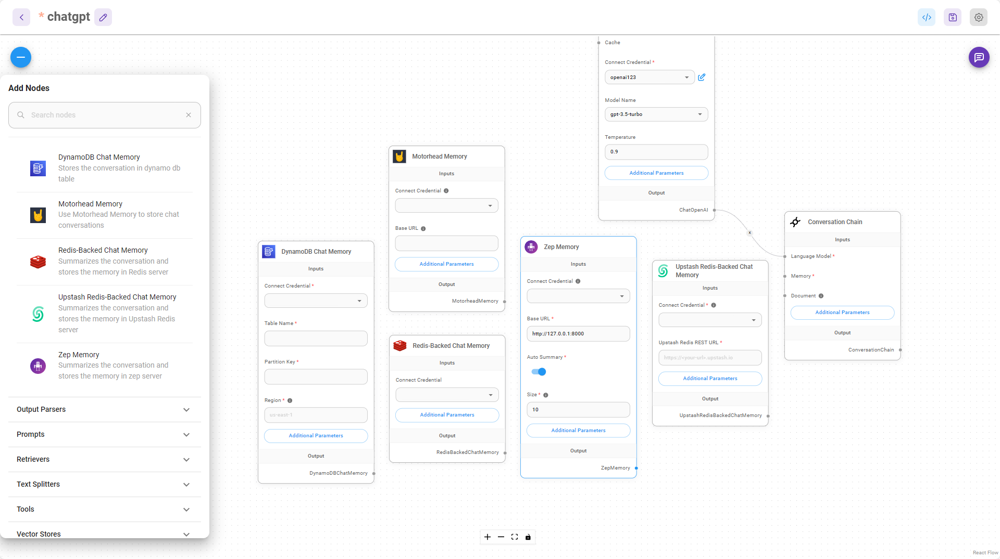

# Long Term Memory

Long Term Memory in Flowise refers to memory nodes that are capable of persisting past conversations, that can be later retrieved to resume the conversation. This allows the conversations for different users to be isolated.

There are 5 short term memory nodes in Flowise:

* DynamoDB Chat Memory
* Motorhead Memory
* Redis Chat Memory
* Upstash Chat Memory
* [Zep Memory](zep-memory.md)

<figure><figcaption></figcaption></figure>

## Separate conversations for multiple users

### UI & Embedded Chat

By default, UI and Embedded Chat will automatically separate different users conversations. This is done by generating a unique **`chatId`** for each new interaction. That logic is handled under the hood by Flowise.

### Prediction API

You can separate the conversations for multiple users by specifying a unique **`sessionId`**

1. Use one of the long term memory nodes on Flowise. Make sure the node has the input parameter **`Session ID`**

<figure><figcaption></figcaption></figure>

<figure><figcaption></figcaption></figure>

2. In the `/api/v1/prediction/{your-chatflowid}` POST body request, specify the **`sessionId`** in **`overrideConfig`**

```json
{
    "question": "hello!",
    "overrideConfig": {
        "sessionId": "user1"
    }
}
```

### Message API

* GET `/api/v1/chatmessage/{your-chatflowid}`
* DELETE `/api/v1/chatmessage/{your-chatflowid}`

| Query Param | Type   | Value       |
| ----------- | ------ | ----------- |
| sessionId   | string |             |
| sort        | enum   | ASC or DESC |
| startDate   | string |             |
| endDate     | string |             |

All conversations can be visualized and managed from UI as well:

<figure><figcaption></figcaption></figure>
