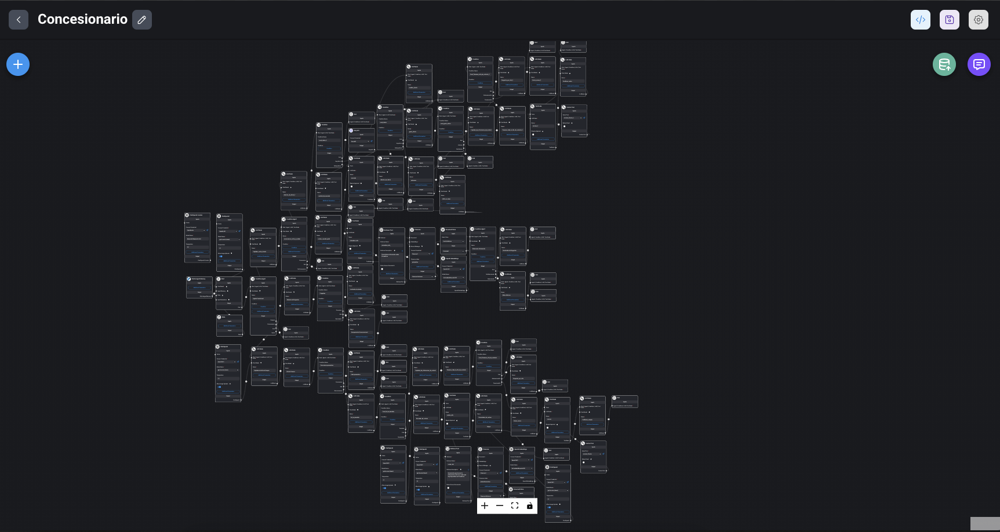

# Parte 10: Sequential Agents Avanzados

Esta guía profundiza en las capacidades avanzadas de los Sequential Agents en Flowise, explorando casos de uso complejos y mejores prácticas para su implementación.

## Contenidos

- [Caso Práctico: Concesionario Virtual](#caso-práctico-concesionario-virtual)
- Principios de los Agentes Secuenciales

## Caso Práctico: Concesionario Virtual

El Concesionario Virtual es un ejemplo avanzado de Sequential Agents que demuestra cómo crear una experiencia de compra de automóviles interactiva y personalizada.

- [Sequential Agents](../../integraciones/langchain/sequential-agents/README.md)
- [State Management](../../integraciones/langchain/state-management/README.md)
- [Condition Nodes](../../integraciones/langchain/condition-nodes/README.md)
- [Loop Nodes](../../integraciones/langchain/loop-nodes/README.md)
- [Tool Integration](../../integraciones/langchain/tool-integration/README.md) 