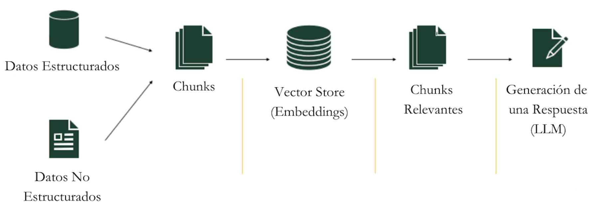
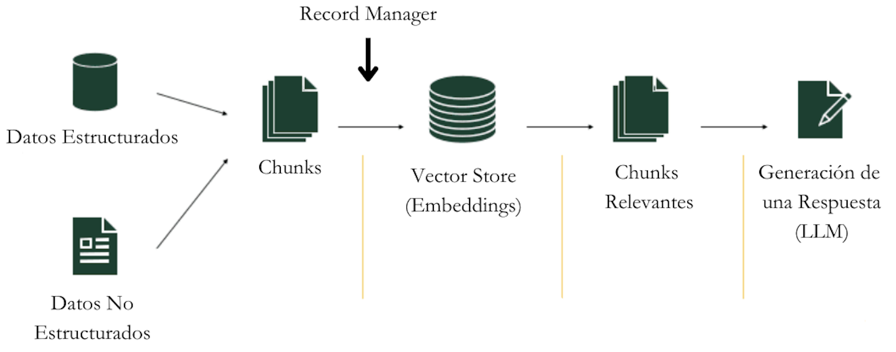
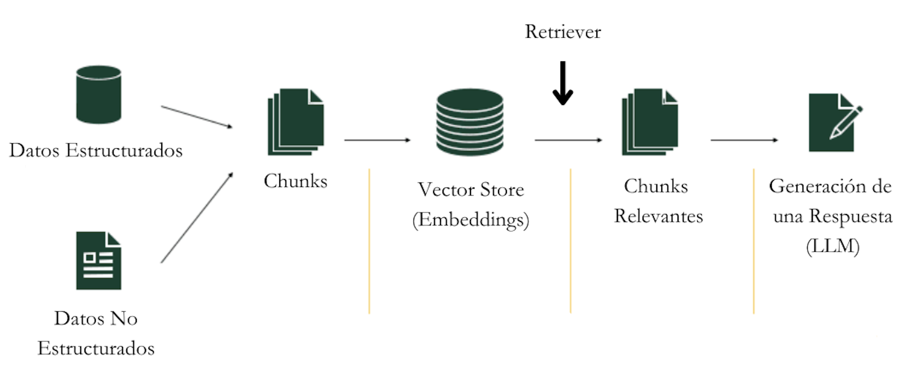
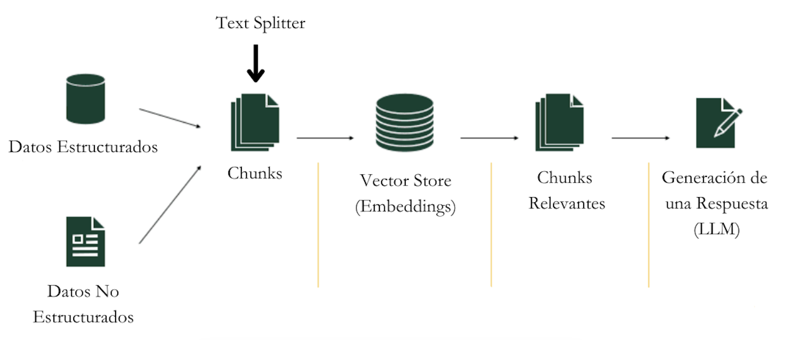
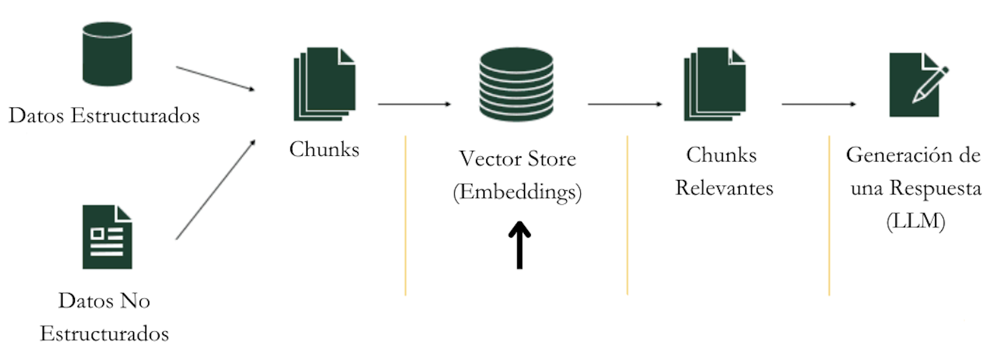

# Parte 3: Gestión de Documentos y Memoria

En esta tercera parte del curso, aprenderemos cómo Flowise maneja documentos y datos de una manera inteligente. Veremos herramientas que nos permiten trabajar con documentos largos, buscar información relevante y mantener todo organizado.

## Contenidos

- [RAG](#rag)
- [Vector Stores](#vector-stores)
- [Document Loaders](#document-loaders)
- [Record Managers](#record-managers)
- [Retrievers](#retrievers)
- [Text Splitters](#text-splitters)
- [Embeddings](#embeddings)

## RAG

RAG (o Retrieval-Augmented Generation) es como tener un asistente que primero busca información en tus documentos y luego la usa para dar respuestas más precisas.

Imagina que tienes una biblioteca enorme. Cuando alguien hace una pregunta:
1. RAG primero busca en los libros relevantes
2. Encuentra la información importante
3. Usa esa información para dar una respuesta completa y precisa

Es como si en vez de inventarse las respuestas, la IA primero "estudiara" tus documentos y luego respondiera basándose en ellos.

## Vector Stores

Un Vector Store es como una biblioteca mágica que organiza documentos por su significado, no por orden alfabético.

Imagina que tienes muchas fotos:
- Una biblioteca normal las ordenaría por fecha o nombre
- Un Vector Store las ordenaría por lo que contienen: todas las fotos de perros juntas, todas las de paisajes juntas, etc.

Pero en lugar de fotos, organiza textos y documentos de manera similar: los que hablan de temas parecidos quedan cerca unos de otros.

## Document Loaders

Los Document Loaders son como traductores universales que pueden leer cualquier tipo de documento y convertirlo en algo que Flowise pueda entender.

Es como tener un equipo de asistentes donde:
- Uno sabe leer PDFs
- Otro entiende documentos de Word
- Otro puede leer páginas web
- Y otro maneja archivos CSV

Cada uno sabe exactamente cómo extraer la información importante de su tipo de documento.

## Record Managers

El Record Manager es como un bibliotecario muy organizado que:
- Lleva un registro de todos los documentos
- Evita tener copias duplicadas
- Sabe exactamente qué documentos son nuevos y cuáles ya existían
- Mantiene todo limpio y ordenado

Imagina que tienes una colección de libros:
1. Cuando traes un libro nuevo, el Record Manager comprueba si ya lo tienes
2. Si es nuevo, lo añade a la colección
3. Si es una versión actualizada, reemplaza la antigua
4. Si ya lo tienes exactamente igual, evita tener un duplicado

## Retrievers

Los Retrievers son como detectives especializados en encontrar exactamente la información que necesitas.

Cuando haces una pregunta:
1. El Retriever busca en todos tus documentos
2. Encuentra las partes más relevantes
3. Te trae solo la información que realmente necesitas

Es como tener un asistente que, en lugar de darte toda la biblioteca, te trae exactamente las páginas que responden a tu pregunta.

## Text Splitters

Los Text Splitters son como expertos en dividir libros grandes en capítulos más pequeños y manejables.

Imagina que tienes un libro muy grande:
- El Text Splitter lo divide en partes más pequeñas
- Intenta mantener juntas las ideas relacionadas
- Se asegura de que cada parte tenga sentido por sí misma
- Mantiene un poco de superposición entre partes para no perder contexto

Es como dividir un libro en capítulos, pero de forma inteligente, asegurándose de que cada división tiene sentido.

## Embeddings

Los Embeddings son como traductores que convierten palabras en números que las computadoras pueden entender y comparar.

Imagina que quieres organizar libros por similitud:
- Cada libro se convierte en una lista de números
- Los libros con números parecidos tratan temas similares
- Es como dar coordenadas a cada libro en un mapa de conocimiento
- Los libros cercanos en el mapa hablan de cosas parecidas

Esta "traducción" permite que la computadora pueda encontrar rápidamente documentos similares o relacionados.

## Links Relevantes

- [Vector Stores](../../integraciones/langchain/vector-stores/README.md)
  - [Pinecone](../../integraciones/langchain/vector-stores/pinecone.md)
  - [Chroma](../../integraciones/langchain/vector-stores/chroma.md)
- [Document Loaders](../../integraciones/langchain/document-loaders/README.md)
  - [PDF Files](../../integraciones/langchain/document-loaders/pdf-file.md)
  - [Web Scrapers](../../integraciones/langchain/document-loaders/cheerio-web-scraper.md)
- [Retrievers](../../integraciones/langchain/retrievers/README.md)
  - [Vector Store Retriever](../../integraciones/langchain/retrievers/vector-store-retriever.md)
- [Text Splitters](../../integraciones/langchain/text-splitters/README.md)
  - [Character Text Splitter](../../integraciones/langchain/text-splitters/character-text-splitter.md)
- [Embeddings](../../integraciones/langchain/embeddings/README.md)
  - [OpenAI Embeddings](../../integraciones/langchain/embeddings/openai-embeddings.md)

### Análisis de la Solución
- Revisión del [Desafío 1: Traductor de Lenguajes Antiguos](../../desafios/desafio-1.md)
- Explicación del enfoque utilizado
- Demostración del flujo implementado
- Lecciones aprendidas

### Mejores Prácticas Identificadas
- Manejo eficiente de imágenes
- Prompts efectivos para traducción
- Gestión del contexto histórico
- Validación de resultados

## Vector Stores

### Conceptos Fundamentales
- [Vector Stores](../../integraciones/langchain/vector-stores/README.md)
- Embeddings y similitud
- Indexación y búsqueda
- Optimización de consultas

### Principales Opciones
- [Pinecone](../../integraciones/langchain/vector-stores/pinecone.md)
- [Chroma](../../integraciones/langchain/vector-stores/chroma.md)
- [Weaviate](../../integraciones/langchain/vector-stores/weaviate.md)
- [Faiss](../../integraciones/langchain/vector-stores/faiss.md)

## Document Stores

### Fundamentos
- [Document Store](../../integraciones/langchain/document-loaders/document-store.md)
- Tipos de documentos soportados
- Estructuración de datos
- Metadatos y etiquetado

### Características Avanzadas
- Búsqueda y filtrado
- Versionado de documentos
- Gestión de permisos
- Backup y recuperación

## Document Loaders

### Tipos de Loaders
- [PDF Files](../../integraciones/langchain/document-loaders/pdf-file.md)
- [Docx File](../../integraciones/langchain/document-loaders/docx-file.md)
- [Json File](../../integraciones/langchain/document-loaders/json-file.md)
- [Web Scrapers](../../integraciones/langchain/document-loaders/cheerio-web-scraper.md)

### Funcionalidades
- Extracción de texto
- Procesamiento de metadatos
- Manejo de formatos especiales
- Limpieza de datos

## Record Managers

### Gestión de Registros
- [Record Managers](../../integraciones/langchain/record-managers.md)
- Seguimiento de cambios
- Auditoría de accesos
- Políticas de retención

## Retrievers

### Tipos de Retrievers
- [Vector Store Retriever](../../integraciones/langchain/retrievers/vector-store-retriever.md)
- [Multi Query Retriever](../../integraciones/langchain/retrievers/multi-query-retriever.md)
- [Embeddings Filter Retriever](../../integraciones/langchain/retrievers/embeddings-filter-retriever.md)

### Optimización
- Ranking y relevancia
- Filtrado contextual
- Caché de resultados
- Estrategias de búsqueda

## Text Splitters

### Opciones Disponibles
- [Character Text Splitter](../../integraciones/langchain/text-splitters/character-text-splitter.md)
- [Token Text Splitter](../../integraciones/langchain/text-splitters/token-text-splitter.md)
- [Markdown Text Splitter](../../integraciones/langchain/text-splitters/markdown-text-splitter.md)

### Consideraciones
- Tamaño de chunks
- Solapamiento
- Preservación de contexto
- Manejo de formatos especiales

## Embeddings

### Proveedores de Embeddings
- [OpenAI Embeddings](../../integraciones/langchain/embeddings/openai-embeddings.md)
- [HuggingFace Embeddings](../../integraciones/langchain/embeddings/huggingface-inference-embeddings.md)
- [Cohere Embeddings](../../integraciones/langchain/embeddings/cohere-embeddings.md)

### Aspectos Técnicos
- Dimensionalidad
- Normalización
- Clustering
- Visualización

## RAG (Retrieval Augmented Generation)

### Componentes
- Indexación de documentos
- Recuperación contextual
- Generación de respuestas
- Validación de outputs

### Implementación
- Arquitectura del sistema
- Flujo de datos
- Optimización de rendimiento
- Monitoreo y mejora

## Otras Opciones de Memorias

### Tipos Avanzados
- [DynamoDB Chat Memory](../../integraciones/langchain/memory/dynamodb-chat-memory.md)
- [MongoDB Atlas Chat Memory](../../integraciones/langchain/memory/mongodb-atlas-chat-memory.md)
- [Redis-Backed Chat Memory](../../integraciones/langchain/memory/redis-backed-chat-memory.md)

### Características
- Persistencia
- Escalabilidad
- Seguridad
- Rendimiento

## Próximos Pasos

Al completar esta parte, estarás preparado para:
- Implementar sistemas de gestión documental
- Trabajar con diferentes tipos de memoria
- Optimizar la recuperación de información
- Procesar y analizar documentos
- Avanzar al [Desafío 2: Chatbot Nikola Tesla](../../desafios/desafio-2.md) 