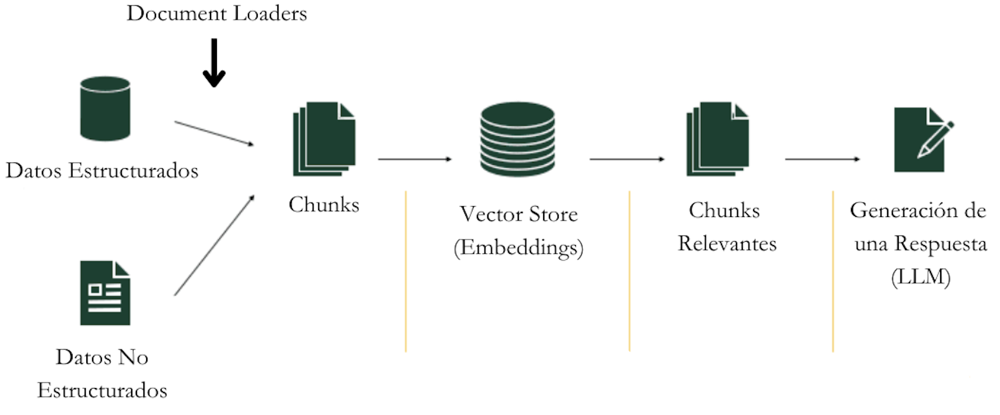

# Parte 3: Gestión de Documentos y Memoria

En esta tercera parte del curso, aprenderemos cómo Flowise maneja documentos y datos de una manera inteligente. Veremos herramientas que nos permiten trabajar con documentos largos, buscar información relevante y mantener todo organizado.

## Contenidos

- [RAG](#rag)
- [Vector Stores](#vector-stores)
- [Document Loaders](#document-loaders)
- [Record Managers](#record-managers)
- [Retrievers](#retrievers)
- [Text Splitters](#text-splitters)
- [Embeddings](#embeddings)
- [Solución del Desafío 1](#posible-solución-del-desafío-1)
## RAG

RAG (o Retrieval-Augmented Generation) es como tener un asistente que primero busca información en tus documentos y luego la usa para dar respuestas más precisas.

Imagina que tienes una biblioteca enorme. Cuando alguien hace una pregunta:
1. RAG primero busca en los libros relevantes
2. Encuentra la información importante
3. Usa esa información para dar una respuesta completa y precisa

Es como si en vez de inventarse las respuestas, la IA primero "estudiara" tus documentos y luego respondiera basándose en ellos.

## Vector Stores

Una Vector Store es como una biblioteca que organiza documentos por su significado, no por orden alfabético.

Imagina que tienes muchas fotos:
- Una biblioteca normal las ordenaría por fecha o nombre
- Una Vector Store las ordenaría por lo que contienen: todas las fotos de perros juntas, todas las de paisajes juntas, etc.

Pero en lugar de fotos, organiza textos y documentos de manera similar: los que hablan de temas parecidos quedan cerca unos de otros.

## Document Loaders

Los Document Loaders son como traductores universales que pueden leer cualquier tipo de documento y convertirlo en algo que Flowise pueda entender.

Es como tener un equipo de asistentes donde:
- Uno sabe leer PDFs
- Otro entiende documentos de Word
- Otro puede leer páginas web
- Y otro maneja archivos CSV

Cada uno sabe exactamente cómo extraer la información importante de su tipo de documento.

## Record Managers

El Record Manager es como un bibliotecario muy organizado que:
- Lleva un registro de todos los documentos
- Evita tener copias duplicadas
- Sabe exactamente qué documentos son nuevos y cuáles ya existían
- Mantiene todo limpio y ordenado

Imagina que tienes una colección de libros:
1. Cuando traes un libro nuevo, el Record Manager comprueba si ya lo tienes
2. Si es nuevo, lo añade a la colección
3. Si es una versión actualizada, reemplaza la antigua
4. Si ya lo tienes exactamente igual, evita tener un duplicado

Podéis pensar en un Record Manager de una manera similar al caché.

## Retrievers

Los Retrievers se usan para encontrar exactamente la información que necesitas.

Cuando haces una pregunta:
1. El Retriever busca en todos tus documentos
2. Encuentra las partes más relevantes
3. Te trae solo la información que realmente necesitas

Es como tener un asistente que, en lugar de darte toda la biblioteca, te trae exactamente las páginas que responden a tu pregunta.

## Text Splitters

Los Text Splitters nos ayudan a dividir información en "chunks" más pequeños y manejables. Similar a como podrías dividir un libro en capítulos.

Imagina que tienes un libro muy grande:
- El Text Splitter lo divide en partes más pequeñas
- Intenta mantener juntas las ideas relacionadas
- Se asegura de que cada parte tenga sentido por sí misma
- Mantiene un poco de superposición entre partes para no perder contexto

Es como dividir un libro en capítulos, pero de forma inteligente, asegurándose de que cada división tiene sentido.

## Embeddings

Los Embeddings son como traductores que convierten palabras en números que las computadoras pueden entender y comparar.

Imagina que quieres organizar libros por similitud:
- Cada libro se convierte en una lista de números
- Los libros con números parecidos tratan temas similares
- Es como dar coordenadas a cada libro en un mapa de conocimiento
- Los libros cercanos en el mapa hablan de cosas parecidas

Esta "traducción" permite que la computadora pueda encontrar rápidamente documentos similares o relacionados.

## Links Relevantes

- [Vector Stores](../../integraciones/langchain/vector-stores/README.md)
- [Document Loaders](../../integraciones/langchain/document-loaders/README.md)
- [Retrievers](../../integraciones/langchain/retrievers/README.md)
- [Text Splitters](../../integraciones/langchain/text-splitters/README.md)
- [Embeddings](../../integraciones/langchain/embeddings/README.md)

## Posible Solución del Desafío 1

- Revisión del [Desafío 1: Traductor de Lenguajes Antiguos](../../partes/parte-2/desafios/index.md)

