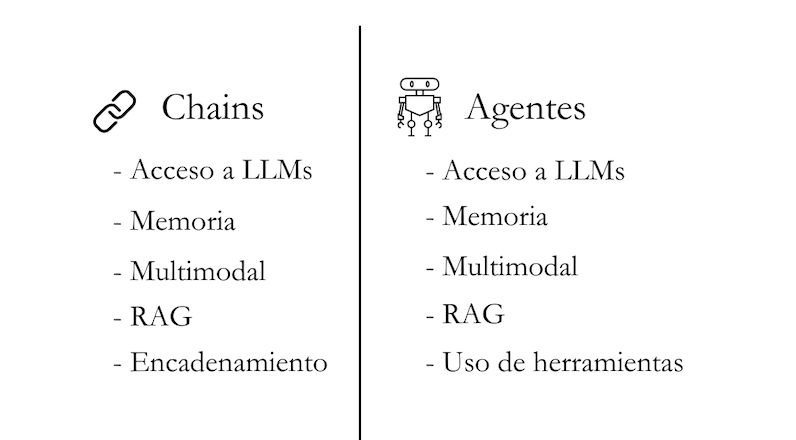

# Parte 5: Introducción a Agentes

En esta quinta parte del curso, nos adentraremos en los agentes. Los agentes son sistemas que utilizan modelos de lenguaje para tomar acciones.

## Contenidos

- [¿Qué son los Agentes?](#qué-son-los-agentes)
- [Herramientas](#herramientas)
- [Chains vs Agentes](#chains-vs-agentes)

## ¿Qué son los Agentes?

Los modelos de lenguaje por sí solos no pueden realizar acciones - solo generan texto. Aquí es donde entran los agentes.

Un agente es un sistema que utiliza un modelo de lenguaje (LLM) como motor de razonamiento para:
- Determinar qué acciones tomar
- Evaluar los resultados de las acciones
- Determinar si se necesitan más acciones o si la tarea está completa

Es como tener un asistente que no solo piensa, sino que también puede interactuar con el mundo a través de herramientas.

## Herramientas

Las herramientas son funciones que los agentes pueden usar para interactuar con el mundo. En Flowise, estas herramientas se dividen en distintas categorías:

### 1. Búsqueda y Navegación Web

Estas herramientas permiten a los agentes buscar información en la web y navegar por páginas web:

*   **BraveSearch API:** Utiliza la API del motor de búsqueda Brave para realizar búsquedas.
*   **Exa Search:** Realiza búsquedas en la web a través del motor de búsqueda Exa (anteriormente Metaphor).
*   **Google Custom Search:** Integra la búsqueda personalizada de Google en tus flujos.
*   **SearchApi:** Una API genérica para realizar búsquedas web.
*   **SearXNG:** Utiliza una instancia del metabuscador SearXNG para realizar búsquedas.
*   **Serp API:** Obtiene datos estructurados de las páginas de resultados de los motores de búsqueda (SERP).
*   **Serper:** Similar a Serp API, pero enfocada en obtener datos de las SERP de Google.
*   **Web Browser:** Una herramienta completa que permite navegar por la web, renderizar páginas y interactuar con su contenido.

### 2. Herramientas de Desarrollo y Programación

Estas herramientas son esenciales para tareas de programación e interacción con APIs:

*   **Python Interpreter:** Permite ejecutar código Python directamente dentro de Flowise.
*   **OpenAPI Toolkit:** Un conjunto de herramientas para interactuar con APIs que siguen la especificación OpenAPI, facilitando la automatización de tareas con servicios web.

### 3. Acceso y Manipulación de Archivos

Estas herramientas permiten a los agentes leer y escribir archivos en el sistema:

*   **Read File:** Lee el contenido de un archivo.
*   **Write File:** Escribe o modifica el contenido de un archivo.

### 4. Solicitudes HTTP

Estas herramientas permiten realizar solicitudes a servidores web:

*   **Request Get:** Realiza solicitudes HTTP GET para obtener recursos de la web.
*   **Request Post:** Realiza solicitudes HTTP POST para enviar datos a servidores web.

### 5. Herramientas de Propósito General

Este conjunto de herramientas ofrece funcionalidades variadas y útiles en diversos contextos:

*   **Calculator:** Realiza cálculos matemáticos.
*   **Chain Tool:** Permite ejecutar como herramienta una chain que hayas creado.
*   **Retriever Tool:** Herramienta especializada en la búsqueda y recuperación de información.

### 6. Herramientas Personalizadas y de Flujo

Estas herramientas permiten una mayor flexibilidad y adaptabilidad a necesidades específicas:

*   **Custom Tool:** Permite a los usuarios definir y ejecutar sus propias herramientas personalizadas, ampliando las capacidades de Flowise.
*   **Chatflow Tool:** Facilita la creación de flujos de conversación, ideal para la construcción de chatbots o asistentes virtuales.

Cada herramienta ofrece un conjunto específico de funcionalidades que, al combinarse, potencian la capacidad de los agentes.

Guía de herramientas: 
[Herramientas](../../integraciones/langchain/tools/README.md)

## Links Relevantes

- [Agentes](../../integraciones/langchain/agents/README.md)
- [Herramientas](../../integraciones/langchain/tools/README.md)
